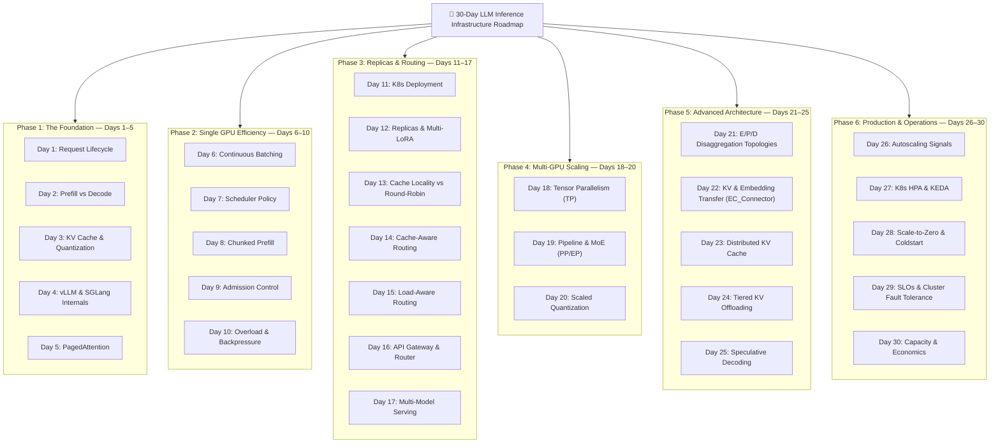

Day 0/30 of inference infrastructure

prerequisites and roadmap

before we dive in, lets set the stage for what this series covers, the core problems we solve, and the roadmap ahead

you ask chatgpt a question and you get a response back. but what happens in between? thats what we explore in this series

we focus on high-level infrastructure: how production systems host, scale, and route llm requests efficiently

---

## 30-Day Series Roadmap

### The Roadmap at a Glance

* **Days 1–5 (The Foundation):** request lifecycle, prefill vs decode, kv cache, vLLM/SGLang internals, and paged attention.
* **Days 6–10 (Single GPU Efficiency):** continuous batching, scheduler policies, chunked prefill, admission control, and backpressure.
* **Days 11–17 (Replicas & Routing):** Kubernetes deployment, multi-LoRA, cache-aware routing, gateways, and multi-model serving.
* **Days 18–20 (Multi-GPU Scaling):** tensor parallelism, pipeline parallelism, MoE routing, and scaled quantization.
* **Days 21–25 (Advanced Architecture):** E/P/D disaggregation topologies (EPD, P/D, E/PD, E/P/D), multimodal embedding transfer, distributed KV caching, tiered offloading, and speculative decoding.
* **Days 26–30 (Production & Operations):** autoscaling with KEDA, scale-to-zero, cluster fault tolerance & SLOs.

DISCLAIMER: this isnt easy as it sounds, I try hard that you go with learned something meaningful about the inference, Im not expert but lets build and break things together
