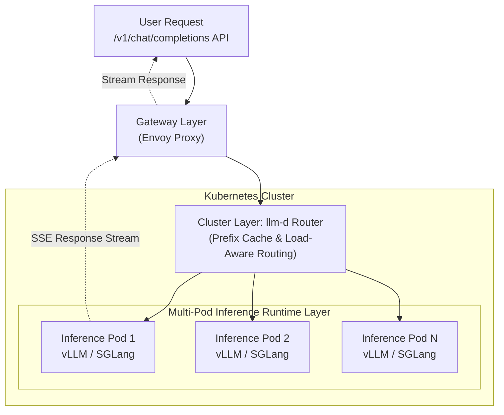
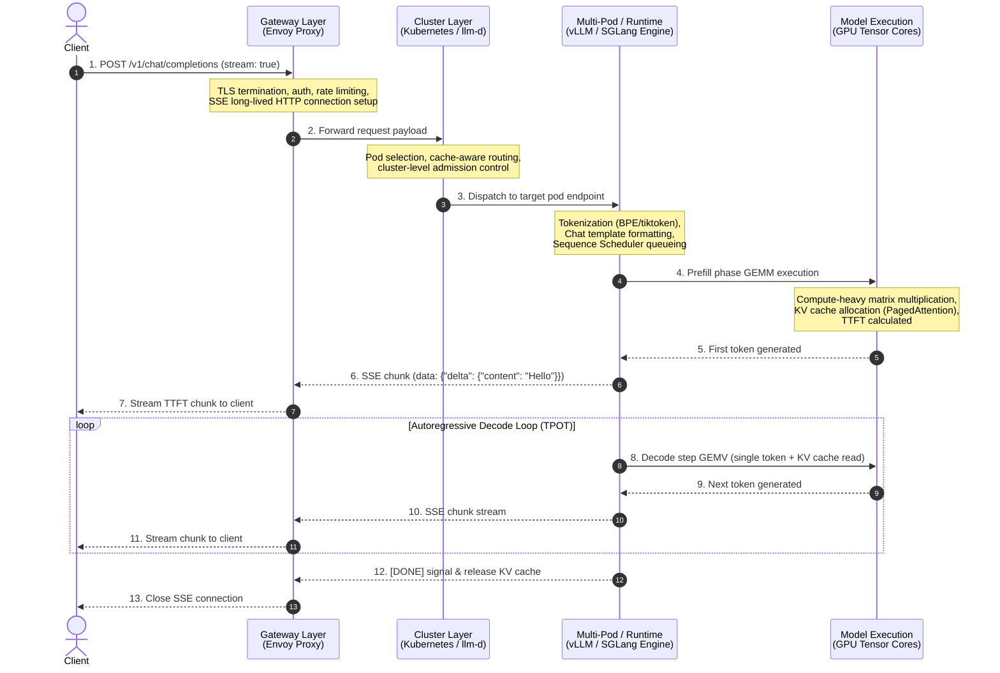

## Day 1/30 of inference infrastructure

request lifecycle

the request lifecycle shows you how your query goes through the server infrastructure

the big difference today is theres no simple HTTP response anymore, we use SSE to stream tokens line by line as soon as they generate

we hit an openAI-compatible endpoint /v1/chat/completions, sending the prompt, model configs, temperature, and max_tokens

single turn chats were old news. now we pass multi-turn chat history inside the context window, and every new turn adds more tokens to the prompt filling up GPU memory with KV cache

to handle this without dropping connections or running out of memory, your request passes through 3 layers:

* gateway (envoy)
* cluster router (llm-d)
* multi-pod runtime (vllm/sglang)

here is the high-level architecture showing how a request moves through each layer of the infrastructure:

# Part 2

we saw the high level flow, but let's go a bit lower level to see what each layer actually does step-by-step:

1/ Gateway (Envoy): checks API keys, enforces rate limits, and opens a long-lived unbuffered SSE connection. no buffering allowed tokens must flush instantly.

2/ Cluster Router (llm-d): checks prompt hashes for KV cache matches. if Pod A has warm cache for your prompt, it routes to Pod A. otherwise, it picks the pod with the lowest queue depth.

3/ Runtime Pod (vLLM / SGLang): host CPU tokenizes your text with tiktoken, applies chat templates (<|im_start|>), and the scheduler puts your request in the pending queue.

4/ GPU Prefill (TTFT): the GPU processes all prompt tokens at once, populates KV cache blocks in VRAM, and outputs token #1. this first token streams all the way back to your screen.

5/ Autoregressive Decode (TPOT): the GPU generates remaining tokens one by one in a loop, reading KV cache from memory. each new token gets de-tokenized and flushed as an SSE chunk.

6/ Finish & Cleanup: once the model done generating or max_tokens, the engine releases VRAM blocks or CPU/storage offloading and closes the SSE stream.

here is the exact sequence diagram mapping this entire loop:

