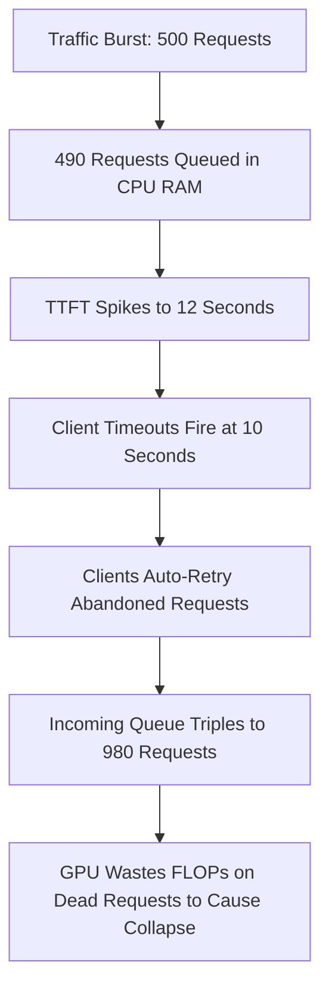
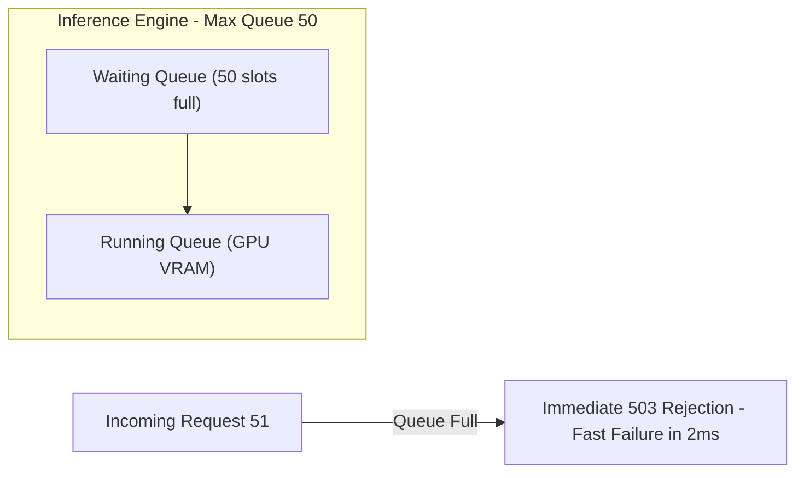
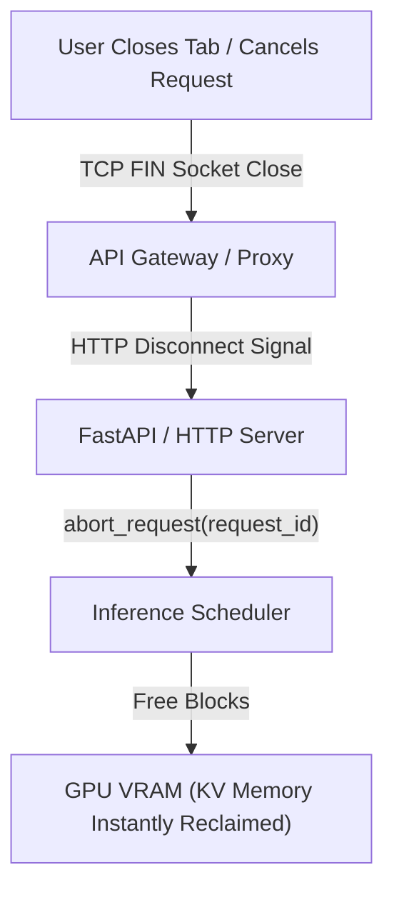
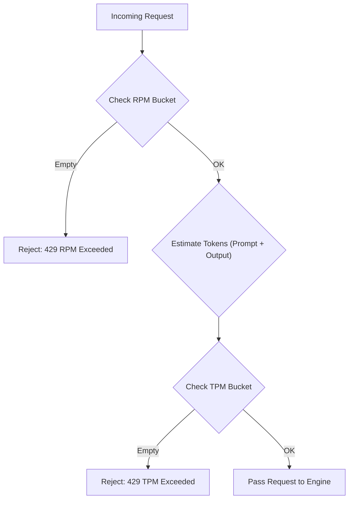
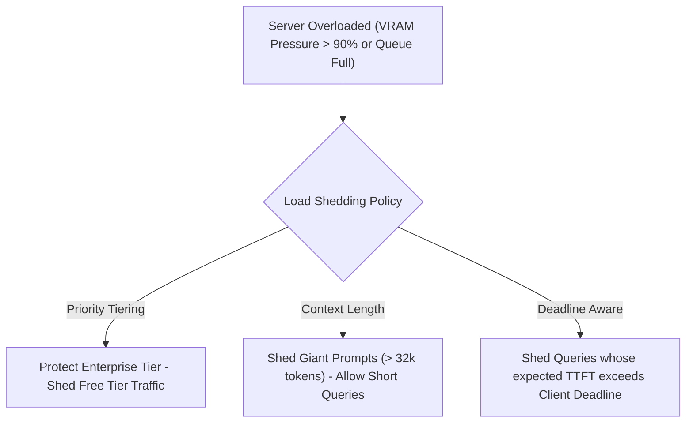
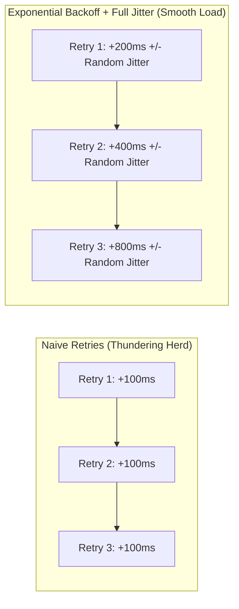

Day 10/30 of inference infrastructure

stopping the crash: backpressure, load shedding, and overload protection in production inference

yesterday on day 8 and 9 we explored the brain of the inference engine: how schedulers manage waiting, running, and swapped queues, how admission control gates prevent VRAM memory exhaustion, and how preemption strategies save servers when GPU memory gets tight.

today we look at what happens when incoming user traffic completely overflows your engine's physical capacity: backpressure, queue timeouts, client cancellation propagation, rate limiting for RPM and TPM, load shedding, and how to stop deadly retry storms from taking down your infrastructure.

---

## 1. the anatomy of an LLM overload crash

picture a sudden rush of traffic hitting your inference server.

say 500 users submit prompts at the exact same second. your single GPU can only run 10 requests concurrently. at first everything looks fine as those first 10 requests start generating tokens.

the remaining 490 requests land in your waiting queue in CPU RAM.

as the waiting queue grows, queries sit in memory waiting for a GPU slot. time-to-first-token (TTFT) climbs from 200 milliseconds up to 12 seconds.

### how retry storms collapse an engine

watch what happens on the client side step by step:

1. **client HTTP timeout**: user web browsers and mobile apps have a default 10-second timeout.
2. **socket drop & retry**: at second 10, the client drops its HTTP socket and automatically sends a retry attempt.
3. **queue doubling**: your engine now has 490 original waiting queries plus 490 new retried queries (980 total requests in queue).
4. **wasted GPU FLOPs**: the GPU spends compute cycles generating tokens for requests that clients already abandoned seconds ago!

without protection, the engine spends all its time managing dead requests until the service crashes.

an overloaded engine must fail predictably by rejecting excess work early instead of collapsing unpredictably under queue pressure.

---

## 2. bounded queues and queue timeouts

when requests arrive faster than your engine can process them, where should they wait?

in naive servers, requests land in an unbounded queue. an unbounded queue sounds safe, but it allows waiting latency to grow to infinity, guaranteeing that every single user experiences a broken timeout.

bounded queues fix this by putting a hard cap on queue depth.

have you ever seen chatgpt throw a "network error", "connection lost", or "request timed out" mid-conversation?

that's backpressure and overload protection in action. when an inference cluster gets slammed with traffic, your request either gets rejected in 2ms with a 503 because the queue is maxed out, drops because it sat in line past the gateway timeout, or gets severed mid-sentence when the engine runs low on KV cache memory.

### fast failure with bounded queues

imagine capping your waiting queue to 50 requests.

when request #51 arrives while all 50 slots are full, the engine rejects request #51 instantly with an HTTP `503 Service Unavailable` error in 2 milliseconds.

this fast rejection protects your server by keeping queue depth capped, ensuring that the 50 requests already in line get served within target latency SLAs.

### dropping expired requests with queue timeouts

even in a bounded queue, a query can wait too long.

picture a prompt sitting in line for 8 seconds. if the client timeout is set to 5 seconds, that request is already dead to the client. running its prefill on the GPU when it reaches the front of the queue is a complete waste of compute.

queue timeouts check how long a request has waited in CPU RAM before promoting it to the GPU:

$$\text{Time in Queue} > \text{Client Timeout} \implies \text{Drop Request Immediately}$$

if the request expired while waiting, the scheduler drops it right at the queue boundary without touching GPU VRAM.

---

## 3. client disconnection and cancellation propagation

what happens when a user closes their browser tab mid-sentence while an LLM is generating a 2,000-token answer?

in standard web servers, the backend might keep generating text in the background. for an LLM server, generating 2,000 unwanted output tokens locks up expensive GPU KV cache memory for 30 full seconds!

cancellation propagation stops this by wiring socket disconnects straight to the inference scheduler.

### tracking cancellations in 3 steps

1. **disconnect detection**: when a client closes their browser tab, the HTTP socket emits a `TCP FIN` signal.
2. **abort signal**: the web server calls `scheduler.abort_request(request_id)`.
3. **KV cache reclamation**: the scheduler removes the request from the running queue and frees its KV cache blocks in 1 millisecond.

freeing KV memory the moment a client disconnects instantly reclaims GPU slots for active users.

---

## 4. rate limiting: RPM vs TPM

in traditional web APIs, a request is a request. whether you fetch user #1 or user #2, the backend performs roughly the same amount of work. standard gateways simply cap traffic using requests per minute (RPM).

in LLM serving, pure RPM rate limiting breaks down immediately.

### why RPM fails for LLMs

why does request count fail for LLMs? because prompt size dictates compute and memory.

think of two users making 10 requests per minute to your engine:

* **user A** sends 10 short prompts of 50 tokens (500 tokens total).
* **user B** sends 10 massive prompts of 100,000 tokens (1,000,000 tokens total).

both pass a 10 RPM rate limit without issue. but user B consumes over 2,000 times more GPU prefill compute and gigabytes more KV cache memory! a single user sending long prompts can completely exhaust your GPU VRAM while sitting comfortably under their RPM limit.

this is why production gateways use dual-bucket token bucket algorithms:

1. **requests per minute (RPM)**: caps total connection frequency to prevent socket exhaustion.
2. **tokens per minute (TPM)**: caps aggregate token volume to protect GPU VRAM and compute capacity.

before forwarding an incoming query, the gateway calculates an estimated token budget:

$$\text{Estimated Cost} = \text{Prompt Tokens} + \text{Requested Max Output Tokens}$$

if a client exceeds their TPM allocation, the gateway rejects excess queries at the edge with an HTTP `429 Too Many Requests` status code before touching the inference cluster.

---

## 5. load shedding under extreme pressure

rate limiting protects you against an individual heavy user. but what happens when hundreds of well-behaved users hit your system at the same time during a traffic surge?

individual rate limits won't trigger because no single user is over budget, but total incoming demand still exceeds what your GPUs can physically process.

this is where load shedding comes in: intentionally dropping a fraction of incoming requests at the door so the rest finish with fast, low-latency streaming.

### three practical load shedding strategies

when the GPU cluster is choking, how do you decide which requests to drop?

* **priority-based shedding**: check incoming metadata headers (`tier=enterprise`). during high queue pressure, drop free-tier requests first to guarantee SLA uptime for paying customers.
* **context-length shedding**: drop 32k+ token prompts when queue depth is high. a single giant prefill prompt can stall dozens of short interactive chat queries.
* **deadline-aware shedding**: estimate time-to-first-token based on current queue drain speed. if a request will take 8 seconds to start prefill but the client timeout is 5 seconds, drop it immediately — it's already dead on arrival.

### why dropping requests increases total goodput

it feels counter-intuitive to reject user traffic on purpose, but under heavy load, load shedding actually increases total successful requests (goodput).

without load shedding, 100% of requests sit in an overloaded queue for 20 seconds. 80% time out and fail with socket errors, and the remaining 20% crawl along with terrible latency. system throughput collapses.

with load shedding, 20% of requests fail instantly in 2ms with a clean `503` code. the remaining 80% process smoothly at full hardware speed with fast TTFT and fluid streaming. you sacrifice a slice of traffic early to save the service for everyone else.

---

## 6. retry budgets, exponential backoff, and jitter

when an inference server returns an HTTP `503` or `429` error, how clients retry determines whether the server recovers or stays trapped in an outage.

if 1,000 rejected clients retry at the exact same millisecond, they hit the server in a synchronized wave called a thundering herd.

### exponential backoff with full jitter

exponential backoff doubles client wait times after each failure:

$$\text{Base Delay} = 200\text{ms} \implies \text{Wait Times: } 200\text{ms}, 400\text{ms}, 800\text{ms}, 1600\text{ms}$$

adding full random jitter introduces noise to break up synchronized retry waves:

$$\text{Actual Delay} = \text{random}(0, \, \text{Base Delay} \times 2^{\text{attempt}})$$

scattering retries randomly across time turns retry spikes into a gentle stream that the recovered GPU can easily process.

---

## 8. landmark research and references

references:

* [Mooncake: A KVCache-Centric Architecture for Serving LLM Chatbot](https://arxiv.org/abs/2407.00079)
* [FastServe: Iteration-Level Preemptive Scheduling for Large Language Model Serving](https://arxiv.org/abs/2305.05920)
* [Niyama: QoS-Driven Serving Framework for LLM Inference](https://arxiv.org/abs/2503.22562)

---

now that we understand how to protect a single GPU inference node from traffic overload, how do we package and deploy this engine setup inside production containers and Kubernetes services?

that is where we head next on day 11 when we scale from a single GPU node to deploying an LLM as a production cloud service!
