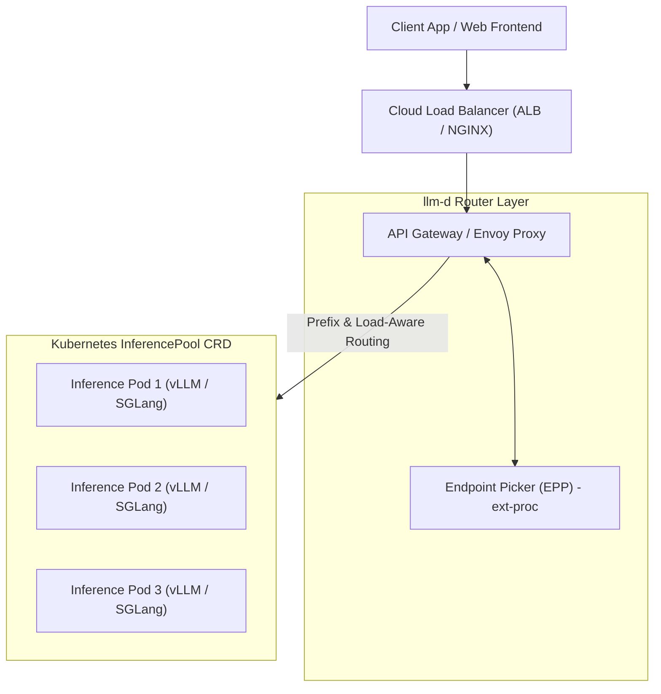
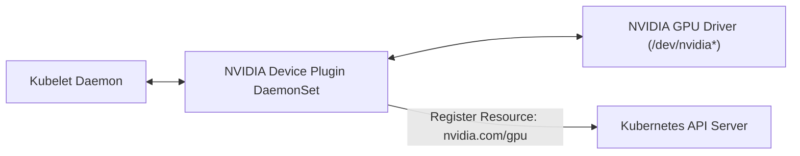
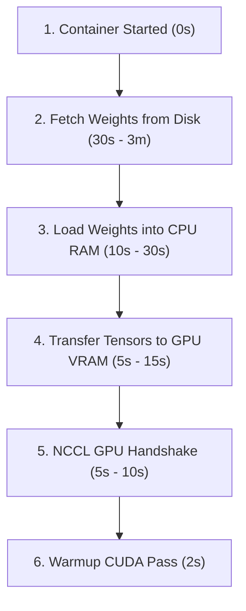
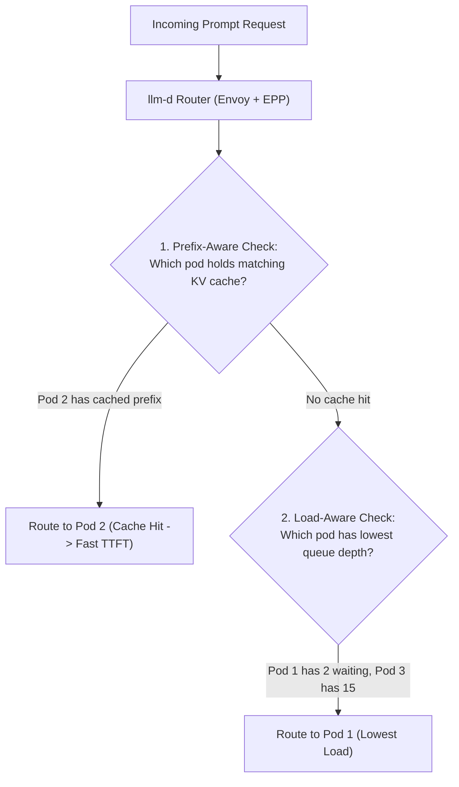

Day 11/30 of inference infrastructure

deploying an LLM as a service: containers, GPU nodes, and the llm-d architecture

yesterday on day 10 we saw how to protect single GPU nodes from traffic overload — using bounded queues, cancellation propagation, and load shedding to keep engines from crashing under load.

now we move from a single node to full cloud deployment. we are going to package our inference engine into production containers, allocate physical GPUs on Kubernetes with device plugins, and set up the cloud-native llm-d router architecture.

we will refer directly to battle-tested guides and blogs from llm-d and SGLang to see how modern LLM serving works in real-world production.

---

## 1. the production LLM serving stack & the llm-d standard

in standard microservices, Kubernetes routes traffic using simple round-robin load balancing.

for LLMs, round-robin breaks down immediately. if two queries share the same system prompt or conversation history, round-robin sends them to different worker pods — forcing both pods to recompute the exact same KV cache from scratch!

to solve this, production serving architectures follow the **llm-d** cloud-native blueprint:



each layer in this architecture handles a specific responsibility:

* **cloud load balancer & API gateway**: handles authentication, RPM/TPM rate limits, and load shedding before queries hit your GPUs.
* **llm-d router (Envoy + EPP)**: routes queries based on prompt prefixes (KV cache hits) and pod queue depth.
* **Kubernetes InferencePool**: groups backend worker pods into a single managed inference cluster.
* **inference pod**: runs vLLM or SGLang on GPUs to execute kernels and stream back tokens.

---

GPU container images easily reach 10GB to 20GB because they bundle CUDA drivers, PyTorch binaries, and pre-compiled kernels. to keep deployments fast, never bake model weights into the Docker image — store checkpoints on external storage. use multi-stage builds to compile custom kernels in a build stage, and set `NVIDIA_DRIVER_CAPABILITIES=compute,utility` so containers access host GPUs safely.

---

## 3. GPU-enabled Kubernetes nodes & device plugins

vanilla Kubernetes only understands standard compute resources: CPU cores and RAM bytes. out of the box, it has no native idea what an NVIDIA H100 or A100 GPU is.

to make GPUs requestable in pod deployment specs, you install the **NVIDIA Device Plugin** on your cluster nodes.



the NVIDIA Device Plugin runs as a DaemonSet across your GPU nodes. it monitors physical GPU health via NVML (NVIDIA Management Library) and advertises `nvidia.com/gpu` capacity directly to the Kubernetes API scheduler.

### Kubernetes deployment manifest for vLLM

here is a production Kubernetes deployment manifest that requests dedicated physical GPU resources:

```yaml
apiVersion: apps/v1
kind: Deployment
metadata:
  name: vllm-qwen-7b
  namespace: llm-serving
  labels:
    app: vllm-qwen
spec:
  replicas: 2
  selector:
    matchLabels:
      app: vllm-qwen
  template:
    metadata:
      labels:
        app: vllm-qwen
    spec:
      # pin pod to nodes equipped with physical H100 GPUs
      nodeSelector:
        accelerator: nvidia-h100
      tolerations:
      - key: "nvidia.com/gpu"
        operator: "Exists"
        effect: "NoSchedule"
      containers:
      - name: vllm-container
        image: vllm/vllm-openai:v0.6.3
        args:
        - "--model"
        - "Qwen/Qwen2.5-7B-Instruct"
        - "--gpu-memory-utilization"
        - "0.90"
        - "--max-num-seqs"
        - "128"
        ports:
        - containerPort: 8000
          name: http
        resources:
          limits:
            cpu: "8"
            memory: "32Gi"
            nvidia.com/gpu: "1"  # requests 1 physical GPU
          requests:
            cpu: "4"
            memory: "16Gi"
            nvidia.com/gpu: "1"
        volumeMounts:
        - name: model-cache
          mountPath: /root/.cache/huggingface
      volumes:
      - name: model-cache
        persistentVolumeClaim:
          claimName: nfs-model-pvc
---
apiVersion: v1
kind: Service
metadata:
  name: vllm-qwen-service
  namespace: llm-serving
spec:
  type: ClusterIP
  selector:
    app: vllm-qwen
  ports:
  - port: 8000
    targetPort: http
```

---

## 4. model loading sequence: why pod startup takes 2 to 10 minutes

standard web apps boot in 100ms. an LLM pod takes minutes because it must fetch weights, deserialize tensors into RAM, transfer matrices to GPU VRAM, and warm up CUDA graphs:



### how to speed up weight loading

downloading 14GB from HuggingFace on every pod boot destroys scaling speed. production setups fix this using three simple patterns:

1. **shared network drives**: mount a shared drive (like AWS EFS or JuiceFS) so pods read cached weights immediately.
2. **pre-cached node SSDs**: store model weights directly on the host machine's NVMe drive before spinning up containers.
3. **parallel cloud streaming**: stream weights from S3 or GCS over high-speed 25Gbps network links in parallel.

---

## 5. llm-d intelligent routing: prefix-aware & load-aware scheduling

in standard Kubernetes setups, a Service load balances requests blindly using round-robin. for LLM workloads, round-robin is a disaster because it ignores KV cache locality.

the **llm-d** architecture introduces an optimized baseline router that replaces naive round-robin with two intelligent routing mechanisms:



### 1. prefix-aware routing (KV cache affinity)

multi-turn chat applications and agentic workflows frequently send identical system prompts and conversation history across requests.

* **naive round-robin**: request 1 lands on Pod 1 (computes prefill and builds KV cache). request 2 lands on Pod 2 (forces Pod 2 to recompute the exact same prefill KV cache from scratch).
* **llm-d prefix-aware router**: tracks KV cache state across endpoints. when request 2 arrives, the router detects that Pod 1 already holds the matching prefix in VRAM and routes request 2 back to Pod 1. this avoids redundant prefill math and dramatically reduces Time-To-First-Token (TTFT).

### 2. load-aware routing (queue depth probing)

LLM request processing times vary by orders of magnitude depending on output token count. round-robin can easily pile 10 long-running queries onto Pod 1 while Pod 2 sits idle.

* **llm-d load-aware router**: continuously probes endpoint metrics (waiting queue depth, active running sequences, and KV cache utilization) at short intervals (~50ms).
* **dynamic scoring**: the router scores endpoints in real time and routes new queries to the least-burdened pod, eliminating traffic hotspots.

---

## 6. Kubernetes probes: startup, readiness, and liveness

because LLM engines take minutes to pull weights into VRAM, standard health checks will kill your container before it even boots. Kubernetes relies on three probes to manage LLM pod lifecycles:

* **startup probe**: holds off health checks for up to 10 minutes so your engine has time to download weights and warm up CUDA memory without getting killed mid-boot.
* **readiness probe**: checks if the engine can accept queries right now. if a pod runs out of KV cache or gets overloaded, Kubernetes pauses incoming traffic without restarting the container.
* **liveness probe**: watches for frozen or deadlocked engine processes. if it fails repeatedly, Kubernetes kills and restarts the pod (keep timeouts >5s so heavy prefill passes don't trigger false restarts).

i will share a step-by-step setup guide and repo reference in the github readme soon so you can follow along and deploy this exact Kubernetes and llm-d stack yourself.

now that our single LLM instance is containerized and health-checked on Kubernetes, how do we scale horizontally across multiple GPU nodes, handle failovers, and manage replica sets?

that is where we head next on day 12 when we move into full cluster deployment — things get really interesting from here!
