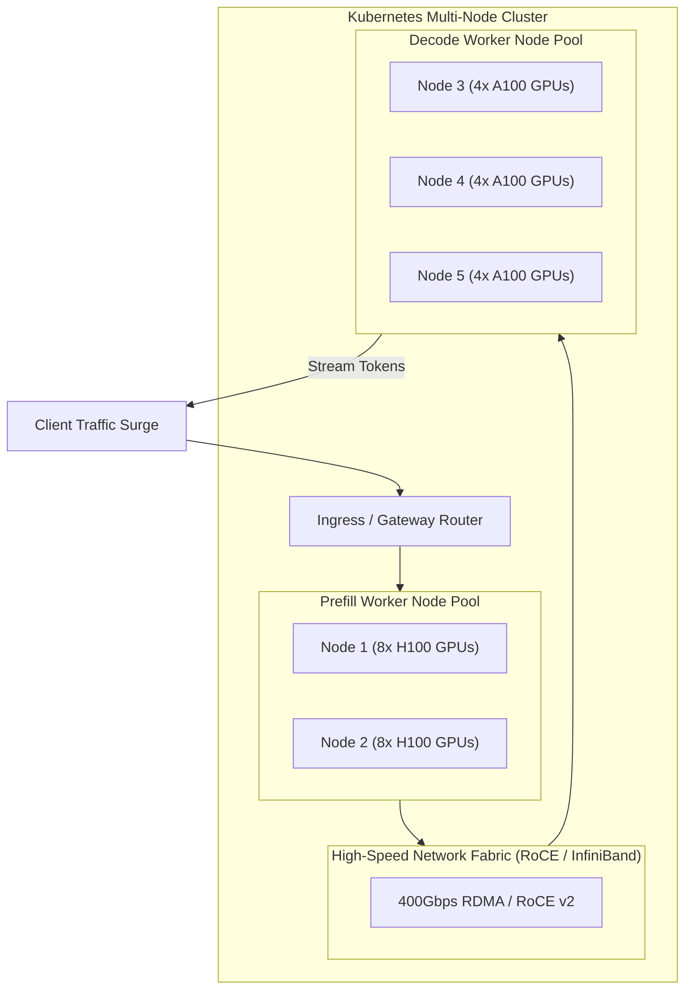
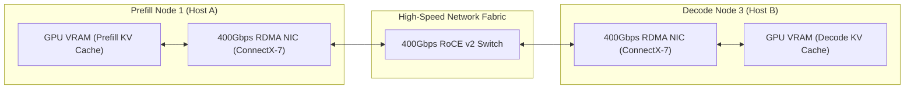
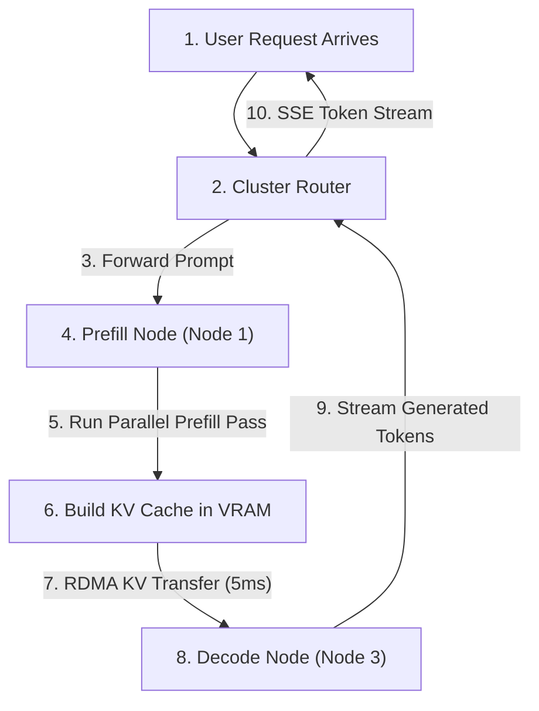

Day 12/30 of inference infrastructure

deploying multi-node inference clusters: worker pools, inter-node networking, and prefill-decode disaggregation

yesterday on day 11 we packaged our inference engine into production containers, assigned GPUs using Kubernetes device plugins, and set up health probes to handle long model boot times.

now we scale beyond a single server to deploy a multi-node GPU cluster. we will see how multi-node deployments are structured, how nodes communicate over high-speed networks, and how prefill and decode worker pools are deployed across Kubernetes.

---

## 1. multi-node deployment topology

picture scaling from 1 GPU node to a cluster of 10 GPU nodes.

when you deploy an LLM across multiple nodes, you organize physical servers into dedicated role pools rather than treating every node as identical:

in a multi-node cluster, deployment configuration dictates how work is distributed across physical machines:

* **node pools**: group physical nodes by hardware capabilities and role labels (`role=prefill` or `role=decode`).
* **inter-node fabric**: connects GPU servers using dedicated 400Gbps RDMA or RoCE v2 switches so nodes transfer KV cache tensors without going through host CPU bottlenecks.
* **worker deployments**: run model server containers (vLLM or SGLang) pinned to designated node pools using Kubernetes nodeSelectors and tolerations.

---

## 2. deploying prefill and decode pools on Kubernetes

in a multi-node deployment, you deploy two separate Kubernetes deployments: one for prefill workers and one for decode workers.

### 1. the prefill deployment pool

the prefill pool ingests incoming prompts, processes prompt tokens, and generates KV cache matrices.

* **node assignment**: pinned to high-compute GPU nodes (like 8x H100 instances).
* **replica configuration**: scaled based on incoming prompt ingestion volume.
* **networking**: assigned dedicated high-bandwidth network interfaces for transferring KV cache tensors to decode nodes after prefill completes.

### 2. the decode deployment pool

the decode pool takes pre-computed KV cache tensors and streams output tokens back to clients.

* **node assignment**: pinned to high-VRAM capacity nodes (like A100 80GB or L40S instances).
* **replica configuration**: scaled independently based on the number of active streaming user sessions.
* **networking**: receives KV cache tensors directly over RDMA from prefill nodes and streams HTTP SSE tokens back to the gateway.

---

## 3. inter-node KV cache transfer & networking

when prefill finishes on Node 1, how does Node 3 get the KV cache to stream tokens?

in standard web clusters, nodes talk over standard 10Gbps TCP ethernet networks. for an LLM cluster, transferring gigabytes of KV cache over TCP ethernet takes hundreds of milliseconds, destroying user latency!

multi-node LLM deployments rely on direct GPU-to-GPU network fabrics:

### 3 network requirements for multi-node deployments

1. **RDMA over Converged Ethernet (RoCE v2) / InfiniBand**: allows GPUs on Node 1 to write KV cache tensors directly into VRAM on Node 3 without involving host CPUs or operating system kernel context switches.
2. **GPUDirect RDMA**: bypasses host CPU RAM completely, streaming data directly over PCIe Gen5 buses to network interface cards (NICs).
3. **dedicated intra-cluster VLANs**: isolates inter-node KV cache transfers on private network channels so public client traffic never degrades inter-GPU bandwidth.

---

## 4. multi-node traffic flow & load orchestration

watch how a prompt travels through a multi-node deployment from request to final token streaming:

### step-by-step multi-node request lifecycle

1. **gateway ingress**: the user request lands on the cluster router.
2. **prefill node selection**: the router selects a prefill worker pod on Node 1 with available GPU compute capacity.
3. **prefill execution**: Node 1 processes the prompt tokens and constructs the KV cache in VRAM.
4. **RDMA handoff**: Node 1 initiates a direct RDMA transfer, sending the KV cache tensors to Node 3 in 5 milliseconds over the 400Gbps fabric.
5. **decode streaming**: Node 3 receives the pre-populated KV cache and streams output tokens step-by-step back to the gateway.

---

## 5. multi-node deployment resilience & node eviction

in a multi-node cluster with 50+ GPUs, hardware faults happen daily. an H100 GPU might throw an XID driver error, or a network switch port might drop packets.

production multi-node deployments maintain cluster health using three mechanisms:

* **automated node eviction**: the router continuously checks worker telemetry every 50ms. if Node 1 drops heartbeats or fails health probes, the router evicts Node 1 instantly and routes queries to Node 2.
* **graceful pool draining**: when upgrading model server software, administrators drain a node pool by marking it `unschedulable`, allowing active queries to finish decode streaming before terminating pods.
* **Kubernetes node affinity & anti-affinity**: ensure replica pods are distributed across different physical server racks to prevent a single power strip failure from taking down the entire pool.
