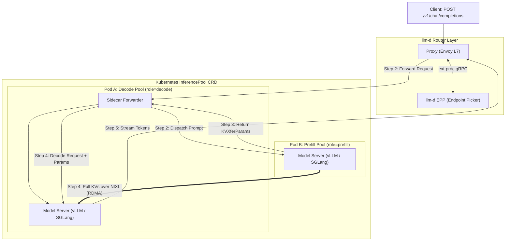
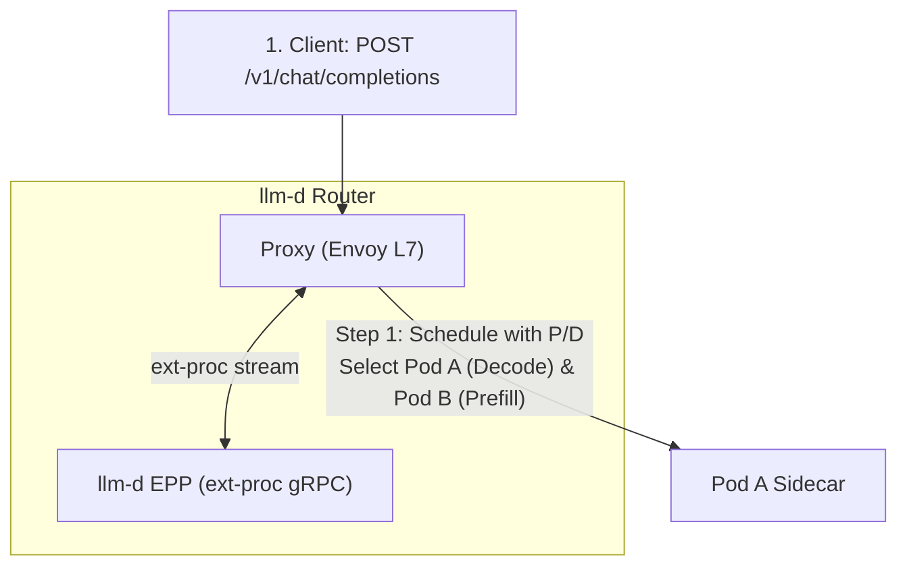
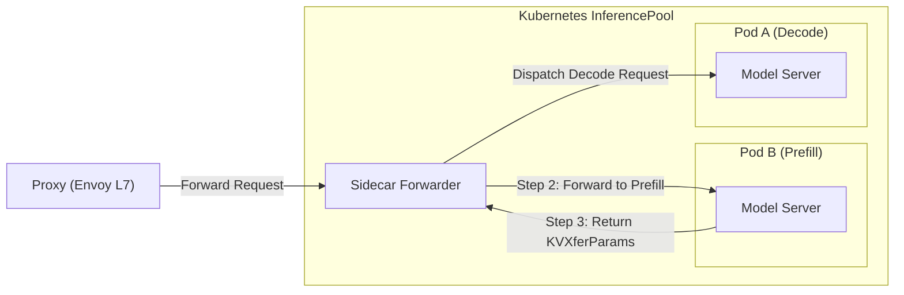
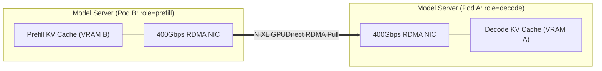
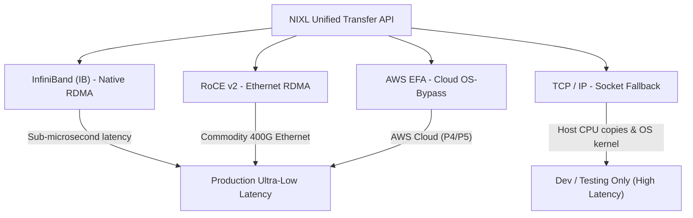
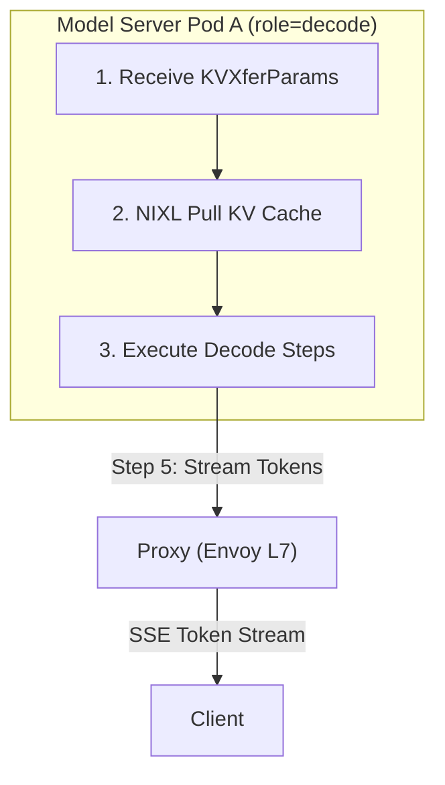

Day 13/30 of inference infrastructure

prefill-decode disaggregation in llm-d: epp routing, sidecar orchestration, and nixl kv transfer

yesterday on day 12 we scaled beyond single servers to deploy multi-node GPU clusters, set up dedicated prefill and decode worker pools, and looked at how RDMA transfers KV cache tensors between nodes.

today we take a deep dive into the exact architectural flow of prefill/decode (P/D) disaggregation inside the llm-d ecosystem. we will trace how an incoming request moves step-by-step through the llm-d router, the endpoint picker, the routing sidecar, and NIXL high-speed KV cache transfer.

---

## 1. why disaggregate prefill and decode?

prefill (compute-bound prompt matrix math) and decode (memory-bandwidth-bound token streaming) fight for GPU resources when collocated, causing severe latency spikes.

**llm-d** disaggregates them into specialized worker pools:

* **prefill workers** (`llm-d.ai/role=prefill`): high-compute GPU nodes for prompt ingestion.
* **decode workers** (`llm-d.ai/role=decode`): high-VRAM nodes for token generation.

here is the complete system architecture diagram:

---

## 2. step 1: request ingress & llm-d EPP dual-pod scheduling

you send an HTTP request (`POST /v1/chat/completions`) containing your prompt to the cluster.

the request arrives at the **llm-d Router**, which consists of an Envoy L7 proxy and the **llm-d EPP** (Endpoint Picker Plugin).

### how EPP picks both pods

standard proxy routers pick only a single target pod. for P/D disaggregation, EPP must schedule **two separate worker pods**: one for prefill and one for decode.

when the Proxy forwards HTTP request headers to EPP over gRPC `ext-proc` (external processing protocol), EPP runs its `disagg-profile-handler`:

1. **decode worker selection**: EPP runs its decode routing profile (checking cache prefix matches, active session counts, and VRAM headroom) to select **Pod A** (`role=decode`).
2. **disaggregation decider**: EPP evaluates whether the prompt length or cluster state requires disaggregation (for example, prompt token count > 512).
3. **prefill worker selection**: if disaggregation is triggered, EPP runs its prefill routing profile to pick an available **Pod B** (`role=prefill`).

EPP attaches the chosen prefill pod address as a custom HTTP header (`x-prefiller-host-port: 10.244.2.14:8000`) and returns control to the Proxy.

### Envoy ext-proc header mutation protocol

the Envoy proxy communicates with EPP over gRPC streaming using Envoy's `ProcessingRequest` protocol.

when EPP evaluates the dual-pod decision, it responds with a header mutation object that instructs Envoy to inject `x-prefiller-host-port` into the request downstream headers without parsing or altering the heavy JSON prompt payload body.

---

## 3. step 2 & 3: sidecar forwarding & prefill processing

the Proxy routes the request payload containing the `x-prefiller-host-port` header to the **Sidecar** located in front of Decode Pod A.

### execution in the prefill node

1. **request dispatch**: the Sidecar reads the `x-prefiller-host-port` header and forwards the prompt payload to Pod B's Model Server (`role=prefill`).
2. **prefill execution**: Pod B processes the full prompt matrix multiplication pass across its GPU cores, populating key-value (KV) matrices for every attention layer.
3. **KV memory registration**: Pod B registers the newly calculated KV cache buffers in GPU VRAM with its network transport layer (NIXL).
4. **returning transfer parameters**: instead of generating text tokens, Pod B finishes prefill execution and returns lightweight transfer parameters (**`KVXferParams`**) back to the Sidecar.

### what `KVXferParams` contains

`KVXferParams` carries all memory pointers and network credentials required for remote VRAM access:

* **prefill node network address**: IP address and gRPC/RDMA port of the prefill worker.
* **remote memory handles**: GPU memory address pointers where KV cache tensors reside.
* **RDMA remote keys (`rkey`)**: security tokens granting one-sided read access to VRAM memory blocks.
* **tensor metadata**: block offsets, layer count, head dimension, number of KV heads, and total byte size.

---

## 4. step 4: NIXL KV cache transfer & network transports (IB, RoCE, EFA, TCP)

once the Sidecar receives `KVXferParams` from Pod B, it hands off the decode request along with `KVXferParams` to **Model Server Pod A** (`role=decode`).

now Pod A needs the KV cache stored in Pod B's VRAM.

### what is NIXL (Network Interchange Transfer Layer)?

**NIXL** (NVIDIA Inference Xfer Library / Network Interchange Transfer Layer) is the unified memory transfer abstraction layer used by modern LLM engines like vLLM and SGLang.

NIXL operates on a **one-sided PULL model**: Decode Pod A uses `KVXferParams` to issue direct read requests to Prefill Pod B's VRAM. Pod B's GPU compute loops are never paused to handle transfer operations.

within a single server node, GPUs transfer tensors over NVLink at up to 900 GB/s. when scaling across nodes in a Kubernetes cluster, NIXL bridges physical server boundaries by mapping GPU memory spaces across network interface cards (NICs) over PCIe Gen5 buses.

---

### deep dive: comparing network transport backends in NIXL

NIXL supports multiple underlying transport mechanisms. choosing the right transport fabric dictates your inter-node KV transfer latency:

#### 1. InfiniBand (IB)

InfiniBand provides native, hardware-level RDMA built specifically for AI superclusters. InfiniBand host channel adapters (HCAs) communicate directly over PCIe Gen5 buses to stream tensors between GPUs.

data moves from Pod B's VRAM over the InfiniBand switch directly into Pod A's VRAM with hardware credit flow control. this delivers 400G to 800G bandwidth, transferring 100MB of KV cache in under 3ms.

#### 2. RoCE v2 (RDMA over Converged Ethernet)

RoCE v2 encapsulates RDMA transport packets inside standard UDP/IP Ethernet frames. this lets you run GPUDirect RDMA over enterprise Ethernet switches without InfiniBand cabling.

using Priority Flow Control (PFC) and ECN at the switch layer creates a lossless network environment. it achieves near-InfiniBand speeds (3ms to 5ms for 100MB transfers) at lower hardware cost.

#### 3. AWS EFA (Elastic Fabric Adapter)

AWS EFA is a custom cloud network interface for AWS GPU instances (like P4 and P5). it bypasses the host operating system kernel using the libfabric interface.

this allows user-space model servers to stream KV tensors directly over AWS network hardware within VPC environments without requiring custom physical switches.

#### 4. TCP fallback & why it fails in production

TCP/IP socket transport allows you to test P/D disaggregation locally on single-node dev setups without needing RDMA network interface cards.

in production, TCP destroys latency. data must be copied from GPU VRAM to host RAM, passed through the OS kernel stack, sent over socket buffers, and copied back into remote VRAM.

these CPU memory copies and kernel context switches add 50ms to 200ms of transfer latency, completely wiping out the performance gains of prefill/decode disaggregation.

| transport backend | RDMA support | CPU overhead | transfer latency (100MB) | recommended usage |
| :--- | :--- | :--- | :--- | :--- |
| **InfiniBand (IB)** | Native Hardware | 0% (GPUDirect) | ~2.5 - 3.5 ms | On-prem / Bare-Metal AI Superclusters |
| **RoCE v2** | Ethernet UDP | 0% (GPUDirect) | ~3.5 - 4.5 ms | High-Performance Ethernet Data Centers |
| **AWS EFA** | OS-Bypass | ~1-2% | ~4.0 - 6.0 ms | AWS Cloud GPU Deployments (P4/P5) |
| **TCP / IP** | None | High (Kernel Copies) | ~50 - 200 ms | Local Development & Testing Only |

---

## 5. step 5: decode execution & InferencePool lifecycle

with the KV cache transferred into Pod A's VRAM, Pod A begins token generation.

### 1. token streaming

Pod A runs its standard autoregressive decode loop. for each generated token:

1. it appends the new key-value vector to its local KV cache.
2. it streams the output token string back through the Sidecar and Proxy to the client via Server-Sent Events (SSE).

### 2. Kubernetes InferencePool CRD management

both worker pools are grouped together under a single Kubernetes custom resource definition (CRD) called the **`InferencePool`**.

the `InferencePool` acts as the native Kubernetes bridge between Layer 3 routing and Layer 4 backend pods:

* **role-based pool targets**: defines distinct `poolTargets` for prefill workers (`llm-d.ai/role=prefill`) and decode workers (`llm-d.ai/role=decode`).
* **EPP endpoint picker binding**: references the `endpointPickerRef` service so Envoy proxy and Gateway API controllers route traffic according to EPP scheduling rules.
* **independent autoscaling**: allows Kubernetes Horizontal Pod Autoscalers (HPA) and KEDA to scale prefill replicas based on prompt ingestion load and decode replicas based on active streaming sessions.

---

## 6. end-to-end request lifecycle summary

to trace the full lifecycle from request arrival to response completion:

| step | component | action | detail |
| :--- | :--- | :--- | :--- |
| **1** | **llm-d Router (Proxy + EPP)** | Schedule request with P/D | Envoy sends `ext-proc` to EPP; EPP selects Decode Pod A and Prefill Pod B. |
| **2** | **Sidecar** | Forward request to Prefill | Sidecar receives dual-pod decision and dispatches prompt to Prefill Pod B. |
| **3** | **Prefill Pod B** | Process prefill & return params | Pod B computes KV cache in VRAM and returns `KVXferParams` to Sidecar. |
| **4** | **Decode Pod A** | Pull KVs via NIXL | Pod A receives `KVXferParams` and pulls KV tensors directly from Pod B VRAM over RDMA. |
| **5** | **Decode Pod A** | Process decodes & stream | Pod A runs decode loop using pre-populated KV cache and streams output tokens back to client. |

---

## 7. landmark resources & references

references:

* [llm-d: P/D Disaggregation Architecture & Foundation Guide](https://llm-d.ai/docs/well-lit-paths/foundations/pd-disaggregation)
* [llm-d: CNCF Sandbox Architecture & Foundation Overview](https://llm-d.ai/docs/well-lit-paths/foundations/optimized-baseline)
* [llm-d GitHub Repository](https://github.com/llm-d/llm-d)

---

now that we understand how llm-d orchestrates P/D disaggregation across router, sidecar, and NIXL transport layers (IB, RoCE, EFA), how do we handle prefix cache hits across disaggregated nodes when multiple users share common prompt templates?

that is where we head next on day 14 when we examine disaggregated prefix caching and index sync protocols!
