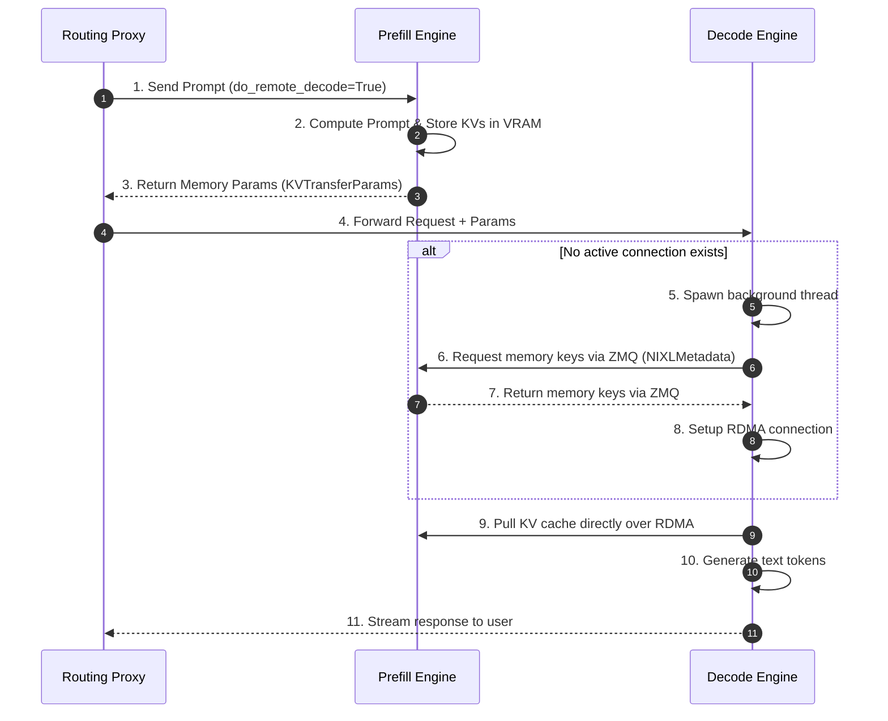
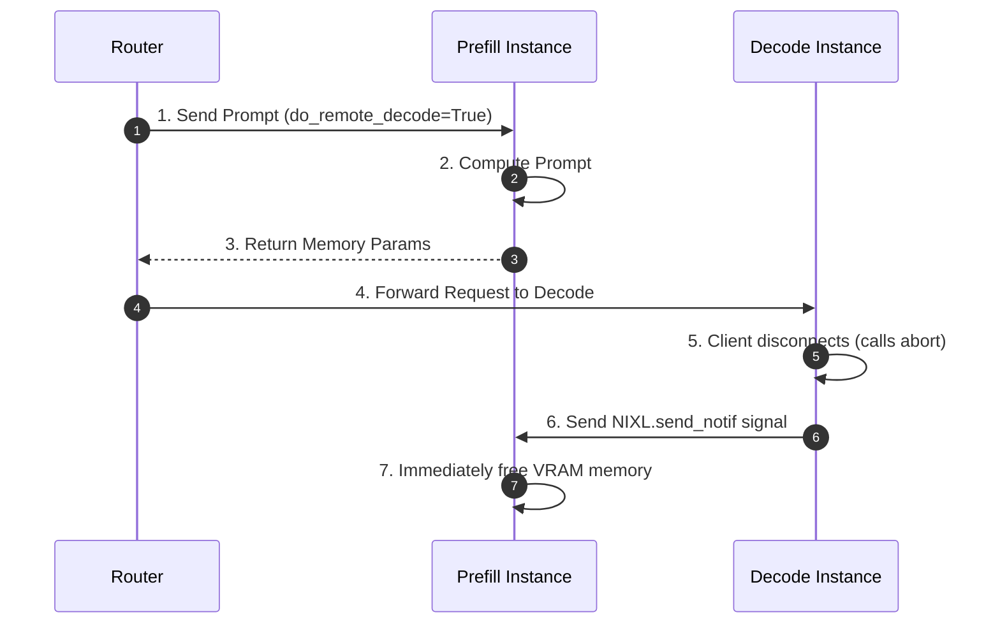
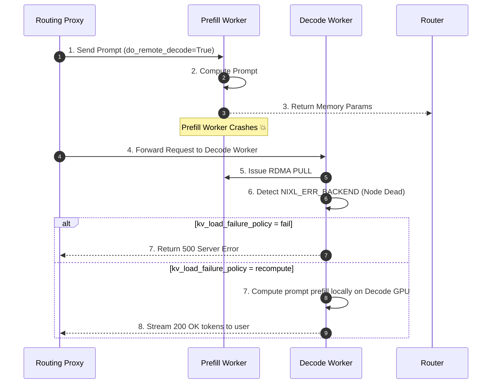
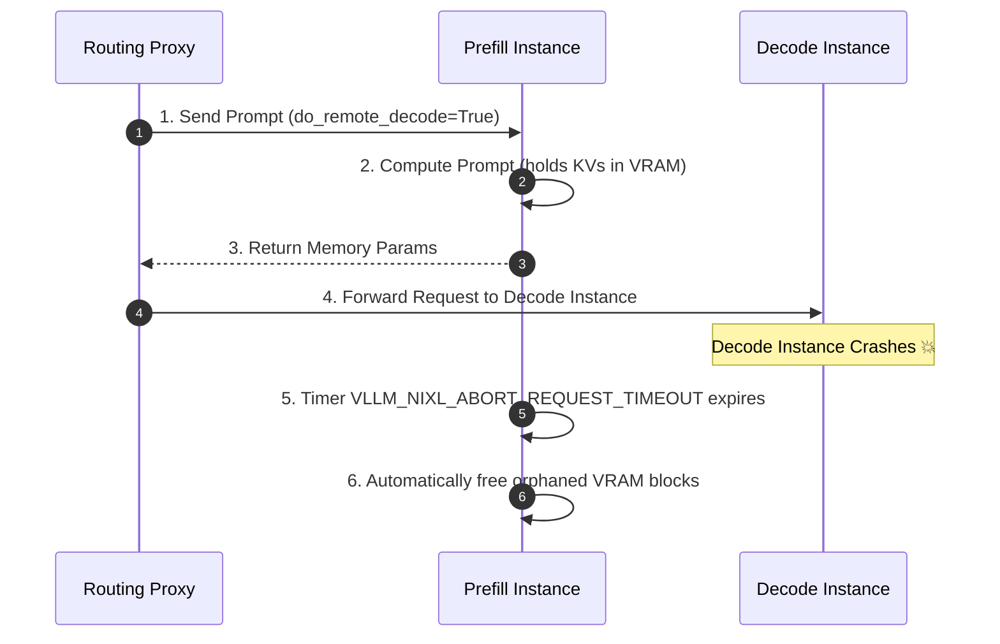

Day 14/30 of inference infrastructure series

pd disaggregation fault tolerance: connection handshake, request cancellation, prefill crash, and decode crash

yesterday on day 13 we traced how an incoming prompt moves step-by-step through the llm-d router, how EPP schedules dual pods, and how NIXL streams KV cache tensors directly over RDMA from a prefill worker to a decode worker.

today we look at what happens under four key operational scenarios in disaggregated serving: setting up new RDMA connection handshakes, handling early request cancellations, recovering from prefill worker crashes, and reclaiming VRAM when decode workers crash.

---

## 1. connection handshake (in simple terms)

in a disaggregated LLM serving cluster, prefill workers and decode workers run on completely separate GPU servers across the network fabric.

when a decode GPU worker receives a request with KV cache parameters from a prefill GPU worker it hasn't talked to before, it must set up a direct RDMA connection before it can pull memory over the network.

think of it like exchanging phone numbers before making a direct call.

### how the connection handshake works step-by-step

the prefill worker processes your prompt matrix multiplication pass, saves the calculated key-value (KV) cache tensors in its local GPU VRAM, and returns memory parameters (`KVTransferParams`) back to the proxy.

the routing proxy forwards your request along with `KVTransferParams` to the chosen decode worker.

the decode worker checks if it already has an open RDMA network pipe connected to that prefill worker. if no connection exists, a background thread contacts the prefill worker over ZeroMQ (`ZMQ`) to fetch its memory access keys (`NIXLMetadata`).

the prefill worker responds over ZMQ with its virtual memory base addresses, remote memory keys (`rkey`), host device IDs, and Infiniband queue pair parameters.

the decode worker uses `NIXLMetadata` to open a direct point-to-point RDMA queue pair channel between the two GPUs across the network fabric.

once connected, the decode worker issues a zero-copy `NIXL READ` command to pull the KV cache tensors directly into its own GPU VRAM across PCIe and network switches.

after loading the KV cache blocks into local memory, the decode worker enters its token generation loop and streams text back to the proxy.

### why on-demand handshakes keep things fast

instead of pre-connecting every GPU pod in your cluster to every other GPU pod (which wastes network queue pair resources), connection handshakes happen on demand only when a request is scheduled between two nodes.

once `Pod A` and `Pod B` complete their initial handshake, the decode worker caches the connection handle in memory. future requests between these two pods skip the ZMQ exchange entirely and pull KV cache tensors instantly.

using a separate background thread for control-plane ZMQ handshakes ensures network setup never freezes or stutters the decode worker's main GPU inference stream.

on-demand handshakes allow cluster operators to add or remove prefill worker nodes on the fly without needing to restart existing decode instances or update static routing tables.

caching connection handles ensures that the control-plane overhead of ZeroMQ metadata exchange is paid only once per worker pair across millions of inference requests.

isolating connection setup to individual worker pairs keeps cluster networking modular, allowing large GPU fleets to auto-scale smoothly under dynamic traffic patterns.

point-to-point transport channels protect network stability, ensuring a temporary connection drop between two pods never disrupts tensor transfers across other worker nodes.

on-demand connection bootstrapping strikes the perfect balance between network memory efficiency and ultra-fast tensor streaming performance.

reusing existing connection channels avoids redundant network handshakes, keeping your Time to First Token (TTFT) extremely low under heavy workloads.

dynamic connection pooling ensures that idle network sockets are managed efficiently across large multi-node clusters.

---

## 2. request cancellation (in simple terms)

when users close their browsers or cancel streaming text requests mid-generation, disaggregated clusters must pass abort signals across physical servers.

when a user closes their browser or aborts a streaming HTTP request mid-generation, a disaggregated cluster must pass cancellation signals across nodes to stop GPU matrix work and free remote VRAM memory.

think of it like calling a restaurant prep kitchen to cancel an order after the waiter left the table.

### how cross-pod cancellation works step-by-step

the router sends your prompt prefill pass to the prefill instance, which computes the prompt attention matrix and returns memory transfer parameters.

the router forwards the request to the target decode instance so it can pull tensors and stream generated text.

if you close your browser or drop your client HTTP connection mid-stream, the decode instance detects the broken socket and stops its local CUDA generation loop.

the decode instance cancels active CUDA kernel streams associated with that request ID and immediately releases its local GPU memory pages.

because the prefill instance lives on a separate physical server across the network, the decode instance sends a fast, non-blocking control signal (`NIXL.send_notif`) to notify the prefill instance that the request was cancelled.

upon receiving `NIXL.send_notif`, the prefill instance looks up the request ID in its memory manager, revokes the registered remote memory key, and recycles the held KV cache blocks back to its available VRAM pool.

### why cancellation signaling prevents memory leaks

without explicit cross-pod cancellation signals, prefill workers would hold onto VRAM memory blocks for disconnected requests until background timers expire, wasting precious GPU memory.

in busy production clusters where 10% to 20% of long generations are cancelled early by users, instant cancellation propagation keeps prefill GPU memory free for incoming prompts.

stopping pending prefill matrix passes immediately prevents GPUs from wasting TFLOPS on requests whose client connections are already dead.

using dedicated sideband control channels ensures cancellation notifications travel across the network instantly without getting stuck behind heavy tensor data transfers.

cross-pod cancellation signaling ensures GPU memory pools stay contiguous and healthy, avoiding unexpected CUDA Out-Of-Memory (OOM) errors during heavy traffic spikes.

sideband control RPCs operate asynchronously outside main CUDA forward streams, preventing lock contention and keeping memory deallocations ultra-fast.

instant VRAM block recycling protects overall cluster throughput by maintaining high GPU memory headroom for newly scheduled user prompts.

cross-pod cancellation notifications keep memory usage predictable during heavy user disconnect spikes, ensuring smooth text generation for active users.

releasing unused prefill memory blocks immediately keeps GPU memory utilization efficient across all active pods in your cluster.

non-blocking sideband signals guarantee that user cancellation events process in sub-millisecond timeframes.

---

## 3. prefill crash (in simple terms)

hardware crashes and GPU driver panics are unavoidable when serving LLMs across hundreds of physical cluster nodes.

what happens if a prefill worker finishes prompt prefill, returns memory parameters to the proxy, but crashes (`P crashes 💥`) right before the decode worker tries to pull the KV cache tensors over the network?

think of it like ordering food at a counter, but the prep chef goes home before sending the plate to your table.

### how prefill crash recovery works step-by-step

the prefill worker finishes prompt prefill, sends memory parameters back to the proxy, and then crashes due to a host error or CUDA driver panic.

the proxy (unaware the prefill node just died) sends the decode request to the designated decode worker.

the decode worker attempts to pull remote KV cache tensors over RDMA, but the prefill node is completely offline.

the NIXL network layer catches the connection failure and raises a `NIXL_ERR_BACKEND` error event inside the decode worker.

the decode worker checks its configured `kv_load_failure_policy` setting:

if `kv_load_failure_policy = fail`, the decode worker aborts and returns an HTTP 500 error to the proxy to fail fast and maintain strict latency limits.

if `kv_load_failure_policy = recompute`, the decode worker catches `NIXL_ERR_BACKEND`, allocates local VRAM on its own GPU, processes the prompt prefill pass locally from scratch, and streams tokens back to you with an HTTP 200 success response.

### why failure policies give you control over reliability

choosing `recompute` guarantees 100% availability for your application because requests succeed even when prefill hardware crashes.

falling back to local recompute adds a small Time to First Token (TTFT) delay for affected requests, but avoids returning ugly 500 server errors to end users.

vLLM's chunked prefill scheduler manages local fallback passes alongside active decode batches, preventing streaming micro-stutters for other active users.

isolating prefill crashes to individual request attempts prevents single-node hardware failures from cascading into cluster-wide outages.

configurable failure policies let cluster operators choose between fail-fast latency bounds and maximum service uptime based on application requirements.

recomputing prefill locally on decode GPUs isolates network errors, keeping client streaming sessions active during major switch reboots or driver panics.

embedding backend error detection into the NIXL transport layer allows decode workers to detect prefill crashes in milliseconds without waiting on slow network timeouts.

dynamic failure policies give infrastructure teams the flexibility to tune system resilience to match strict application SLA targets.

local recompute fallback guarantees uninterrupted user sessions during unexpected hardware restarts or data center network glitches.

automatic backend error handling prevents transient prefill restarts from affecting downstream client streaming throughput.

---

## 4. decode crash (in simple terms)

when decode instances experience process crashes or pod restarts mid-pipeline, remote prefill instances must automatically clean up VRAM allocations.

what happens when a prefill worker finishes prefill and holds KV cache blocks in VRAM, but the decode worker crashes (`D crashes 💥`) before it can pull tensors or send a cancellation message?

because the decode worker is dead, it cannot send an `NIXL.send_notif` signal to release remote memory. prefill workers solve this using automated background lease timers.

### how decode crash VRAM cleanup works step-by-step

the prefill instance processes your prompt, registers KV cache buffers in GPU VRAM, and returns memory parameters to the router while keeping the physical memory blocks allocated.

the router forwards the request to the target decode instance.

right at that moment, the decode instance crashes due to an unrecoverable engine exception or node reboot.

because the decode instance died instantly, no tensor transfer happens, and no explicit `NIXL.send_notif` cleanup message is ever sent to the prefill instance.

the prefill instance maintains a background timer (`VLLM_NIXL_ABORT_REQUEST_TIMEOUT`) for every active KV cache allocation returned to the router.

if `VLLM_NIXL_ABORT_REQUEST_TIMEOUT` expires without receiving a tensor transfer or cancellation notification, the prefill instance marks the request as abandoned and automatically recycles the held VRAM blocks.

### why lease timers keep prefill nodes self-healing

without automated lease timeouts, crashed decode nodes would leave orphaned KV allocations permanently occupying prefill GPU VRAM.

enforcing a bounded timeout lease window lets prefill instances self-heal and recover 100% of their VRAM capacity automatically during node crashes or network splits.

lease reclamation cleans up orphaned allocations cleanly during Kubernetes pod evictions or rolling image upgrades without requiring manual operator intervention.

background lease sweeps run continuously without freezing active GPU prefill matrix passes, preserving high inference throughput across the cluster.

tuning the lease timeout duration balances fast memory recovery against network jitter resilience, keeping prefill nodes stable under volatile workloads.

automated lease monitoring guarantees that unexpected decode crashes never cause silent memory degradation over long production serving runs.

background lease sweeps protect prefill memory pools automatically during node restarts, preventing VRAM leaks from reducing cluster capacity.

automated lease management provides robust self-healing guarantees for disaggregated prefill worker pools operating under heavy production load.

self-healing lease timeouts ensure prefill GPU memory pools automatically restore full capacity even during major node restart events.

periodic lease garbage collection runs in the background to ensure steady memory availability across long-running clusters.

---

## 5. summary matrix of disaggregation operational flows

here is how the four core operational scenarios compare side-by-side:

| operational flow | primary trigger | network mechanism | error / timeout signal | VRAM reclamation strategy | user impact |
| :--- | :--- | :--- | :--- | :--- | :--- |
| **connection handshake** | First request between a decode & prefill pair | On-demand ZMQ metadata exchange followed by RDMA setup | ZMQ transport error | Normal release upon decode completion | Seamless; slight one-time bootstrap overhead |
| **request cancellation** | Client closes browser or aborts HTTP stream | Asynchronous cross-pod `NIXL.send_notif` signal | Client disconnect event | Immediate VRAM block deallocation on prefill node | Request halted; VRAM freed instantly |
| **prefill crash** | Prefill node crashes after returning parameters | `NIXL_RDMA_READ` attempt fails over RDMA link | `NIXL_ERR_BACKEND` | Node reboot clears VRAM | Success (200) via local recompute or 500 error |
| **decode crash** | Decode node crashes after prefill completes | Background lease monitoring on prefill worker | `VLLM_NIXL_ABORT_REQUEST_TIMEOUT` | Prefill engine forcibly reclaims VRAM after timeout | Request fails; prefill VRAM recovered safely |

---

## 6. summary & what comes next

managing disaggregated LLM serving at scale requires clear operational primitives for connection bootstrapping, signal propagation, and failure recovery.

by combining on-demand ZMQ connection handshakes, asynchronous `NIXL.send_notif` cancellation signals, configurable `kv_load_failure_policy` recomputation, and automated `VLLM_NIXL_ABORT_REQUEST_TIMEOUT` lease reclamation, disaggregated serving clusters remain resilient against single-node crashes and network disruptions.

now that we have covered how disaggregated clusters establish connections, propagate cancellations, and recover from prefill and decode crashes, how do we measure the performance impact of these operational choices on real-world cluster throughput and TTFT latency?

tomorrow on day 15 we dive into benchmarking disaggregated LLM infrastructure under varying prefill and decode pool ratios!
