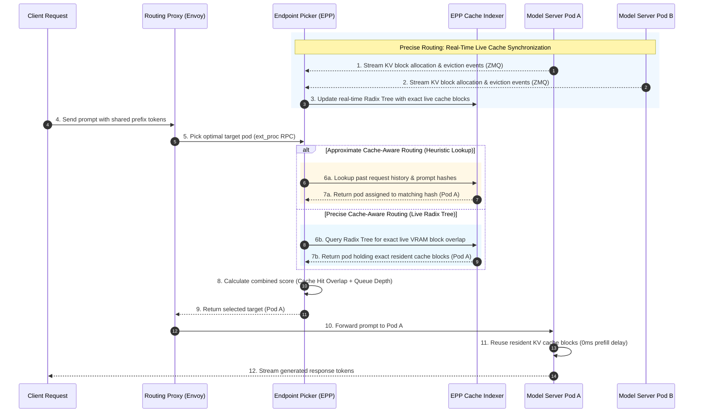

Day 15/30 of inference infrastructure

prefix-cache aware routing: approximate vs precise cache matching

yesterday on day 14 we looked at fault tolerance in disaggregated serving — how nodes establish RDMA connection handshakes, how cancellation signals propagate across physical servers, and how the cluster recovers when prefill or decode workers crash.

we already know from our earlier discussions on KV cache management why prefix reuse matters: sending a prompt to a node holding matching key-value cache blocks skips redundant prefill matrix math and slashes Time to First Token (TTFT) from hundreds of milliseconds to single digits.

today we look at prefix-cache aware routing — how the llm-d endpoint picker (EPP) discovers and routes requests to GPU pods holding matching key-value cache blocks, comparing approximate heuristic tracking with precise event-driven cache indexing.

---

## 1. how approximate and precise routing work under the hood

the endpoint picker (EPP) inside the llm-d router is responsible for picking the best GPU pod for every incoming prompt.

to pick the right pod, EPP needs to know which pod holds which prefix cache blocks.

it does this using two distinct mechanisms: approximate routing and precise routing.



### step-by-step flow of prefix routing

the sequence diagram above shows how an incoming user request moves through the routing control plane.

first, in precise mode, backend model server pods stream live cache allocation and eviction events over ZeroMQ background channels to EPP, keeping the Radix Tree index synchronized with physical GPU VRAM.

when a client sends a prompt payload, the routing proxy pauses the request and calls EPP to ask which pod should handle the prompt.

EPP takes the prompt tokens and evaluates cache locality using either approximate hash lookups or precise Radix Tree prefix matching.

after computing cache overlap scores and factoring in current queue lengths across candidate pods, EPP selects pod a and returns the routing decision to the proxy.

the proxy forwards the request to pod a, which reuses its resident KV cache blocks, skips redundant prefill matrix math, and streams response tokens back to the user.

### why routing needs to balance locality and state accuracy

the fundamental challenge in prefix routing is keeping the router's view of GPU memory synchronized with the actual state of physical VRAM across dozens of worker nodes.

when processing short system prompts, cache hits save a few dozen milliseconds of prefill compute.

however, when serving massive 100,000+ token retrieval-augmented generation (RAG) contexts or agent chat histories, a cache hit avoids reading gigabytes of attention matrices from high-bandwidth memory (HBM), reducing prefill latency from several seconds to single-digit milliseconds.

skipping these expensive prefill calculations frees up streaming multiprocessor (SM) compute cycles, allowing GPUs to process decode tokens for other concurrent user requests at higher throughput.

in high-concurrency production setups serving multi-tenant LLM traffic, prefix-aware routing is what prevents popular system prompts from triggering prefill storms across your entire GPU cluster.

by directing requests with identical prompt headers to the same set of worker nodes, the control plane ensures high cache hit rates without requiring manual prompt pinning or static pod partitioning.

if the router's index is too slow or inaccurate, requests land on cold pods and suffer expensive prefill recomputations, wasting precious HBM memory bandwidth.

if the index synchronization protocol is too heavy, the control plane gets bogged down by network traffic and processing overhead.

approximate routing solves this by prioritizing zero control-plane overhead, relying entirely on internal request history.

precise routing solves this by prioritizing absolute memory accuracy, streaming real-time allocation and eviction events straight from the inference engines.

---

## 2. approximate routing (heuristic matching)

approximate routing relies on historical request traffic patterns to guess where cache blocks live without talking to the backend GPUs.

when a request passes through the router, EPP computes cryptographic or fast rolling hashes for fixed chunks of the prompt tokens, like 16-token or 64-token blocks.

EPP saves these token block hashes alongside the pod ID it selected in a local in-memory lookup table.

when a new request arrives, EPP breaks its prompt into identical block sizes, hashes them, and checks its local lookup table.

if EPP sees that it routed a request with the exact same prefix hashes to pod a ten seconds ago, it infers that pod a is likely still holding those cache blocks in VRAM.

EPP assigns a high locality score to pod a and routes the new request there.

### how token block hashing works

prompt text is first broken down into discrete token IDs using a fast tokenizer or prefix hashing function.

instead of hashing individual tokens, EPP groups tokens into fixed block sizes matching the physical block size of the engine's PagedAttention allocator.

for example, if the engine uses 16-token blocks, EPP computes rolling hashes over contiguous 16-token slices of the prompt.

the first 16 tokens produce hash 1, tokens 17 through 32 produce hash 2, and so forth along the prompt sequence.

if block sizes are mismatched between the router and the engine (for example, if the router uses 64-token chunks while vLLM allocates 16-token pages), partial prefix matches cannot be identified accurately, resulting in missed cache opportunities.

this block-aligned hashing ensures that the router's hash tokens correspond directly to physical memory blocks allocated in GPU VRAM.

EPP stores these block hash chains in a fast hash map keyed by block sequence signatures.

to score candidate pods, EPP calculates the prefix overlap ratio by comparing the longest matching contiguous sequence of block hashes in the request against entries in its historical lookup table.

### pros and cons of approximate routing

the biggest pros of approximate routing are zero setup hassle and zero network overhead.

your router stays completely self-contained. model engines like vLLM or SGLang run stock containers without needing any custom event sidecars, ZMQ sockets, or engine modifications.

there are zero control-plane network messages streaming between engine pods and the router, keeping your cluster network fabric clean and lightweight.

the main cons come down to guesswork and blind spots.

because EPP cannot see inside GPU memory, it has no idea when vLLM evicts cached blocks under heavy VRAM pressure.

if pod a gets flooded with heavy requests and drops an 8,000 token prefix, EPP still assumes pod a holds that cache.

EPP routes the next request to pod a expecting a fast hit, but pod a suffers a surprise cache miss and recomputes prefill from scratch.

approximate routing also gets fooled when worker nodes crash or when different prompts share identical system prefixes, accidentally crowding one pod while leaving others idle.

to mitigate stale entries, EPP relies on time-to-live (TTL) expiration timers for stored hashes, but short TTLs decrease hit rates while long TTLs increase stale routing errors.

fast rolling hashes like Murmur3 offer high throughput, but hash collisions can occasionally lead EPP to misidentify different prompt prefixes as identical blocks.

### hash map expiration and memory bounds

because the router's historical lookup table resides in memory, EPP caps the maximum number of stored block hashes to prevent control-plane memory leaks.

when the hash map reaches capacity, EPP uses least-recently-used (LRU) eviction to drop the oldest prompt hashes, ensuring that active system prompts remain indexed while cold historical requests are purged.

stored block hashes also carry a configurable time-to-live (TTL) timestamp. if no request matches a given hash chain for several minutes, EPP automatically marks the entry as expired, assuming that the backend GPU engine has likely evicted those physical VRAM blocks during intervening inference steps.

it works great for steady, repetitive traffic with low VRAM churn, but falls short under heavy dynamic workloads.

---

## 3. precise routing (event-driven live tracking)

precise routing eliminates guessing by giving the router real-time visibility into the exact KV cache contents of every GPU pod in your cluster.

model servers emit high-frequency background events over zero-copy messaging sockets like ZeroMQ (ZMQ) whenever their cache state changes.

when vLLM allocates GPU memory blocks for a new prompt, it publishes an allocation event containing the block virtual memory IDs, pod IP, and token block hashes over ZMQ.

when vLLM frees memory or evicts older cache blocks due to LRU memory pressure, it immediately publishes an eviction event.

EPP subscribes to these live ZMQ event streams from all active model server pods across the cluster.

### pub-sub event streaming architecture

vLLM instances run a lightweight background event publisher thread connected to a ZeroMQ PUB socket.

EPP maintains a ZeroMQ SUB socket connected to all model server pods, filtering incoming messages by event topic prefixes.

allocation messages carry token block hashes alongside physical block sequence numbers, while eviction messages broadcast freed block IDs.

ZMQ subscriber sockets apply prefix string filters at the socket level, allowing EPP to discard irrelevant event topics directly in socket buffers before copying memory to user space.

by separating control-plane event pub-sub channels from main HTTP inference endpoints, event broadcasts never interfere with prompt token streaming or model weights loading.

### radix tree indexing for instant lookup

EPP feeds these incoming allocation and eviction events into a centralized internal data structure called a Radix Tree or Trie.

the Radix Tree stores prefix paths where each node represents a sequence of prompt tokens and maps directly to the active GPU pod IDs holding those exact blocks in VRAM.

when an allocation event arrives from pod a for block chain [hash1 -> hash2 -> hash3], EPP inserts those nodes into the Radix Tree and attaches pod a to the leaf node.

when an eviction event arrives from pod a for block hash1, EPP prunes hash1 from pod a's branch in the Radix Tree.

if two requests share the first 500 tokens but diverge afterwards, the Radix Tree branches at block 31, preserving common prefix nodes while maintaining separate child branches for each distinct suffix.

when a new prompt arrives at the router, EPP queries its Radix Tree using the prompt tokens.

the Radix Tree performs a prefix match search, instantly returning the exact pod holding the longest contiguous chain of active KV cache blocks.

because EPP receives eviction signals the instant a block is dropped from GPU memory, its Radix Tree reflects ground truth at all times.

EPP never sends a request to a pod under the false assumption that cache exists when it was actually evicted two milliseconds prior.

### lock-free concurrency and event stream reliability

to handle thousands of requests per second without bottlenecking, EPP maintains its Radix Tree using lock-free read structures or read-copy-update (RCU) primitives.

incoming HTTP requests perform fast read-only traversals of the tree to compute prefix matches in sub-microsecond time frames.

background ZMQ worker threads apply allocation and eviction mutations asynchronously without acquiring global locks.

if a network hiccup or socket queue drop causes EPP to miss an eviction event, the Radix Tree could theoretically retain a ghost reference to a freed block.

to prevent state drift, model servers periodically publish lightweight checksum heartbeat snapshots of their active cache block IDs over ZMQ.

EPP compares these periodic heartbeats against its Radix Tree nodes, silently purging any orphaned block references that are no longer present in physical GPU VRAM.

### handling worker pod reboots and state sync

when a new GPU pod boots up or an existing pod restarts after a crash, its VRAM is completely empty.

the pod publishes a full state reset event over ZMQ, signaling EPP to clear any historical Radix Tree branches previously associated with that pod ID.

this instant state synchronization prevents the router from sending traffic to a restarted pod under the mistaken assumption that old cache blocks survived the reboot.

### pros and cons of precise routing

the major pros of precise routing are near-perfect cache hit ratios and massive latency savings.

by tracking real-time allocation and eviction events, EPP never sends a request to an evicted block, slashing Time to First Token (TTFT) by up to 50x for shared prompt prefixes and saving GPU compute.

the main cons are control-plane overhead and tighter infrastructure coupling.

the router must ingest and process high-volume ZMQ event streams from dozens of GPU pods without introducing scheduling delays.

ZMQ socket buffers must be tuned to prevent packet drops during heavy allocation bursts, avoiding transient state mismatches between physical VRAM and the router's Radix Tree.

engine containers must be configured to run event publisher sidecars with open ZMQ ports, requiring extra setup in your Kubernetes manifests.

---

## 4. balancing cache locality with queue depth

cache locality alone can trap your cluster in a queue bottleneck.

if pod a holds 100% of your prompt prefix in VRAM but has 30 requests waiting in line, sending a 31st request to pod a means it will sit waiting in queue.

meanwhile, if pod b holds only 50% of your prefix but has zero queue depth, pod b can start immediately, finish its 50% prefill pass, and start generating tokens before pod a even begins.

to fix this, EPP calculates a simple composite score for each pod: locality score minus queue depth penalty.

if a pod has high cache match and low queue depth, it wins. if a pod gets congested, its load penalty knocks it down, and EPP shifts traffic to an idle pod with partial cache.

when cluster queue depth rises during traffic bursts, EPP dynamically scales up the load penalty weight while turning down the cache hit weight.

this score adjustment spreads incoming prompts evenly across all available GPUs during peak demand spikes, ensuring that high cache affinity never causes tail latency spikes for active users.

by combining live queue telemetry with cache locality metrics in sub-millisecond RPC lookups, the router achieves optimal global cluster throughput while preserving prefix cache speedups.

in production clusters with mixed prompt lengths, this hybrid scoring approach guarantees that no single GPU pod gets stuck processing backlogged prefills while neighboring GPUs sit idle.

this balance keeps prefix caching fast without creating single-pod traffic jams.

---

## 5. engine startup flags and event types

to enable precise prefix routing, vLLM and SGLang stream KV cache allocation and eviction events to EPP over a background ZeroMQ port (default `5555`).

### vLLM event streaming setup

in vLLM, you pass these startup args to enable prefix caching and open the ZMQ publisher port:

```bash
python3 -m vllm.entrypoints.openai.api_server \
    --model Qwen/Qwen2.5-7B-Instruct \
    --enable-prefix-caching \
    --kv-events-port 5555
```

- `--enable-prefix-caching`: enables PagedAttention prefix reuse inside vLLM.
- `--kv-events-port 5555`: opens ZeroMQ PUB socket on port 5555.
- event types emitted: `KV_ALLOC` (when a new block is cached) and `KV_FREE` (when a block is evicted under memory pressure).

see the [vLLM distributed serving documentation](https://docs.vllm.ai/en/latest/serving/distributed_serving.html) for details.

### SGLang event streaming setup

in SGLang, you pass these startup args to enable RadixAttention cache tracking and event publishing:

```bash
python3 -m sglang.launch_server \
    --model-path Qwen/Qwen2.5-7B-Instruct \
    --enable-radix-cache \
    --zmq-port 5555
```

- `--enable-radix-cache`: enables RadixTree KV block management.
- `--zmq-port 5555`: streams Radix tree node mutations to EPP on port 5555.
- event types emitted: Radix tree node insertion and eviction events.

for full architecture specs, see the [llm-d prefix-cache aware routing documentation](https://llm-d.ai/docs/architecture/advanced/kv-management/prefix-cache-aware-routing).

---

whether you choose approximate hash lookups for zero sidecar overhead or precise ZeroMQ event indexing for maximum TTFT savings, prefix-aware routing ensures your LLM serving cluster reuses every megabyte of resident GPU memory efficiently.

---

tomorrow on day 16 we will explore multi-node tensor parallelism and how KV cache tensors are partitioned and synchronized across NVLink and Infiniband interconnects.
