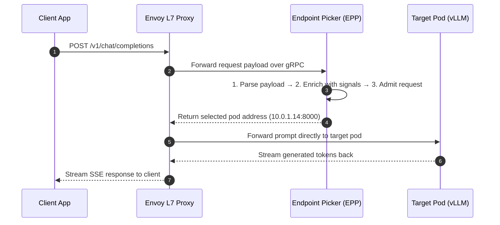

Day 16/30 of inference infrastructure

the brain of llm-d: endpoint picker (epp), request handling, flow control, and dynamic scheduling

yesterday on day 15 we looked at prefix-cache aware routing and how cache locality speeds up prefill execution.

you might wonder: doesn't a vllm pod already handle queues and kv caching internally? why do we need epp?

the answer comes down to local vs global visibility.

a single vllm pod only sees its own GPU. it has no idea what neighboring pods are doing. epp acts as the global brain at the gateway — checking queue depths, KV cache matches, and tenant priority across your entire cluster before picking the best pod for every request.

epp is the endpoint picker which used to be developed directly by kubernetes itself for cloud-native model routing. but later kubernetes migrated completely to llm-d for large scale deployments — which in the sense means kubernetes natively no longer supports llm-inference routing directly on its own, and you should be using llm-d if you want to deploy something at scale.

today on day 16 we examine the core building blocks of epp inside llm-d — covering request handling, flow control, scheduling, and live telemetry data collection.

---

## 1. request handling: processing incoming prompts

the request handling layer inside epp forms the hot path that every incoming prompt passes through before reaching an endpoint decision.

when the proxy receives a client HTTP prompt, it pauses the request and opens a bi-directional stream to epp.



request handling breaks down into three simple steps:

1. **parsing**: reads raw request headers and prompt tokens into an internal format.
2. **signal enrichment**: attaches prefix cache match scores, queue predictions, and latency estimates to the request context.
3. **admission control**: evaluates client SLO targets and drops low-priority requests early if the cluster is completely saturated, protecting GPUs from wasted compute.

---

## 2. flow control: pool defense and tenant fairness

pushing excessive traffic directly onto GPU inference engines causes out-of-memory crashes and severe queuing stalls.

flow control acts as a gateway shield by keeping excess requests in lightweight control plane queues instead of overloading GPU memory.

it organizes traffic into priority bands (such as interactive user requests over background batch processing) and applies fairness algorithms to ensure no single tenant hogs cluster resources.

when backend GPU memory or queue depths hit safety limits, flow control temporarily pauses new dispatches until compute capacity frees up.

---

## 3. request scheduler: filtering, scoring, and picking

once a request is admitted, the request scheduler selects the optimal GPU pod using a three-phase pipeline:

```
All Candidate Pods ──► Filter (Drop unfit pods) ──► Score (Rank by load & cache) ──► Pick Winner
```

1. **filter**: drops pods that cannot serve the request (such as pods missing required model weights or wrong execution roles).
2. **score**: assigns a score to surviving pods based on available GPU VRAM headroom, active queue length, prefix cache matches, and expected latency.
3. **pick**: selects the highest-scoring pod (or uses weighted random selection) and returns its IP address to the proxy.

---

## 4. the data layer: background telemetry updates

for the scheduler to make smart choices, epp needs up-to-date information on every model server in the cluster.

the data layer runs asynchronously in the background so it never slows down live request routing.

it periodically scrapes engine metrics (like queue sizes and KV cache usage) and watches kubernetes pod events so epp immediately knows when pods scale up, scale down, or crash.

---

tomorrow on day 17 we will take all these core epp concepts and put them into action — walking through full production kubernetes yaml manifests, gateway api CRDs, and real-world deployment setups to get your cluster running at scale.
