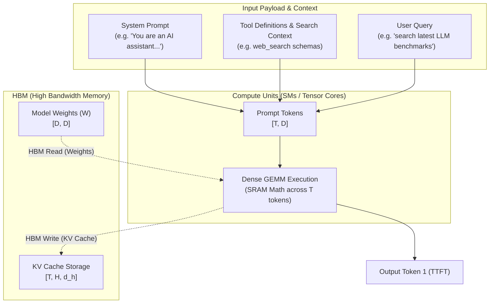
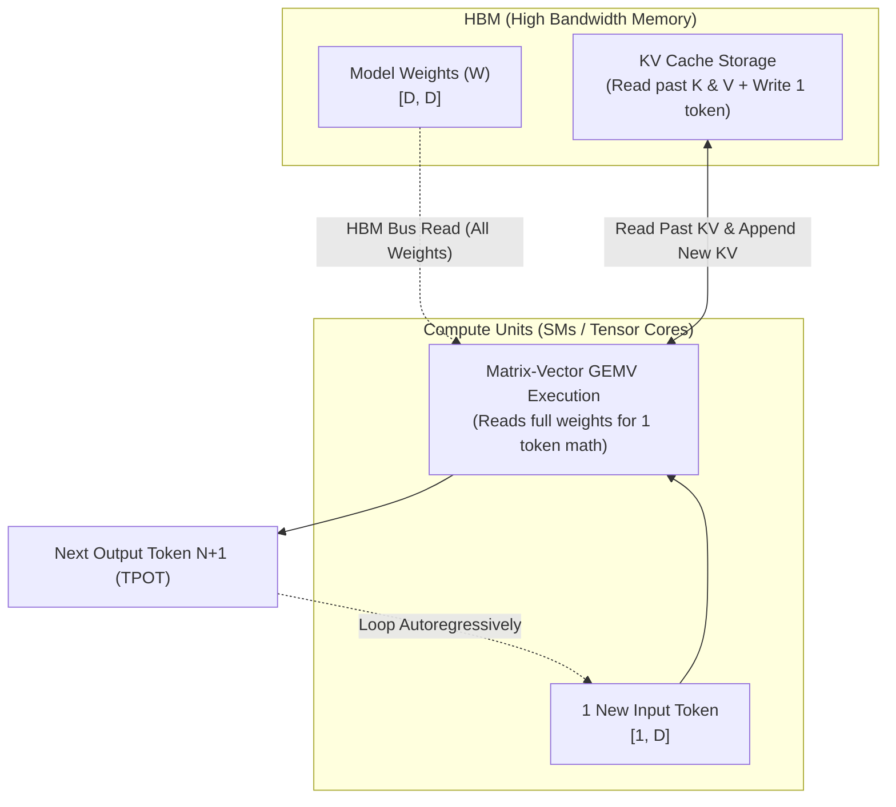

## Day 2/30 of inference infrastructure series

Prefill vs Decode

while day 1 gave us a high level tour of the request lifecycle, today we focus on the two fundamentally different workloads happening inside that lifecycle: prefill and decode

these two phases have different computational patterns,understanding their performance characteristics is key to building efficient inference systems

ref paper:
<https://arxiv.org/html/2401.09670v2>

# Part 1: Prefill

in prefill, the GPU processes the entire input prompt (e.g. 1000 tokens) all at once in a single parallel pass

prompt tokens = system prompt + tool search/definitions + chat context + user query

this operation is powered by GEMM (general matrix multiplication). instead of multiplying one token vector at a time, the GPU stacks all 1000 prompt tokens into a matrix [1000 × D] and multiplies it by the weight matrix [D × D] in one shot

prefill is compute-bound because of high volume arithmetic intensity. every single weight parameter loaded from HBM into GPU registers gets reused 1000 times across all tokens. because the math workload is heavy, GPU compute units (Tensor Cores) run at maximum capacity rather than waiting on memory bandwidth transfers.

this is where we benchmark the GPU's TFLOPS (TeraFLOPS / trillions of floating-point operations per second) because prefill is matrix-heavy, its performance depends on raw compute throughput rather than memory bus speed. when benchmarking prefill, you measure how close your GEMM kernels get to the GPUs TFLOPS ceiling!  

here is the visual breakdown:

# Part 2: Decode

in decode, the GPU generates one token at a time autoregressively in a loop

at each step, the model takes your newly generated token and runs another forward pass to predict the next one. unlike prefill where all prompt tokens process together, decode usually processes only one new token per active sequence

at batch size 1, this operation is GEMV-like (matrix-vector multiplication). your input is a single token vector [1 × D] multiplied against the model weight matrices [D × D] across every layer

with continuous batching, the GPU processes one token from multiple active sequences together. when that happens, the math transforms into a skinny GEMM [B × D] × [D × D], where B is your batch size of active requests

decode is typically memory-bandwidth-bound at low batch sizes. think of it like reading a 140 GB book from GPU memory just to write down one single word

for example, a dense 70B parameter model stored in FP16 or BF16 occupies roughly:

70 billion parameters × 2 bytes ≈ 140 GB

to generate one token for a single sequence, your inference system must stream roughly one full copy of the active weight data across participating GPUs

because each loaded weight is used for very little math during batch-1 decode, arithmetic intensity is extremely low. Tensor Cores finish the math instantly, but stay underutilized because they are constantly waiting for weights to arrive from HBM

decode also reads your existing KV cache and appends new key and value vectors for each generated token. as context length grows, streaming past KV cache becomes another massive source of memory traffic

this is why decode performance is not judged by TFLOPS. instead, the metrics that actually matter are:

* memory bandwidth (TB/s) — how fast weights stream off HBM
* inter-token latency (TPOT) — time between generated tokens
* output throughput — total tokens generated per second
* memory capacity — how many model weights and KV cache blocks fit in VRAM

higher memory bandwidth lets the GPU stream weights and KV cache faster to compute units, shrinking the delay between generated tokens

however, decode is not stuck being memory-bound forever. larger batches increase weight reuse across multiple requests, while quantization cuts the bytes transferred per weight. at large batch sizes, decode shifts back toward being compute-bound

here is the visual breakdown:

