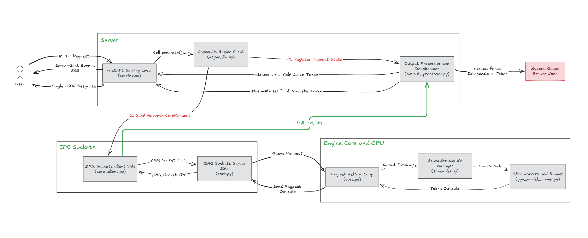

Day 4/30 of inference infrastructure series

vllm & sglang

today we look at how actual LLM serving engines manage this memory and execute requests in production: focusing on what happens inside a single request in a serving engine like vllm & Sglang.

## why traditional web servers fail for llms

traditional web frameworks (like Flask or FastAPI) were built for fast, stateless I/O — a client sends a request, the server fetches data from a database, and returns a complete JSON response in milliseconds.

LLM serving breaks this model in four fundamental ways:

1. long-running generation — a single prompt takes seconds or minutes as tokens are generated iteratively one by one.
2. dynamic memory growth — each newly generated token expands the KV cache footprint in VRAM.
3. varying request lifespans — request A might finish in 10 tokens while request B runs for 1,000 tokens. wrapping PyTorch directly in a raw FastAPI app causes the GPU to sit idle or crash from out-of-memory errors under concurrent traffic.
4. token-by-token streaming — clients expect low latency Server-Sent Events (SSE) token chunks rather than waiting for full sequence completion.

a crazy thing to consider is for the first time in tech history we are not storing anything or reading from a database — instead model weights become the database, and reading memory from HBM becomes the query execution.

this is why the tech world moved from simple web wrappers to specialized runtimes — which we call LLM engines (such as vllm and sglang).

an LLM engine is a stateful runtime that manages continuous batching, GPU VRAM allocation, request queueing, and real-time token streaming for Hugging Face models out-of-the-box.

## what happens inside a single request in vllm

every single request entering a vLLM engine moves through a 6-step execution cycle from prompt input to streamed completion:

* **1. tokenization & queueing** — converts prompt text to integer token IDs via fast Rust tokenizers, wraps the request in a state object, and pushes it to the scheduler queue (`WAITING`).
* **2. prefill phase** — processes all prompt tokens in parallel in a single GPU pass, computes initial KV cache tensors into VRAM, and samples token #1 (setting Time-to-First-Token / TTFT).
* **3. chunked prefill** — splits long prompts into fixed chunks (e.g. 512 tokens) and co-batches them alongside active decode steps to prevent inter-token latency (ITL) spikes.
* **4. continuous batching** — schedules at the iteration level instead of static batching; evicts completed sequences instantly at step $K$ and inserts new prompts at step $K+1$ without dummy padding.
* **5. decode loop** — generates tokens one by one; each iteration fetches past KV cache blocks from VRAM via PagedAttention, projects the single new query token, and samples the next token ID.
* **6. detokenization & streaming** — maps generated token IDs back to UTF-8 text and streams them immediately over HTTP Server-Sent Events (SSE); frees VRAM blocks upon reaching `EOS`.

from start to finish, this single-request lifecycle turns static GPU memory into a dynamic, streaming execution pipeline.

from a high-level data pipeline flow perspective, both vllm and sglang follow this exact same lifecycle for processing requests. where they fundamentally diverge — and what sets them apart — is how they manage the KV cache memory internally: vllm uses block-based virtual memory paging (PagedAttention), while sglang uses a dynamic Radix Tree prefix trie (RadixAttention).

we keep it simple today so tomorrow on day 5 we can go deep into PagedAttention vs RadixAttention — how they actually handle KV cache memory, how they differ, and what trade-offs you make when choosing between them.

here is the shared high-level data flow diagram for both engines:

