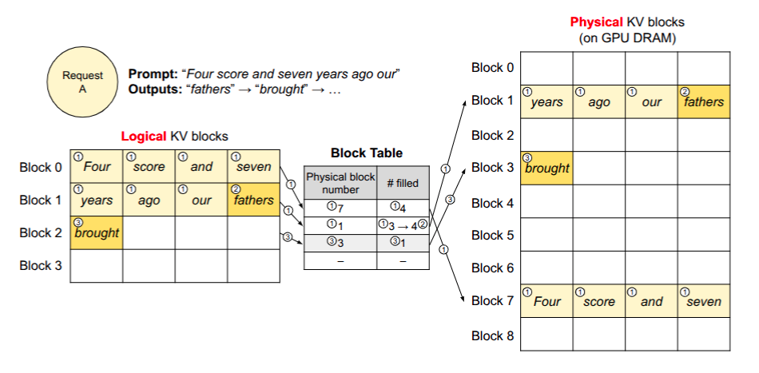
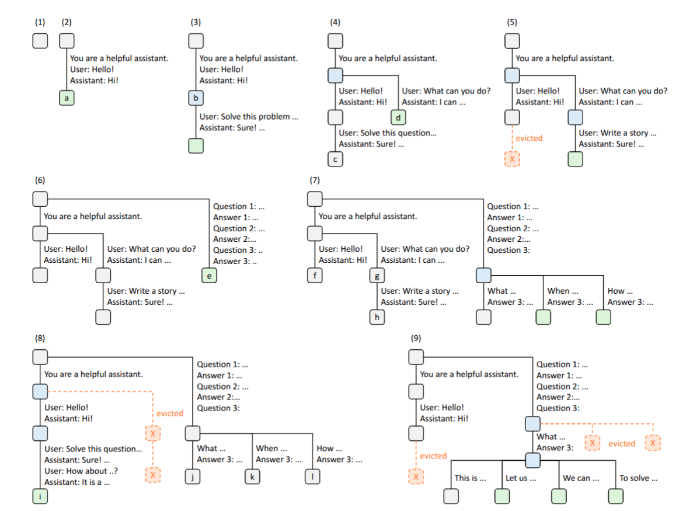
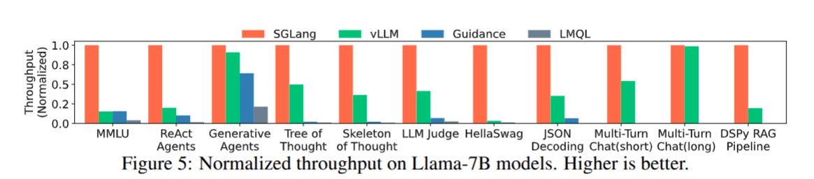

Day 5/30 of inference infrastructure series

pagedattention & radixattention

yesterday on day 4 we explored vLLM and SGLang and traced how a single request moves through an engine lifecycle from tokenization to streaming output. today we dive deep into the two core mechanisms that make these serving runtimes so fast and memory-efficient: PagedAttention in vLLM and RadixAttention in SGLang.

managing GPU memory during LLM inference is one of the most exciting engineering challenges in modern AI. today we look at how two brilliant techniques solve memory and compute bottlenecks from two complementary angles: virtual memory paging for intra-request memory allocation, and prefix tree caching for inter-request compute reuse.

## 1. PagedAttention (vLLM)

it is important to clarify right upfront: PagedAttention is primarily a Key-Value cache memory-management technique, not a completely new mathematical attention algorithm. the underlying attention math stays standard — every query token still computes dot-product attention against past key and value vectors. what PagedAttention changes is how those Key-Value vectors are stored and gathered in physical GPU VRAM.

### why the KV cache becomes a massive memory problem

imagine renting apartments in a building where tenants arrive dynamically and stay for unpredictable amounts of time. if you assign every tenant a 10-bedroom suite on day one just in case they decide to bring nine friends later, almost all of your rooms sit completely empty while new tenants are turned away at the door.

that is precisely how naive LLM serving handles the Key-Value (KV) cache in GPU memory.

during inference, the Key-Value cache creates a massive, dynamically growing footprint:

* dynamic memory growth — during the decode phase, every newly generated token appends a new Key vector and Value vector across every layer and attention head in the model.
* unpredictable sequence lifespan — one user request might finish in 20 tokens while another runs for 2,000 tokens.
* naive continuous allocation — to avoid running out of VRAM mid-generation, standard PyTorch implementations reserve a contiguous chunk of GPU memory sized to `max_sequence_length` (e.g. 4,096 tokens) for every active request up front.

for example, on a 70B parameter model using Grouped-Query Attention (GQA), storing 4,096 tokens requires over 1.3 GB of VRAM per request.

allocating continuous memory regions per request causes two severe forms of memory waste:

* internal fragmentation — if a user request finishes after generating 100 tokens, the remaining 3,996 reserved token slots sit empty. up to 80% of reserved VRAM is wasted on memory that is never written to.
* external fragmentation — as requests start and finish at different times, freed memory chunks get scattered across VRAM in different sizes. even if total free VRAM is large enough for a new request, memory allocation fails because there is no single contiguous block big enough to fit `max_sequence_length`.

because of this memory fragmentation and waste, traditional servers could only fit tiny batch sizes (often 2 to 4 concurrent requests per GPU) before running out of VRAM, leaving powerful GPU compute units idling while waiting for memory operations.

we call it **compute starvation**: paying top dollar for an H100 GPU only to let its CUDA cores sit idle waiting at the VRAM memory red light.

### splitting the KV cache into fixed-size blocks

PagedAttention solves this by bringing virtual memory paging from operating systems into GPU VRAM management.

instead of requiring one continuous memory region for every request, PagedAttention splits the Key-Value cache of a sequence into small, fixed-size physical blocks (typically 16 or 32 tokens per block).

to understand how this works in practice, we distinguish between two concepts:

* logical blocks — how the sequence views its own tokens sequentially. logical block 0 stores tokens 0 to 15, logical block 1 stores tokens 16 to 31, and so on.
* physical GPU-memory blocks — actual 16-token VRAM memory pages allocated anywhere in GPU memory from a global free block pool. physical block 7 might live at the beginning of VRAM, while physical block 42 lives near the end.

### block size trade-offs

choosing the block size involves a fundamental engineering trade-off:

* smaller block sizes (e.g. 8 or 16 tokens) — minimize internal memory fragmentation because the last incomplete block leaves very few unused token slots, but increase block table lookup metadata and kernel overhead.
* larger block sizes (e.g. 32 or 64 tokens) — reduce CPU block table management overhead and improve GPU memory access alignment, but slightly increase internal fragmentation for very short generations.

### mapping sequences with a block table

a sequence no longer needs to occupy contiguous physical memory. instead, vLLM maintains a block table for each active sequence:

* block table lookup — the block table maps each logical block index of a sequence to a specific non-contiguous physical block ID in VRAM.
* dynamic allocation on demand — when a request arrives, vLLM allocates only one physical block (16 tokens). as generation proceeds and fills token slot 15, the engine claims a new physical block from the free pool and appends it to the request's block table for token 16.
* instant memory release — as soon as a request finishes or reaches `EOS`, all its assigned physical blocks are immediately freed and returned to the global free block pool for other requests to use.

### step-by-step example: sequence growing across blocks

let us trace how a prompt grows across 4-token physical blocks in GPU memory:

1. **prompt prefill** — prompt `"Four score and seven years ago our"` (7 tokens) fills logical block 0 (mapped to physical block 7) and 3 slots of logical block 1 (mapped to physical block 1).
2. **generating "fathers"** — output token `"fathers"` fills the 4th and final slot of logical block 1 (physical block 1).
3. **generating "brought"** — logical block 1 is full, so the engine claims physical block 3 from the free pool for logical block 2.
4. **completion & cleanup** — upon reaching `EOS`, physical blocks 7, 1, and 3 are unmapped and returned immediately to the global VRAM pool.

### block table mapping architecture

here is how logical sequence blocks map through the vLLM Block Table to non-contiguous physical GPU DRAM memory pages:

as shown in the architectural request flow diagram above:

* Request A arrives with prompt `"Four score and seven years ago our"` and generates output tokens `"fathers" -> "brought"`.
* logical blocks 0, 1, and 2 are mapped via the vLLM block table to physical blocks 7, 1, and 3 scattered across GPU DRAM.
* unallocated physical blocks (0, 2, 4, 5, 6, 8) remain completely free in VRAM for other concurrent requests.
* custom CUDA gather kernels collect these non-contiguous physical blocks directly from GPU DRAM during attention calculation without needing physical memory consolidation.

### memory efficiency and throughput gains

by managing KV memory through paged blocks, external fragmentation drops to zero because physical pages do not need to be contiguous in VRAM. internal fragmentation is strictly bounded to the final incomplete block of a request, cutting overall memory waste from 60%-80% down to under 4% across active serving workloads.

because memory waste is virtually eliminated, better memory usage allows larger batch sizes on the same GPU hardware.

higher batch concurrency keeps GPU memory bandwidth and CUDA cores fully utilized during decode steps, significantly increasing overall serving throughput.

in simple terms, fitting more active sequences into VRAM means your GPU spend goes directly toward useful token generation rather than holding empty memory slots.

the biggest advantage of PagedAttention is that it virtually eliminates memory waste, keeping memory fragmentation under 4% and letting you fit 2x to 4x more concurrent requests into GPU VRAM. sequences grow seamlessly on demand without reserving giant contiguous buffers upfront.

the main trade-off is control-plane and kernel complexity. managing block tables on the CPU introduces lookup overhead, and gathering non-contiguous physical memory blocks requires custom CUDA kernels instead of standard PyTorch memory operations.

in practice, this trade-off is almost always worth it for production serving workloads. eliminating fragmentation unlocks massive batch sizes on existing hardware.

this is why we call PagedAttention an **intra-request** memory allocation technique ("intra" meaning within). it focuses entirely on how blocks and pages are dynamically assigned inside a single sequence as its tokens grow, without caring about what other requests are doing.

---

## 2. RadixAttention (SGLang)

while PagedAttention optimizes memory allocation within individual requests, RadixAttention addresses a different bottleneck: redundant compute and memory across multiple requests.

importantly, RadixAttention and PagedAttention are compatible, but the SGLang paper does not describe RadixAttention as simply building on top of vLLM's PagedAttention.

the paper says RadixAttention stores KV cache tensors in a non-contiguous, paged layout where each page holds one token. so the physical KV memory is paged, while the radix tree adds a separate idea on top: it indexes cached token prefixes so their KV states can be found and reused.

instead of discarding a request's KV cache as soon as processing finishes, RadixAttention retains the cached prompt and generation states so later requests can reuse them. those states stay in the shared memory pool until SGLang needs to evict them.

it organizes token sequences in a CPU-managed Radix Tree that maps token sequences to their corresponding KV cache tensors. this turns the shared KV memory pool into a dynamic, tree-structured LRU cache across multiple requests.

the distinction matters here:

* paged layout describes how KV tensors live in physical GPU memory.
* radix tree describes how SGLang finds shared token prefixes and the KV tensors that belong to them.
* LRU eviction describes which unused cached leaf is removed when the shared memory pool needs space.

the paper explicitly calls PagedAttention compatible with RadixAttention. it does not present the two names as the same mechanism.

it is important to clarify right upfront: RadixAttention is mainly about reusing cached Key-Value states across requests with shared prefixes. mathematically, attention computation remains standard; what changes is that prefill computation for repeated prompt prefixes is skipped by reusing pre-computed Key-Value states directly from memory.

this is why we call RadixAttention an **inter-request** compute reuse technique ("inter" meaning between or across). while PagedAttention manages page blocks within a single request, RadixAttention shares cached prefix blocks across multiple completely independent requests.

### why requests reuse prompt prefixes

think about reading a 500-page technical textbook where every chapter begins with the exact same 50-page historical background. if three different readers ask you to summarize three different chapters, re-reading the identical 50-page background from scratch for every single reader wastes immense time.

in real-world LLM applications, incoming requests frequently reuse the exact same prompt prefixes:

* system prompts — long role instructions, guidelines, and safety framing appended to every user message.
* multi-turn chat history — past conversation turns re-sent with every follow-up question in a chat session.
* few-shot prompt examples — identical demonstration pairs included across many distinct user queries.
* tool definitions & agent instructions — JSON schemas, API specs, and agent loop trajectories.

in naive engines, every new request forces the GPU to recompute Key-Value states for the exact same prefix tokens over and over again, wasting GPU FLOPs and increasing Time to First Token (TTFT).

### storing shared prefixes in a radix tree

RadixAttention solves this by storing cached Key-Value states in a radix tree. a radix tree is a space-efficient tree data structure where each edge represents a sequence of tokens, and the tree maps those sequences directly to their pre-computed Key-Value cache tensors.

by structuring the cache this way, shared token prefixes naturally become common ancestor nodes near the root of the tree, allowing multiple child branches to share them. when a new request arrives, SGLang simply traverses the radix tree to find the longest matching cached prefix.

### reusing cached KV states to skip prefill

when a new request arrives at the SGLang engine:

1. prefix matching — the engine searches the radix tree for the incoming token sequence to find the longest matching cached prefix path.
2. state reuse — cached Key-Value states for the matching prefix are retrieved directly from existing VRAM memory blocks.
3. partial prefill pass — the GPU skips prefill computation for the matched prefix tokens and computes Key-Value projections only for the remaining unmatched part of the prompt.
4. prefill compute reduction — computing only the unmatched tokens drastically reduces prefill latency, cutting Time to First Token (TTFT) for prefix-heavy workloads.

### tree eviction and memory management

when GPU VRAM becomes constrained under heavy traffic:

* reference counting — SGLang maintains reference counts on radix tree nodes corresponding to active requests currently accessing those memory blocks.
* LRU node eviction — when VRAM is full and a new request needs memory, SGLang prunes unreferenced leaf nodes using a Least Recently Used (LRU) eviction policy.
* dynamic re-computation fallback — if an evicted prefix is requested again later, SGLang simply recomputes its Key-Value states, ensuring high stability under peak load.
* shared memory pool — cached tokens and running requests use the same memory pool. if an allocation cannot be satisfied, SGLang evicts eligible cached leaves and retries the allocation.

### radix-tree state transition flow

here is the full RadixAttention lifecycle diagram from the SGLang paper showing dynamic tree expansion, multi-turn chat reuse, branching, parallel sampling, and LRU cache eviction across nine sequential steps (1)-(9):

let us trace how this tree grows and adapts over time. it starts completely empty. when your first chat request arrives, SGLang processes the entire prompt and saves your system instructions, user message, and its own reply as a single continuous path in the tree.

when you send a follow-up message in that exact same chat, SGLang matches the prefix. it reuses the entire cached memory block from turn one and only computes the brand new message, appending it to the end of the branch.

now imagine a completely different user starts a new chat but uses the exact same system prompt. SGLang notices this and splits the original branch. both chat sessions now share the same physical memory for the system prompt, branching off only where the specific user messages differ.

as more requests pour in — like multi-shot benchmarks or parallel sampling — the GPU memory eventually fills up. when a new request needs space but the memory pool is full, SGLang simply finds the oldest, unused leaf at the edge of the tree and evicts it to free up physical blocks.

this makes the tree a highly elastic, self-managing memory pool that balances heavy cache reuse with stability under high load.

### the bottom line on radix attention

the biggest win of this tree structure is how it automatically speeds up generation and saves compute power. by keeping chat histories, system prompts, and few-shot examples cached in memory, it skips the heavy math required to process them again.

the key benefits are:

* **faster first tokens** — skips redundant prefill math for shared prompts.
* **cheap parallel sampling** — multiple branches reuse the same cached prefix.
* **elastic memory** — safely locks active requests, evicts the oldest unused leaves when VRAM is full, and recalculates dropped data on the fly.

but there are trade-offs to keep in mind:

* **cpu overhead** — managing the tree and tracking evictions adds control-plane work.
* **requires shared text** — if every request is completely random and unique, the cache hit rate drops to zero, and you pay the CPU overhead for no speedup.

---

### comparison of PagedAttention and RadixAttention

to understand how PagedAttention and RadixAttention compare across core serving dimensions:

Feature | PagedAttention (vLLM) | RadixAttention (SGLang)
---|---|---
Primary Problem Solved | Intra-request memory fragmentation & allocation waste | Inter-request redundant prefill compute & state duplication
Memory Efficiency | High (eliminates external waste, caps internal waste <4%) | High (deduplicates shared prefix KV cache blocks across requests)
Prefix Reuse | Basic / explicit system prompt caching | Automatic, dynamic prefix indexing via radix tree trie
Prefill Performance | Full prefill pass executed for every prompt | Prefill computed only for unmatched prompt tokens
Decode Performance | High (gather non-contiguous physical page blocks) | High (gather tree-mapped physical page blocks)
Throughput | Maximizes batch concurrency & GPU decode occupancy | Reduces total prefill FLOPs, unlocking higher overall serving capacity
Time to First Token | Standard prefill latency based on full prompt length | Drastically reduced TTFT when prompt matches cached prefix
Best Workload Type | Diverse unique prompts, high concurrency, standard serving | Multi-turn chat, AI agents, structured generation, tool use
Main Overhead | Block table metadata & non-contiguous gather attention kernel | CPU radix-tree lookup, node ref-counting & LRU eviction
Production Trade-off | Simple, robust, works universally across all workloads | Requires prefix hit rate to deliver maximum performance speedups

### when to choose who

so, which engine should you actually run in production? the truth is, PagedAttention and RadixAttention are not direct competitors — they solve entirely different bottlenecks. PagedAttention focuses purely on squeezing memory waste to zero, while RadixAttention focuses on skipping redundant prefill computation.

if you look at the throughput comparison below, you can see exactly where SGLang pulls ahead:

this performance gap tells a clear story based on your workload. if your application relies heavily on shared context — like long multi-turn agent conversations, structured JSON generation with massive schemas, or complex few-shot tool loops — SGLang is the absolute winner. it leverages the radix tree to reuse all that shared history across requests, which drastically cuts your latency and shoots your serving throughput through the roof.

on the other hand, if you are building a general-purpose API serving completely unique, randomized traffic (like text summarization across thousands of unrelated documents), that radix tree will not help you. if there are no shared prefixes to cache, managing the tree just adds unnecessary CPU overhead. for these random-traffic workloads, vLLM remains the gold standard, giving you rock-solid, low-overhead memory paging to maximize continuous batching throughput.

ultimately, the foundation of modern high-performance inference lies in understanding both. combining efficient memory allocation to pack the GPU with smart compute reuse to skip redundant math is how you scale real-world LLM workloads.

### sources & references

the concepts and benchmarks presented in this article are derived from the following core research papers and open-source projects:

* PagedAttention / vLLM paper — Kwon et al., *"Efficient Memory Management for Large Language Model Serving with PagedAttention"*, SOSP 2023. [arXiv:2309.06180](https://arxiv.org/abs/2309.06180) | [vLLM GitHub Repository](https://github.com/vllm-project/vllm)
* RadixAttention / SGLang paper — Zheng et al., *"SGLang: Efficient Execution of Structured Language Model Programs"*, 2023/2024. [arXiv:2312.07104](https://arxiv.org/abs/2312.07104) | [SGLang GitHub Repository](https://github.com/sgl-project/sglang)
