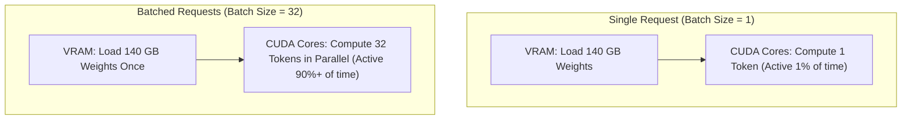
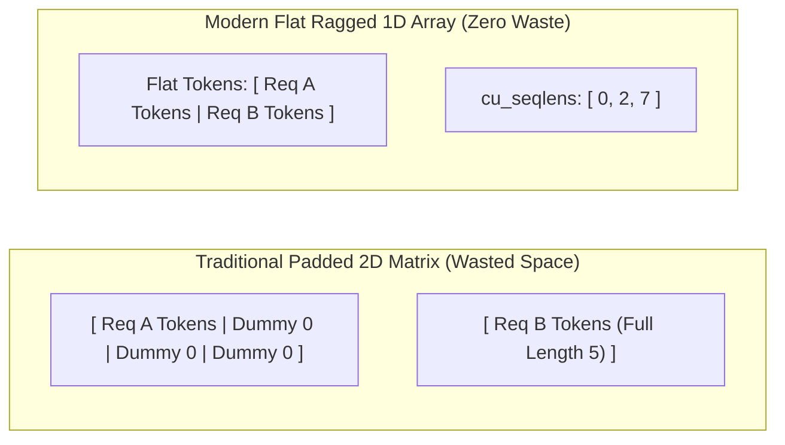
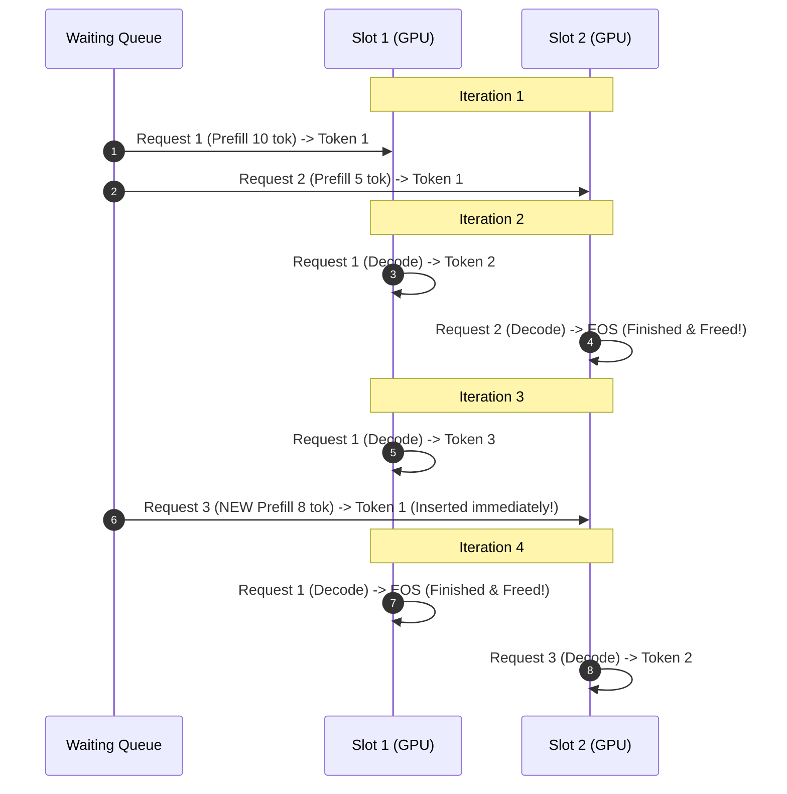
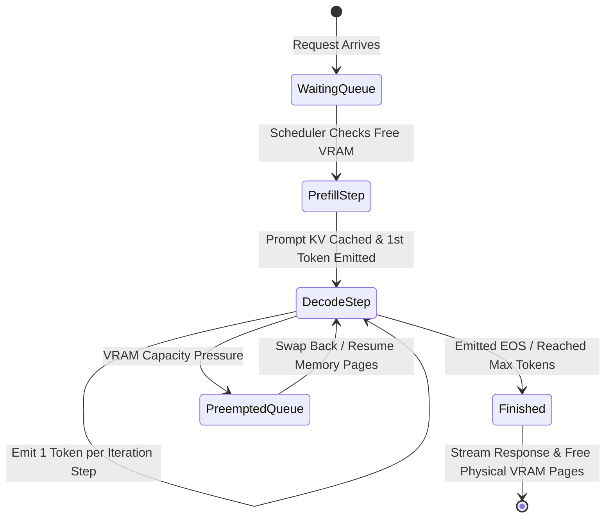

Day 6/30 of inference infrastructure

static, dynamic, and continuous batching

yesterday on day 5 we looked at how pagedattention and radixattention manage memory inside and across requests. today we shift our focus from memory page allocation to request scheduling: how modern inference engines group multiple user requests together on GPU hardware. we will break down static batching, dynamic batching, and continuous batching, showing how batching evolved to solve memory bandwidth bottlenecks and compute starvation.

---

## 1. the hardware bottleneck: why a single user starves your GPU

gpu hardware is designed to execute thousands of matrix operations at the exact same moment. but when you serve a single user query at a time, the GPU sits mostly idle waiting for model parameters to stream out of VRAM.

batching is the core engine that turns slow, expensive single-token generation into high-throughput production serving. let us explore how prefill and decode phases behave under the hood.

when you ask chatgpt a question, the server processes your request in two steps:

* prefill phase — the GPU ingests your entire input prompt at once. because all prompt tokens are calculated together in parallel, GPU compute cores run at full speed.

* decode phase — the model generates your response one token at a time. because each new word depends on the previous word, the GPU must run step by step sequentially, making execution limited by memory streaming speed rather than raw compute power.

### the single-user decode bottleneck

during the decode phase, to output just a single token for one user, the GPU must stream every single parameter weight out of high-bandwidth memory (VRAM) into its compute cores (SRAM/ALUs).

for a 70-billion parameter model in 16-bit precision, that means loading 140 gigabytes of model weights through the memory bus for every single token step.

think of it like opening a 500-page textbook, reading one single word on page one, closing the textbook, and then opening it all over again from scratch just to read the next word.

### memory bandwidth vs compute math

on an nvidia h100 GPU (with 3.35 TB/s VRAM memory bandwidth), streaming those 140 GB of model weights takes roughly 42 milliseconds per step.

the GPU's compute cores can finish the actual matrix math for a single token in less than 1 millisecond. for the remaining 41+ milliseconds, those powerful compute cores sit completely idle, waiting for VRAM to finish sending weights.

when serving a single user (batch size = 1), your GPU spends 98% of its time moving memory across the bus and only 2% doing actual token math.

### arithmetic intensity and batching

we measure serving efficiency using arithmetic intensity, which is simply the amount of math done divided by the memory moved:

$$\text{Arithmetic Intensity} = \frac{\text{Compute Operations (FLOPs)}}{\text{Memory Transferred (Bytes)}}$$



when you process 32 requests together in a batch:

1. you load the 140 GB of model parameters from VRAM into cache once.

2. you run matrix math for all 32 user prompts at the exact same time.

3. your arithmetic intensity jumps by 32x without increasing memory loading overhead.

batching reuses loaded model parameters across multiple active requests, turning an idle, memory-starved GPU into a high-throughput inference engine.

---

## 2. the matrix shape problem: padding vs ragged tensors

before we explore batching strategies, we need to solve a fundamental data packing problem: user prompts arrive in all different token lengths.

imagine Request A has 2 tokens ("hello world") while Request B has 5 tokens ("explain quantum physics to me"). because GPUs run matrix math on neat, rectangular 2D grids, early deep learning frameworks could not stack these sequences directly without making their shapes match.

### the old way: traditional padding and its bottlenecks

the old solution was padding. frameworks picked the longest sequence in the batch and filled shorter sequences with dummy `<pad>` or `0` tokens to force them into a rectangular matrix:

```text
Request A: [hello, world, 0, 0, 0]  # padded with 3 dummy tokens
Request B: [explain, quantum, physics, to, me] # full 5 tokens
```

think of padding like placing small items inside identical oversized cardboard boxes so they stack evenly on a delivery truck.

this padding approach creates a massive bottleneck for LLM serving:

* wasted memory — padded slots consume real VRAM space in input tensors and KV cache allocations.

* wasted compute — the GPU still runs full matrix multiplication over dummy tokens, even though an attention mask filters their scores later.

if a batch contains prompt lengths of `1024`, `1000`, `50`, and `20` tokens, padding every sequence to 1024 forces the GPU to calculate 4,096 tokens total. over 50% of that matrix math is pure dummy work.

### the modern solution: ragged tensors and offset indexing

modern LLM engines eliminate padding waste completely by using ragged tensors.

instead of packing sequences into fake rectangular boxes, a ragged tensor packs all valid user tokens back-to-back into one single flat 1D array.

alongside this flat array, the engine maintains an offset array called `cu_seqlens` (cumulative sequence lengths) that tracks exact sequence boundaries:



the index offset array `cu_seqlens = [0, 2, 7]` tells the GPU exactly where each prompt begins and ends:

* Request A starts at index `0` and ends at index `2` (length = 2 tokens).

* Request B starts at index `2` and ends at index `7` (length = 5 tokens).

custom CUDA kernels like FlashAttention VarLen read `cu_seqlens` directly to slice and process exact sequence ranges in parallel.

by eliminating padding, no fake tokens are allocated in memory, no VRAM is wasted, and every single floating-point operation on the GPU goes toward actual user prompts.

ragged tensors serve as the foundational data structure for all modern batching algorithms.

---

## 3. comparing batching strategies: static, dynamic, and continuous

batching evolved across three major architectural generations to maximize GPU throughput and eliminate compute starvation:

* 1. static batching — waits until a fixed number of requests (e.g. batch size = 4) fill the queue before launching. shorter prompts are padded with dummy zero tokens to form a rectangular matrix. finished queries sit locked and idle in their batch slots until the longest response completes.

* 1. dynamic batching — fixes queue waiting delays by adding a max wait timer (e.g. 50 ms). the server fires the batch as soon as it hits max capacity OR when the timer expires. while this eliminates infinite queue waiting, it still locks batch slots until the longest sequence completes.

* 1. continuous batching — schedules at every single token iteration step instead of whole requests. whenever any query emits an end token (`EOS`), its slot and physical VRAM pages are freed immediately, allowing a waiting request to step in on the very next token step.

### static vs dynamic batching comparison

Feature | Static Batching | Dynamic Batching
--- | --- | ---
Trigger | Fires only when batch is full | Fires when full OR timeout expires
Queue Wait | Unbounded queue delay | Capped queue delay (e.g. 50 ms)
Execution Unit | Entire request locked | Entire request locked

### the slot locking bottleneck

despite fixing queue delays, both static and dynamic batching suffer from severe slot locking:

```mermaid
gantt
    title Request-Level Slot Locking Bottleneck
    dateFormat X
    axisFormat %s
    section Requests
    Request A (10 tokens) :active, r1, 0, 10
    Slot Locked & Idle :crit, r1_idle, 10, 50
    Request B (50 tokens - Longest) :active, r3, 0, 50
```



if Request A generates 10 tokens while Request B generates 500 tokens, Request A's batch slot remains locked and idle for 490 steps until Request B finishes.

request-level batching leaves GPU compute cores starving whenever requests in the same batch have different output lengths.

---

## 4. iteration-level scheduling: continuous batching

continuous batching (also called in-flight batching or iteration-level scheduling) was introduced by Orca in 2022 and quickly became standard across engines like vLLM, SGLang, and TensorRT-LLM. it fundamentally redefines batching from request-level to token-level.

### how continuous batching works

instead of scheduling entire requests from start to finish, continuous batching schedules at every single token step:

* decode iteration — run one decode step for all active requests in the batch.

* completion check — if any request emits an end token (`EOS`), immediately return its output and free its VRAM memory.

* dynamic insertion — if free VRAM is available, instantly insert a new request from the waiting queue into the empty batch slot on the very next token step.

### step-by-step continuous batching trace

let us trace 4 requests moving through a continuous batching scheduler with a capacity of 2 slots:



at Iteration 2, Request 2 finishes. instead of leaving Slot 2 idle while Request 1 keeps running, the engine inserts Request 3 into Slot 2 on Iteration 3 right away.

### request-level vs iteration-level scheduling

to understand why this architectural shift is so powerful:

* request-level scheduling (static/dynamic) — locks VRAM pages and batch slots for the full duration of the longest request in a batch.

* iteration-level scheduling (continuous) — evaluates VRAM allocation and slot occupancy at every single forward pass step on the GPU.

### request state transition flow

under continuous batching, requests move through clear states:



### internal scheduler queue management

continuous batching engines maintain three internal queues to manage request state transitions:

* waiting queue — holds newly arrived user requests waiting for prefill execution.

* running queue — holds active sequences currently executing decode steps on the GPU.

* preempted queue — holds active requests temporarily paused if VRAM runs out during generation.

### memory allocation during iteration steps

continuous batching pairs naturally with paged KV cache memory (like vLLM's PagedAttention):

1. at each iteration step, every active request appends one new token to its KV cache.

2. the scheduler allocates new physical VRAM blocks only when a request fills its current page.

3. when a sequence emits `EOS`, all its assigned physical pages return to the global free pool immediately for new requests to use.

### how frameworks implement continuous batching

modern serving frameworks implement continuous batching under different internal names:

* vLLM — uses an iteration-level `vLLMScheduler` to update memory mappings step by step.

* TensorRT-LLM — calls this in-flight batching, using C++ schedulers linked into TensorRT graphs.

* SGLang — combines continuous batching with RadixAttention trie node management.

* LMDeploy — uses persistent batching to maintain active KV state across iterations.

### why continuous batching is a massive win

continuous batching removes the tail-latency bottleneck of traditional batching:

1. zero idle slots — completed requests are replaced immediately, keeping GPU cores busy.

2. lower user latency — short queries complete and return right away without waiting for long queries.

3. huge throughput gains — real-world benchmarks show continuous batching delivers 10x to 23x higher throughput than static batching.

---
