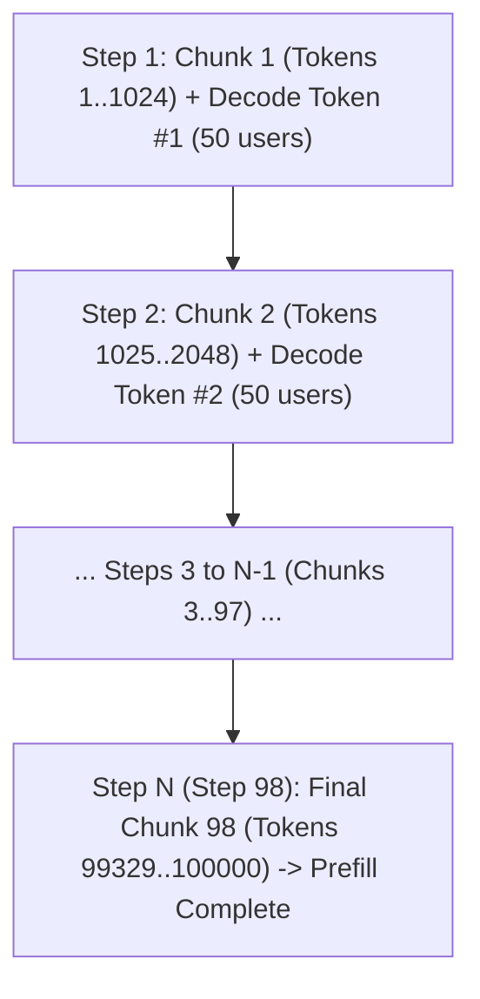
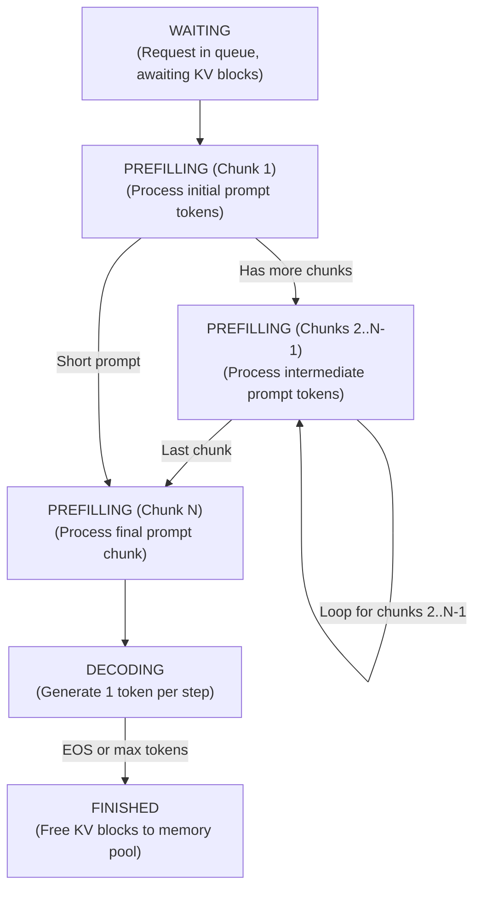

Day 7/30 of inference infrastructure

chunked prefill

yesterday on day 6 we saw how continuous batching schedules requests at the iteration level so new queries step into empty slots the moment any sequence finishes. today we tackle one of the biggest performance bottlenecks in LLM serving: what happens when a massive prompt hits your GPU while dozens of active users are waiting for their next streaming token.

while frontier model providers often run prefill-decode (PD) disaggregation at scale (which we explore on day 21), chunked prefill does not make sense on dedicated prefill nodes in a disaggregated cluster. when prefill and decode are decoupled onto separate physical GPUs, prefill nodes do not handle live decode traffic, so there are no decoding users to stall!

for short and medium context workloads (under 5,000 tokens), using PD disaggregation is a complete waste of network KV transfer overhead. moving KV cache blocks across PCIe or RDMA links between nodes can take longer than calculating the prefill itself! this is why chunked prefill is specifically built for co-located serving — where a single GPU or single node handles both prefill and decode together without network transfer bottlenecks.

---

## 1. what is chunked prefill and how it works

chunked prefill is a scheduling technique that breaks large input prompts into smaller, fixed-size token chunks and processes them across multiple iteration steps alongside active decode requests.

instead of forcing the GPU to calculate all prompt tokens in one giant burst, the engine sets a maximum chunk size (for example, 1,024 tokens per chunk) to keep GPU iteration times strictly bounded.

### how chunking prevents prompt stalls

picture a live production engine serving 50 active users on a single GPU. all 50 users are in the decode phase, receiving streaming tokens on their screens word by word.

suddenly a new user submits a 100,000-token document asking for a summary.

without chunked prefill, the engine scheduler hands that entire 100K prompt to the GPU all at once in a single massive matrix multiplication step. GPU compute cores get 100% saturated for 1,000 milliseconds (1 full second), completely freezing all 50 active decoding users and causing a massive TPOT spike.

With chunked prefill enabled (chunk size = 1,024 tokens), the engine calculates the chunk split:

Total Chunks N = ceil(100,000 / 1,024) = 98 steps

Calculation:

100,000 / 1,024 = 97.65625

Round up to the next whole chunk:

N = 98 steps

instead of processing 100,000 tokens in one burst, the engine executes 98 iteration steps:

on steps 1 through $N-1$ (chunks 1 to 97), the prompt is progressively cached while all 50 decode users receive a steady token on every step. on step $N$ (chunk 98), the final chunk is processed and the 100K request transitions into the decode phase.

instead of freezing all users for 1 full second, decoding tokens continue streaming smoothly every 60 milliseconds while the long prompt completes its prefill phase over 98 iterations.

as we saw on day 1, this directly protects TPOT (Time Per Output Token) streaming quality for decoding users by trading off a small, predictable increase in TTFT (Time to First Token) for the incoming long prompt.

### KV cache state and attention math during chunked prefill

how does self-attention work when a prompt is processed in chunks across multiple steps?

when chunk 1 (tokens 1..1024) runs in iteration 1, the engine calculates key-value pairs for those 1,024 tokens and stores them in paged KV memory.

the attention calculation for chunk $i$ evaluates:

$$\text{Attention}(Q_{\text{chunk } i}, K_{\le i}, V_{\le i}) = \text{softmax}\left(\frac{Q_{\text{chunk } i} K_{\le i}^T}{\sqrt{d_k}}\right) V_{\le i}$$

because chunk $i$ only computes query projections for its own tokens, we avoid recomputing $Q$ projections for previous chunks while ensuring full causal context attention across all prior prompt tokens.

### how chunked prefill works with prefix caching (radix attention)

when chunked prefill is combined with prefix caching (which we saw on day 4 and day 5), the engine checks the radix tree before scheduling chunk 1.

if the first 2,048 tokens of a 4,096-token prompt already exist in the shared prefix cache:

1. chunk 1 and chunk 2 are matched and loaded directly from shared KV memory blocks in zero compute time.

2. chunked prefill begins at chunk 3 (tokens 2049 to 3072), skipping the cached prefix tokens entirely.

this integration between radix tree lookup and token budget chunking allows engines to maximize KV cache reuse while keeping iteration step times strictly bounded.

---

## 3. TTFT vs TPOT trade-offs

choosing the right chunk size is a simple trade-off between streaming smoothness and kernel overhead.

if your chunk size is too large (like 4,096 tokens), incoming prompts cause noticeable TPOT spikes for decoding users. if your chunk size is too small (like 128 tokens), a 32,000-token prompt requires 250 separate iteration steps, piling up CPU scheduler overhead and CUDA kernel launch delays on every step.

additionally, because chunked prefill changes token counts dynamically on every step, mixed iterations cannot easily run inside pre-captured static CUDA Graphs (which we covered on day 4).

this is why production engines like vLLM and SGLang default to chunk sizes around 512, 1024, or 2048 tokens — striking the ideal balance between zero TPOT jitter and peak GPU throughput.

---

## 4. landmark research and implementation references

### paper references

+ [Sarathi: Efficient LLM Inference by Chunking Prefills with Piggybacking](https://arxiv.org/abs/2308.16369) (Agrawal et al., OSDI 2024)
+ [Sarathi-Serve: Taming Throughput-Latency Tradeoff in LLM Inference](https://arxiv.org/abs/2403.02310) (Agrawal et al., 2024)
