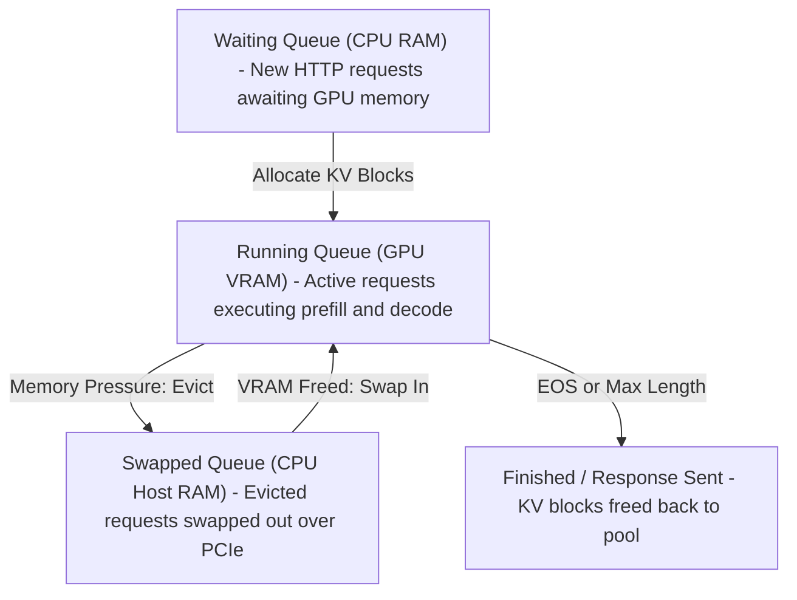
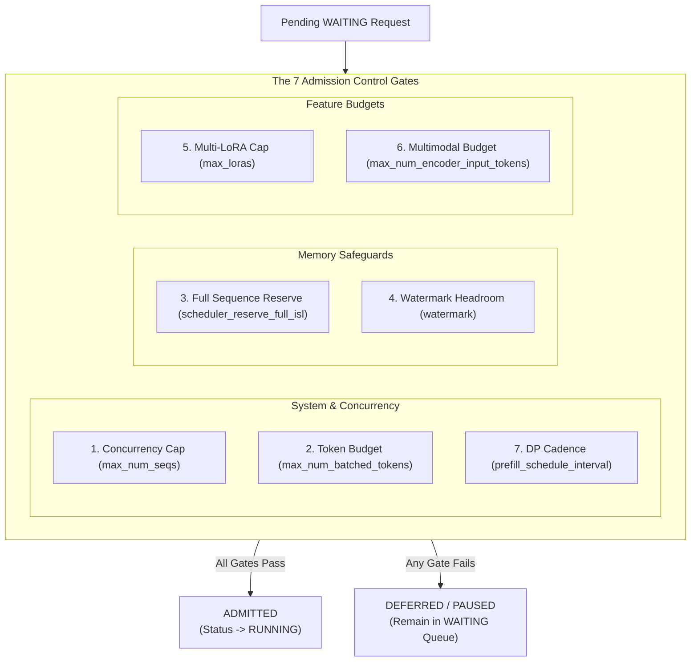
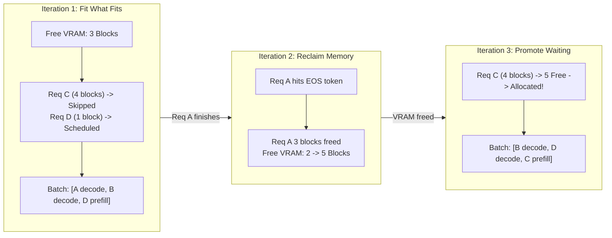
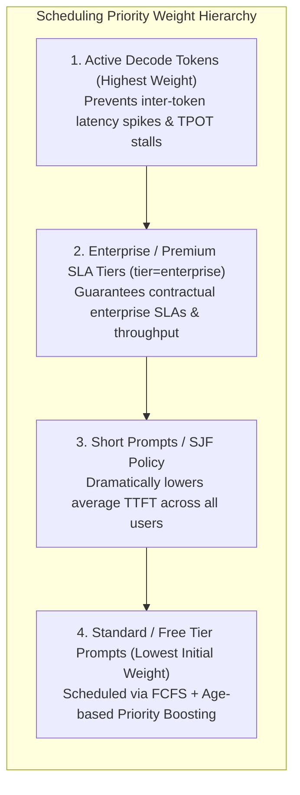
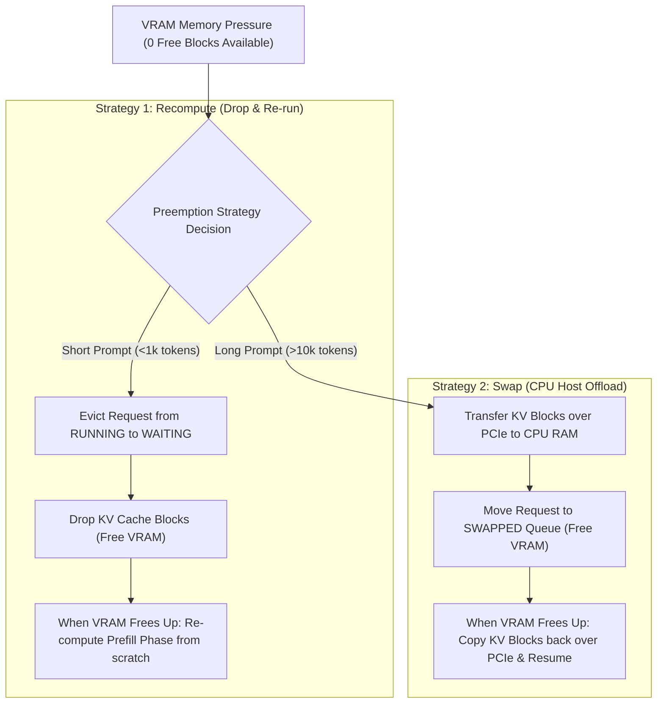

Day 8/9/30 of inference infrastructure

the brain of the inference engine: scheduling, admission control, and preemption

yesterday on day 7 we saw how chunked prefill slices giant prompts into fixed token chunks and piggybacks them onto decode passes to prevent prefill stalls. but while chunked prefill controls how much work gets packed into a single iteration, it leaves one crucial question unanswered: when 100 users submit requests at the exact same time, how does the engine decide who gets GPU memory and processing slots first?

today we dive deep into the brain of the LLM engine: the inference scheduler. we will explore how production engines manage waiting, running, and swapped queues, how scheduling policies prevent memory exhaustion, how preemption policies save servers from crashing under sudden traffic spikes, and how real engines like vLLM and SGLang execute their scheduling loops on every single iteration step.

---

## 1. the core job of the inference scheduler

to understand the scheduler, think of an LLM server as an airport control tower.

an airport has a finite amount of runway space and gates. you cannot land 10 planes simultaneously on a single runway — if 20 planes arrive at the exact same minute, the control tower puts some planes in a holding pattern in the air, lets a few land, and keeps others waiting on the tarmac.

it might be a poor example, but hope you get the context — an LLM server works the exact same way.

at any given second, dozens of requests arrive over HTTP. some queries have short 50-token prompts asking for quick answers, while others have 32,000-token documents asking for complex summaries. some requests have just started, others are mid-generation, and a few are about to hit their end-of-sequence token.

just like an airport runway, the GPU has strictly finite VRAM and memory slots. it cannot blindly run every incoming request at once. if the scheduler allocates more requests than available KV cache blocks, the GPU runs out of VRAM and crashes with an out-of-memory (OOM) error.

you might wonder: if holding KV cache blocks in VRAM is such a problem, why not just recompute tokens every step instead of storing them?

that is where GPU economics kick in. GPUs are billed by the hour. if you recompute the exact same prompt tokens millions of times across requests, you burn expensive GPU FLOPs and throw money away. caching KV blocks saves compute, but it puts all the pressure onto memory management — which is why the scheduler exists.

the inference scheduler runs at the start of every single iteration step (every 20 to 50 milliseconds) to answer three fundamental questions:

1. **who runs next?** — which waiting requests should be moved onto the GPU to begin their prefill phase?

2. **who keeps running?** — which active decode requests get to generate their next token in this step?

3. **who gets evicted?** — if VRAM fills up completely, which low-priority request must be paused or preempted to protect active streams?

in modern engines (like vLLM V1), there is no rigid boundary between a prefill phase and a decode phase. instead, the scheduler uses a **unified catch-up model**: every request tracks how many tokens have been processed (`num_computed_tokens`) versus total tokens needed (`num_tokens_with_spec`). on every iteration step, the scheduler simply allocates token budget to push computed tokens forward, handling chunked prefills, prefix cache hits, and speculative decoding seamlessly.

---

## 2. the three-queue architecture

modern inference engines manage request lifecycles using three distinct queues:



* **1. the waiting queue (CPU RAM)** — when an API client sends an HTTP prompt request, it lands in the waiting queue in CPU memory. it holds raw input text and token IDs, but no GPU KV cache blocks are allocated yet. requests sit here until the GPU has enough free VRAM blocks to process their prompt.

* **2. the running queue (GPU VRAM)** — requests in the running queue have active allocations in paged KV memory. on every iteration step, every request in the running queue gets 1 decode token slot, while remaining token budget goes to processing prefill chunks for newly promoted waiting requests.

* **3. the swapped queue (CPU Host RAM)** — when live traffic spikes and active decode sequences expand beyond available VRAM blocks, the scheduler evicts low-priority sequences and swaps their KV cache blocks to CPU RAM over PCIe. when VRAM frees up later, those blocks are transferred back to GPU VRAM to resume generation.

---

## 3. admission control: why it exists and what happens without it

why do we need admission control?

without admission control, scheduling is naive. the scheduler looks at the waiting queue and promotes any request whose initial prompt prefill fits in current VRAM. at first, everything seems fine.

the nightmare happens during decode. as those 20 admitted requests generate output tokens step after step, their KV caches expand simultaneously. within a few iterations, VRAM runs out of blocks completely. the engine is forced to crash with an out-of-memory error or constantly preempt and swap active sequences over PCIe, causing massive latency spikes.

admission control solves this by acting as a strict guard gate before request promotion. instead of blindly accepting work, modern schedulers (like vLLM V1) evaluate **7 admission control gates** to verify that admitting a request will not crash active streams:



1. **concurrency cap (`max_num_seqs`)**: ensures active sequences do not exceed configured server concurrency limits.
2. **token compute budget (`max_num_batched_tokens`)**: verifies that the request's prefill chunk fits within the step's FLOP budget.
3. **full sequence KV reservation (`scheduler_reserve_full_isl`)**: verifies VRAM has enough KV blocks for the *entire* prompt + max output tokens before admitting. if full sequence KV memory cannot be reserved, admission is deferred to prevent mid-generation OOM preemption!
4. **memory watermark headroom (`watermark`)**: reserves a safety buffer (e.g. 1% free KV blocks) so active decodes never starve.
5. **multi-lora adapter cap (`max_loras`)**: caps the maximum distinct LoRA adapter weights loaded in VRAM per batch.
6. **multimodal encoder budget (`max_num_encoder_input_tokens`)**: verifies vision/audio embedding cache availability for multimodal prompts.
7. **dp cadence alignment (`prefill_schedule_interval`)**: synchronizes prefill step scheduling across Data Parallel GPU ranks.

---

## 4. step-by-step scheduling loop: a concrete example

let us walk through a concrete example to see how the scheduler makes decisions step by step.

imagine your GPU has 10 total KV memory blocks. right now, 7 blocks are already in use by active decodes: request A uses 3 blocks, and request B uses 4 blocks. that leaves exactly 3 free VRAM blocks remaining.

in the waiting queue, two new requests arrive:

* **request C** needs 4 blocks for its prompt.
* **request D** needs 1 block for its prompt.



### step 1: fitting what can run

at the start of iteration 1, the scheduler first reserves slots for the active decodes (A and B). both keep generating tokens.

next, it looks at the waiting queue to see who can start prefill. request C is first in line, but it needs 4 VRAM blocks. since only 3 blocks are free, request C cannot start yet. instead of stalling the GPU, the scheduler skips ahead and evaluates request D. request D only needs 1 block, so it fits comfortably.

the scheduler packs a batch containing decodes for A and B, plus prefill for D. request D finishes its prefill in this step, leaving 2 free VRAM blocks.

### step 2: freeing memory on completion

in iteration 2, request A reaches its end-of-sequence token and finishes. the scheduler immediately reclaims request A's 3 KV blocks and returns them to the memory pool.

free VRAM blocks instantly jump from 2 to 5.

### step 3: promoting the waiting request

at the start of iteration 3, request C is still waiting at the front of the queue needing 4 blocks. with 5 blocks now free, the scheduler allocates 4 blocks to request C, moves it into the running queue, and begins its prefill phase.

---

## 5. scheduling policies: FCFS, SJF, and priority queues

how does the scheduler choose which request to evaluate first when multiple queries sit in the waiting queue?



### 1. first-come, first-served (FCFS)

with first-come, first-served, the scheduler processes requests in the exact order they arrive. it is simple, completely fair, and guarantees that no request waits forever.

the downside shows up under heavy traffic. if a giant 100,000-token prompt arrives at the front of the queue, it consumes all available VRAM and forces twenty smaller 50-token queries to sit behind it waiting, spiking average time-to-first-token across your server.

### 2. shortest job first (SJF)

to fix queue delays, shortest job first sorts the waiting queue by prompt length, serving smaller prompts first. this dramatically lowers average time-to-first-token because fast requests clear out immediately.

however, SJF introduces a real risk: starvation. under high traffic, if short 50-token queries keep arriving continuously, a long 32,000-token prompt might sit at the back of the queue and never get scheduled.

### 3. priority queues and SLA-aware scheduling

in production, providers assign priority tiers based on metadata headers like `tier=enterprise` versus `tier=free`. enterprise requests jump to the front of the queue so paid SLAs are always met.

to keep free-tier requests from starving completely, engines use age-based priority boosting: the longer a low-priority request waits in the queue, the higher its priority score grows until it eventually gets scheduled.

### 4. multi-level feedback queue (MLFQ)

popularized by systems like FastServe (OSDI '23), MLFQ places new requests into a high-priority queue with a small token budget. if a prompt needs more compute iterations, the scheduler demotes it to lower-priority queues.

this gives short queries instant response times while ensuring long jobs still make steady progress without blocking the entire engine.

---

## 6. handling memory pressure: recompute vs swap preemption

memory pressure strikes when GPU VRAM runs out of KV cache blocks. this happens as active decode sequences generate output tokens step after step, expanding their KV caches beyond available memory. add a sudden burst of incoming HTTP traffic or several long-context RAG prompts running simultaneously, and free VRAM headroom drops to zero.

when a decode request needs a new KV cache block to store its next token but no free blocks exist in VRAM, the scheduler must preempt an active request using one of two strategies:



### 1. recompute preemption

with recompute preemption, the scheduler cancels a running request, discards its allocated KV cache blocks to free up GPU memory, and pushes the request back to the waiting queue.

when memory opens up later, the engine re-runs the prompt prefill phase from scratch. this works best for short prompts (under 1,000 tokens) because recomputing a small prefill takes only a few milliseconds, making it significantly faster than transferring data over the PCIe bus.

### 2. swap preemption

with swap preemption, the scheduler copies the evicted request's KV cache blocks out of GPU VRAM into CPU host memory over PCIe, keeping the generated context intact.

when VRAM frees up later, the engine copies those KV blocks back from CPU RAM to GPU VRAM, resuming token generation immediately. this is ideal for long-context prompts (10,000+ tokens) where re-running prefill would waste massive amounts of GPU compute FLOPs.

### 3. what are the odds of an actual CUDA OOM crash?

with a scheduler, admission control, and preemption in place, what are the odds your engine still crashes with a CUDA out-of-memory error?

in a properly configured production engine, the odds are extremely low (under 1%). engines pre-allocate a fixed pool of GPU memory for KV cache blocks at startup, and admission control stops new requests before memory runs out. if decode memory spikes anyway, preemption kicks in to save the server.

however, a hard CUDA OOM crash can still happen in three specific edge cases:

* **setting `--gpu-memory-utilization` too high**: if you set GPU utilization to `0.98`, you leave only 2% of VRAM for CUDA context overhead and dynamic PyTorch activations. a small batch spike will trigger a `torch.cuda.OutOfMemoryError`.
* **disabling swap space and sequence safeguards**: if `scheduler_reserve_full_isl` is disabled and `--swap-space 0` is set, the engine has zero fallback memory when VRAM fills up completely.
* **untracked memory in custom CUDA kernels**: custom model operators, vision encoder embeddings, or C++ extensions that allocate GPU memory outside PyTorch and vLLM memory trackers.

---

## 7. hands-on: deploying vLLM & monitoring scheduler metrics

to see the inference scheduler in action, let us launch a vLLM server serving `Qwen/Qwen2.5-0.5B-Instruct` with constrained concurrency flags so we can inspect scheduler behavior under traffic.

### step 1: configuring vLLM scheduler arguments

when launching vLLM, key CLI flags directly control scheduler behavior and admission limits:

```bash
python -m vllm.entrypoints.openai.api_server \
    --model Qwen/Qwen2.5-0.5B-Instruct \
    --port 8000 \
    --max-num-seqs 4 \
    --gpu-memory-utilization 0.5 \
    --swap-space 4
```

here is what each scheduler argument controls:

* `--max-num-seqs 4` — caps active sequences in the `RUNNING` queue to 4. any additional requests are held in the `WAITING` queue.
* `--gpu-memory-utilization 0.5` — allocates 50% of GPU VRAM for KV cache blocks after loading model weights.
* `--swap-space 4` — reserves 4 GiB of CPU host RAM for offloading evicted sequences in the `SWAPPED` queue over PCIe.

### step 2: inspecting real-time Prometheus metrics

when traffic arrives, query the vLLM Prometheus metrics endpoint at `http://localhost:8000/metrics` to view live scheduler gauges:

```text
# 4 requests actively generating tokens on GPU
vllm:num_requests_running 4.0

# 16 requests waiting in CPU RAM queue
vllm:num_requests_waiting 16.0

# 0 requests evicted to CPU host memory
vllm:num_requests_swapped 0.0

# 78% of GPU KV cache blocks currently in use
vllm:gpu_cache_usage_perc 0.78

# 0% of CPU swapped KV cache blocks in use
vllm:cpu_cache_usage_perc 0.0
```

here is what these numbers tell you in plain english:

* **running (4.0)** — 4 requests are actively generating tokens on the GPU right now (hitting our `--max-num-seqs` cap).
* **waiting (16.0)** — 16 incoming requests are queued in CPU memory waiting for GPU slots to open up.
* **swapped (0.0)** — 0 active requests have been evicted to CPU memory, meaning memory pressure is under control.
* **gpu cache usage (0.78)** — 78% of available GPU KV memory is currently occupied.

### step 3: interpreting scheduler metrics for production

| Metric | Prometheus Metric Name | What It Indicates | Production Threshold |
| :--- | :--- | :--- | :--- |
| **Running Requests** | `vllm:num_requests_running` | Requests currently executing on GPU | Equal to active concurrency limit |
| **Waiting Requests** | `vllm:num_requests_waiting` | Requests queued in CPU RAM waiting for VRAM | $> 0$ indicates queueing & TTFT spikes |
| **Waiting Reason** | `vllm:num_requests_waiting_by_reason` | Breakdown by reason (`capacity` vs `deferred`) | Pinpoints exact admission bottleneck |
| **Swapped Requests** | `vllm:num_requests_swapped` | Requests evicted to CPU RAM via PCIe | $> 0$ indicates memory pressure preemption |
| **Preemptions** | `vllm:num_preemptions` | Total count of evicted active sequences | $> 0$ signals severe VRAM shortage |
| **GPU KV Cache Usage** | `vllm:gpu_cache_usage_perc` | Fraction of allocated GPU KV blocks | $> 90\%$ risks preemption / queueing |
| **CPU KV Cache Usage** | `vllm:cpu_cache_usage_perc` | Fraction of allocated CPU swap blocks | $> 50\%$ indicates severe memory overflow |
| **Time to First Token** | `vllm:time_to_first_token_seconds` | TTFT distribution latency histogram | Track SLA prompt latency targets |
| **Prefix Cache Hit Rate** | `vllm:prefix_cache_hits` / `queries` | Radix tree prompt cache hit fraction | High ratio dramatically saves prefill compute |

when `vllm:num_requests_waiting` remains above zero continuously in production dashboards, it signals that incoming request arrival rate exceeds your single-node GPU capacity. to resolve this, production engineers scale horizontally by adding more model replicas behind a load balancer or increasing `--max-num-seqs` if VRAM headroom allows.

---

## 8. landmark research and engine implementations

the evolution of LLM inference scheduling was driven by several landmark systems:

* [Orca: Iteration-Level Scheduling for LLM Serving](https://www.usenix.org/conference/osdi22/presentation/yu) (Yu et al., OSDI 2022) — introduced continuous batching and iteration-level scheduling.
* [vLLM / PagedAttention](https://arxiv.org/abs/2309.06180) (Kwon et al., SOSP 2023) — combined paged memory management with a dynamic 3-queue scheduler (`waiting`, `running`, `swapped`).
* [FastServe: Iteration-Level Preemptive Scheduling](https://arxiv.org/abs/2305.05920) (Wu et al., OSDI 2023) — introduced multi-level feedback queue (MLFQ) scheduling to minimize TTFT for unpredictable prompt lengths.
