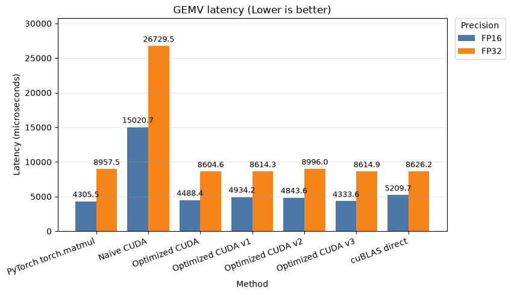
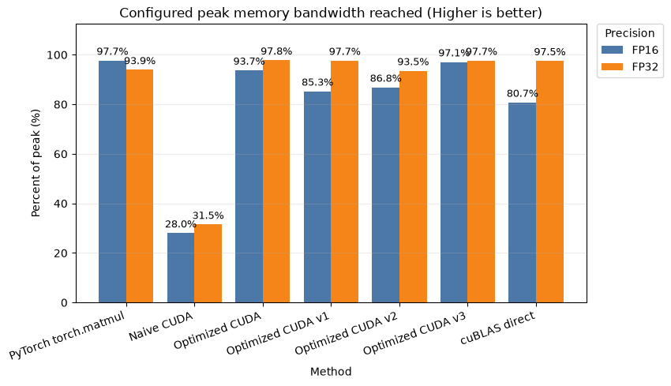
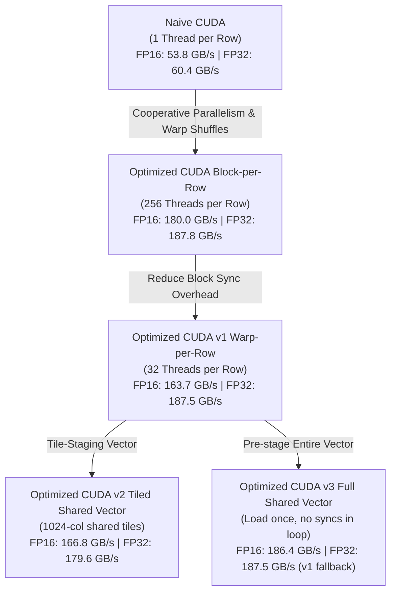

# CUDA GEMV: What We Tried, What Worked, and What Did Not

When we talk about custom CUDA kernels in deep learning, we usually jump straight to the complex stuff attention kernels, fused activation layers, and custom operators.

But if you want to understand how GPU memory constraints actually bottleneck model inference, you have to start with the absolute foundation: **GEMV** (GEneral Matrix-Vector multiplication).

In simple terms, it is:
$$\text{matrix} \times \text{vector}$$

```text
A = matrix of shape [M, K]
x = vector of shape [K]
y = vector of shape [M]

y = A * x
```

Keep in mind that we perform a pure matrix-vector multiplication $y = Wx$. What makes GEMV interesting is that it is primarily a **memory movement problem**, not a math problem. The challenge is: how much memory will you move between off-chip and on-chip memory for the matrix operations?

In this article, we'll see how much we can squeeze out of custom kernels and optimize them compared to native NVIDIA cuBLAS, PyTorch, and standard CUDA.

---

## 1. Intro: How Data Flows Inside the GPU

Before diving into CUDA code, we need to understand how the GPU chip is physically structured and how data moves through it.

Your GPU has massive compute power, but it doesn't automatically know the best way to cache and reuse data for a specific workload. When you write a custom kernel, you are essentially guiding this data flow yourself.

### The Off-Chip vs. On-Chip Boundary

The GPU divides memory into two physical domains:

* **OFF-Chip Memory (VRAM/HBM):** Where your model weights and input tensors live. It has massive capacity but high access latency.
* **ON-Chip Memory:** Located right next to the compute units. It is extremely fast but has very limited capacity.

Every time we perform a matrix multiplication, we have to transfer data from VRAM across the off-chip boundary. To do this efficiently, the GPU pulls data through several memory layers, each smaller and faster than the last:

1. **VRAM (Off-chip DRAM):** The starting point. High capacity, slow access.
2. **L2 Cache (On-chip):** Shared across all Streaming Multiprocessors (SMs). It caches VRAM accesses to save physical memory bus traffic.
3. **L1 Cache & Shared Memory (On-chip, per SM):** Private scratchpad memory shared by threads within the same block. Perfect for staging data we need to reuse across multiple threads.
4. **Registers (On-chip, per Thread):** The fastest memory on the chip. This is where mathematical computations (like Fused Multiply-Add) actually take place.

**In simple terms:** You want to pull data once from VRAM, stage it in registers or shared memory, and reuse it as many times as possible. If your threads have to keep going back to VRAM to read the same values, the memory latency and traffic will completely destroy your kernel throughput.

### Hardware Specifications (RTX 4050 Laptop GPU)

I have an RTX 4050 in my local machine, so we'll be using this for benchmarking the GEMV kernels here. This chip is based on the Ada Lovelace architecture, which contains:

| Metric | Value | Meaning |
|---|---|---|
| **GPU Name** | NVIDIA GeForce RTX 4050 Laptop GPU | Device name |
| **Compute Capability** | 8.9 | CUDA architecture version |
| **SM Count** | 20 | Number of Streaming Multiprocessors |
| **Warp Size** | 32 | Threads per warp |
| **Max Threads / SM** | 1536 | Maximum resident CUDA threads per SM |
| **Max Threads / Block** | 1024 | Maximum CUDA threads per block |
| **Shared Memory / Block** | 48.0 KiB | On-chip shared memory limit per block |
| **Shared Memory / SM** | 100.0 KiB | On-chip shared memory available per SM |
| **Registers / Block** | 65536 | On-chip register limit per block |
| **Registers / SM** | 65536 | On-chip register file per SM |
| **L2 Cache** | 24.00 MiB | On-chip / near-chip cache |
| **Global Memory / VRAM** | 5.64 GiB | Off-chip GPU memory |
| **Core Clock** | 1605.0 MHz | Reported GPU core clock |
| **Memory Clock** | 8001.0 MHz | Reported CUDA memory clock |
| **Memory Bus Width** | 96 bit | Off-chip memory bus width |
| **Peak Memory Bandwidth (Decimal)** | **192.02 GB/s** | Sustained VRAM bandwidth limit |

For this RTX 4050 GPU, there are **2,560 unified shader CUDA cores** and **80 Tensor Cores**.

---

## 2. GEMV Problem Definition & The "L2 Cache Trap"

We run the GEMV operation with a square weight matrix $W$ and vector $x$:

```text
y = W * x
```

Earlier, we tried benchmarking with smaller matrix sizes like $1096 \times 1096$. However, we ran into an interesting issue:

### The Smaller Value Peak

Since a $1096 \times 1096$ matrix in FP32 is under 24MB, **the whole matrix fits entirely inside the L2 cache**. It never actually has to go read from off-chip HBM/VRAM. Because of this, the logical bandwidth calculations explode:

* **FP32 Optimized CUDA v3** = 519 GB/s
* **Percent Peak Bandwidth** = 270%

Here, the physical GPU memory is under-utilized, so the goal of the benchmark is to write custom kernels that utilize the GPU memory at a peak of over 90%.

To prevent L2 cache residency from skewing the results, we scaled the problem up so that it exceeds the L2 cache capacity (24 MB) by a wide margin. We chose:
$$\mathbf{M = 20096, \quad N = 20096}$$

At this shape, here is the memory layout for both FP16 and FP32:

### FP16 Case

* **W**: $(20096, 20096)$, `torch.float16`, **807.698 MB**
* **x**: $(20096,)$, `torch.float16`, **40.192 KB**
* **y**: $(20096,)$, `torch.float16`, **40.192 KB**
* **Logical Traffic per GEMV**: **807.779 MB** (well above the 24 MB L2 cache)

### FP32 Case

* **W**: $(20096, 20096)$, `torch.float32`, **1615.397 MB**
* **x**: $(20096,)$, `torch.float32`, **80.384 KB**
* **y**: $(20096,)$, `torch.float32`, **80.384 KB**
* **Logical Traffic per GEMV**: **1615.558 MB**

For both cases, the custom kernels accumulate partial sums in **FP32** to ensure numerical stability, then store the output in the target precision format.

---

## 3. Implementations Walkthrough

We compared seven different approaches to solve this GEMV problem, ranging from naive loops to highly optimized, hardware-specific caching strategies.

### 1. PyTorch Baseline (`torch.matmul`)

Standard PyTorch matrix-vector multiplication that dispatches internally to highly tuned vendor libraries like cuBLAS or cuBLASLt.

```python
torch.matmul(W, x, out=y_torch)
```

### 2. Naive CUDA

We assign **one thread to compute one output row** and run a simple serial loop through the columns:

```cuda
// Loop sequentially through columns to compute dot product
float partial_sum = 0.0f;
for (int col = 0; col < num_cols; ++col) {
    partial_sum = fmaf(load_as_float(weight_row[col]), load_as_float(vector[col]), partial_sum);
}
store_output(output, output_row, partial_sum);
```

* **Why it's slow**: Thread lanes in a warp load different rows, causing non-coalesced global memory reads. Each thread does 20,096 serial multiply-adds, which leaves the GPU cores mostly waiting on memory stalls.

### 3. Optimized CUDA (Cooperative Block-per-Row)

We assign **one block of 256 threads to cooperate on a single row**. Threads step through columns in parallel, load data using vectorized reads (`half2`/`float2`), perform warp shuffle reductions, and run a final block-level reduction:

```cuda
// Strided parallel dot product across the row
float partial_sum = strided_dot(weight_row, vector, num_cols, thread_id, blockDim.x);
partial_sum = warp_sum(partial_sum); // Reduce registers within warp

// Block-wide shared memory reduction
__shared__ float warp_sums[32];
if (lane_id == 0) warp_sums[warp_id] = partial_sum;
__syncthreads();

if (warp_id == 0) {
    float row_sum = lane_id < num_warps ? warp_sums[lane_id] : 0.0f;
    row_sum = warp_sum(row_sum); // Final warp reduction
    if (lane_id == 0) store_output(output, output_row, row_sum);
}
```

Vectorized loading in the helper function `strided_dot` (for FP16):

```cuda
// Load two elements in a single 32-bit transaction
const half2* weight_pairs = reinterpret_cast<const half2*>(weight_row);
const half2* vector_pairs = reinterpret_cast<const half2*>(vector);
for (int pair_col = thread_id; pair_col < num_pairs; pair_col += thread_count) {
    const float2 weight_pair = __half22float2(weight_pairs[pair_col]);
    const float2 vector_pair = __half22float2(vector_pairs[pair_col]);
    partial_sum = fmaf(weight_pair.x, vector_pair.x, partial_sum);
    partial_sum = fmaf(weight_pair.y, vector_pair.y, partial_sum);
}
```

### 4. Optimized CUDA v1 (Warp-per-Row)

To avoid block reduction and synchronization overhead, we assign **one warp (32 threads) to compute one row**. A block of 256 threads now computes **8 rows** in parallel:

```cuda
// One warp per row; stride of 32
float partial_sum = strided_dot(weight_row, vector, num_cols, lane_id, 32);
partial_sum = warp_sum(partial_sum); // Warp reduction only

if (lane_id == 0) store_output(output, output_row, partial_sum);
```

### 5. Optimized CUDA v2 (Warp-per-Row with Vector Tiling)

Since 8 warps in a block execute in parallel, they reload the same vector `x` from global memory. We cache a tile of `x` (1024 elements) in shared memory:

```cuda
for (int tile_start = 0; tile_start < num_cols; tile_start += vector_tile_cols) {
    // Cooperatively load vector tile into shared memory
    for (int col = thread_id; col < tile_cols; col += blockDim.x) {
        shared_vector[col] = vector[tile_start + col];
    }
    __syncthreads(); // Barrier 1: Tile is loaded

    if (valid_row) {
        partial_sum += strided_dot(weight_row + tile_start, shared_vector, tile_cols, lane_id, 32);
    }
    __syncthreads(); // Barrier 2: Safe to load next tile
}
```

* **Tradeoff**: Saves global reads of `x`, but calling `__syncthreads()` twice per tile loop adds warp stall overhead.

### 6. Optimized CUDA v3 (Full Shared Vector Caching)

For the FP16 case, we load the **entire** vector `x` into shared memory at block startup with a single synchronization. The 8 warps then compute their row dot products with zero inner loop barriers:

This caching strategy only works for **FP16** because of shared memory size constraints (the 20,096-element vector is $\approx 40.2 \text{ KB}$, which fits under the RTX 4050's 48 KiB block limit). For **FP32**, the vector requires $\approx 80.4 \text{ KB}$ and exceeds this limit, causing an automatic fallback to `v1`.

```cuda
// Load the entire vector at block startup
for (int col = thread_id; col < num_cols; col += blockDim.x) {
    shared_vector[col] = vector[col];
}
__syncthreads(); // Single block synchronization

// Zero block barriers inside the computation loop
float partial_sum = strided_dot(weight_row, shared_vector, num_cols, lane_id, 32);
partial_sum = warp_sum(partial_sum);
```

* **Note**: Fits FP16 vectors up to the 48 KiB shared memory limit ($20096 \times 2\text{ bytes} \approx 40.2\text{ KB}$). For FP32, it requires $80.4\text{ KB}$ and automatically falls back to `v1`.

### 7. Direct cuBLAS GEMV

Expresses GEMV as a column-major GEMM of shape $[M, N] \times [N, 1] \rightarrow [M, 1]$, calling `cublasGemmEx` directly to bypass PyTorch wrapper overhead:

```cuda
CUBLAS_CHECK(cublasGemmEx(
    handle, CUBLAS_OP_T, CUBLAS_OP_N,
    num_rows, 1, num_cols, &alpha,
    weight.data_ptr(), data_type, num_cols,
    vector.data_ptr(), data_type, num_cols, &beta,
    output.data_ptr(), data_type, num_rows,
    CUBLAS_COMPUTE_32F, algorithm));
```

---

## 4. Benchmarking Results

To evaluate the performance of our custom CUDA kernels, we benchmarked all seven implementations on our local NVIDIA GeForce RTX 4050 Laptop GPU. Below are the execution results for both FP16 and FP32 precisions, comparing latency, logical memory bandwidth, and peak bandwidth utilization:

### 1. Latency (µs)

This plot compares the execution latency in microseconds. A lower value indicates a faster kernel.


* **Key Takeaways**:
  * **Naive CUDA is by far the slowest**: Stalling at 15,020 µs in FP16 and 26,729 µs in FP32 due to non-coalesced loads and serial thread execution.
  * **We beat PyTorch and cuBLAS on FP32 latency**: Our Custom Optimized CUDA (Block-per-Row) achieved **8,604.58 µs**, beating PyTorch (8,957.48 µs) and cuBLAS direct (8,626.20 µs). This is because our custom kernel runs directly with zero PyTorch runtime dispatch wrapper overhead. PyTorch has to do dynamic shape checking, memory allocation, and algorithm selection, which adds CPU-GPU dispatch latency. Because FP32 execution takes longer (~8.6 ms), our raw kernel's low launch overhead makes it the winner.
  * **We failed to beat PyTorch on FP16 latency**: PyTorch achieved **4,305.50 µs**, while our best Custom Optimized CUDA v3 took **4,333.57 µs** (missing PyTorch by ~28 µs). Analyzing `gemv_kernels.cu`, our v3 kernel launches 2,512 blocks (`(20096 + 8 - 1) / 8`). Because each block cooperatively pre-stages the entire vector into shared memory at block startup:
    $$\text{Grid Vector Traffic} = 2,512 \text{ blocks} \times 20,096 \text{ elements} \times 2 \text{ bytes} \approx 101 \text{ MB}$$
    This redundant loading of the vector across blocks represents an extra **12.5%** of memory traffic over the 807.7 MB matrix. At FP16's fast execution speed, this redundant traffic and the block startup `__syncthreads()` barrier become the bottleneck. PyTorch's backend uses highly optimized tiling/persistent-block architectures to reuse the vector across rows and minimize redundant VRAM reads.

### 2. Memory Bandwidth (GB/s)

This plot compares the logical memory bandwidth achieved by each kernel. A higher value indicates better memory bus saturation.


* **Key Takeaway**: Both FP16 and FP32 optimized implementations converge to around **180–187 GB/s**, effectively saturating the memory bus.

### 3. Peak Memory Bandwidth Utilization (%)

This plot measures what percentage of the physical maximum memory bandwidth (192.02 GB/s) is saturated by the kernel.


* **Key Takeaway**: The best optimized CUDA implementations (like Optimized CUDA v3 in FP16 and Block-per-Row in FP32) achieve over **97% of the hardware's peak bandwidth** (186.40 GB/s and 187.76 GB/s respectively). Utilizing this peak memory bandwidth means we are utilizing the GPU memory bus to its fullest potential, satisfying our main target of >90% saturation.

*Note: Minor floating-point discrepancies under FP16 (e.g., max relative error ~0.0168) are expected and are due to the non-associative nature of parallel floating-point reduction.*

---

## 5. Performance Progression: How We Optimized Step-by-Step

Our optimizations show a clear performance evolution:



### 1. From Naive to Block-Level Cooperative Reduction

The Naive CUDA kernel was painfully slow because one thread did the entire serial dot product. By moving to **Optimized CUDA (Block-per-Row)**, we assigned 256 threads to run the columns in parallel. We also vectorized our memory loads using `half2` and `float2`.

* **The Result**: A massive jump in memory bandwidth from **~53.8 GB/s to 180.0 GB/s in FP16 (3.35x speedup)** and **~60.4 GB/s to 187.76 GB/s in FP32 (3.11x speedup)**. We went from stalling on memory to saturating the hardware.

### 2. Reducing Block Overhead (v1: Warp-per-Row)

While block-per-row was fast, launching 20,096 block-level reductions with shared memory handoffs and block barriers (`__syncthreads()`) created extra overhead.

* **Optimized CUDA v1** shifted to warp-per-row (32 threads), computing 8 rows per block.
* **The Result**: For FP32, v1 performed almost identically to the block version (**187.54 GB/s vs 187.76 GB/s**). For FP16, it dropped slightly to **163.71 GB/s** because 32 threads per row couldn't hide global memory latency as effectively as 256 threads.

### 3. The Shared Vector Cache Experiment (v2 vs v3)

Every warp has to load the vector `x` from global memory. Since we have 8 warps in a block, they reload the same vector elements.

* **v2 (Tiled Vector)** loaded tiles of 1024 elements of `x` into shared memory. However, the overhead of block barriers (`__syncthreads()`) inside the tile loop slowed it down, leading to only **166.77 GB/s** in FP16.
* **v3 (Full Vector)** resolved this by loading the entire vector `x` (40 KB in FP16) into shared memory at block startup with a single synchronization.
* **The Result**: This achieved our absolute best FP16 performance of **186.40 GB/s (97.07% of the RTX 4050's hardware peak)**, beating the basic `v1` warp-per-row path and performing on par with PyTorch's native matmul.

---

## 6. Key Tradeoffs & Technical Takeaways

When writing custom CUDA kernels, you are constantly trading one hardware constraint for another. Here are the key tradeoffs we observed in this benchmark:

### 1. Shared Memory Size Limit vs. Vector Length (v3 Fallback)

Loading the entire vector `x` into shared memory (v3) is the fastest approach because it avoids global memory reloads and synchronization overhead. But it is limited by **hardware shared memory limits**.

* On the RTX 4050, the default shared memory limit is **48 KiB** per block.
* A vector of size 20,096 in FP16 takes $20096 \times 2 \text{ bytes} \approx 40.192 \text{ KB}$ (fits in shared memory).
* A vector of size 20,096 in FP32 takes $20096 \times 4 \text{ bytes} \approx 80.384 \text{ KB}$ (does not fit in shared memory).
* **The Tradeoff**: v3 must fallback to v1 for FP32. If we want v3 to run in FP32, we would have to dynamically request larger shared memory from the driver, which adds API overhead, or fall back to global memory loops.

### 2. Global Memory Latency vs. Synchronization Barriers (v1 vs. v2)

To reuse vector elements, v2 stages them in shared memory. But sharing memory across warps in a block requires calling `__syncthreads()`.

* Every block synchronization forces all warps to pause and wait.
* If your tiles are small, the warps spend more time waiting at barriers than they save on global memory loads.
* **The Tradeoff**: v1 (which does no caching but has zero syncthreads) ended up faster than v2. **Avoid shared memory barriers in your inner loop if the global memory reads are coalesced and cheap.**

### 3. The Memory Bandwidth Bottleneck (Why We Can't Beat cuBLAS)

For a $20096 \times 20096$ GEMV, the weight matrix $W$ is **807 MB** in FP16. The vector $x$ is only **40 KB**.
The kernel spends $99.9\%$ of its time loading the weight matrix from VRAM. Once our cooperative row kernel achieved coalesced, vectorized memory reads (`half2`/`float2`), we immediately saturated the physical VRAM bus.

* Our optimized kernels hit **186.4 GB/s (FP16)** and **187.7 GB/s (FP32)**.
* The hardware limit of the RTX 4050 Laptop GPU is **192.02 GB/s**.
* **The Tradeoff**: We are running at **97.7% of the physical memory bandwidth** of the chip. Because we are memory-bound, there is no arithmetic optimization that can make this run any faster. This is why our custom kernels and cuBLAS/PyTorch perform practically the same — they have all converged to the physical hardware limit.

### 4. Standalone Microbenchmarks vs. LLM Serving Performance

While it is satisfying to write a custom kernel that runs at 97% of peak bandwidth and slightly beats cuBLAS, this is a **standalone microbenchmark**.

* In a real LLM serving engine (like vLLM or SGLang), performance is measured by end-to-end serving metrics (Time to First Token, Inter-Token Latency, and max stable concurrency).
* Since PyTorch and cuBLAS are already hitting the memory bandwidth ceiling for GEMV, replacing them with a custom GEMV kernel will not show any measurable difference in end-to-end serving.
* **The Takeaway**: Keep this as an educational baseline. Focus custom kernel development on layers that involve element-wise operations and kernel fusion (like RMSNorm, SwiGLU, or RoPE), where we can actually prevent memory traffic from going back to VRAM.
