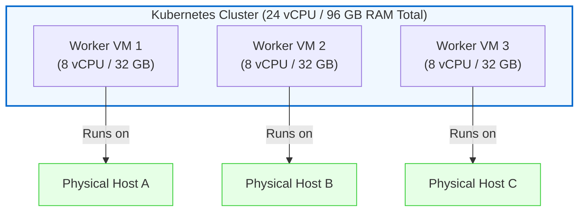
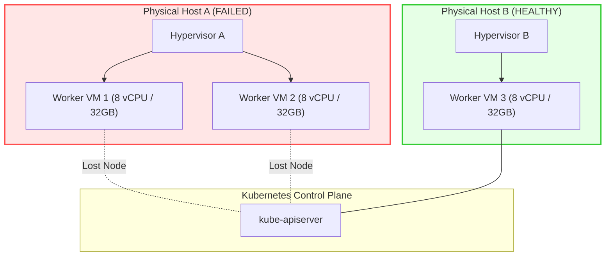
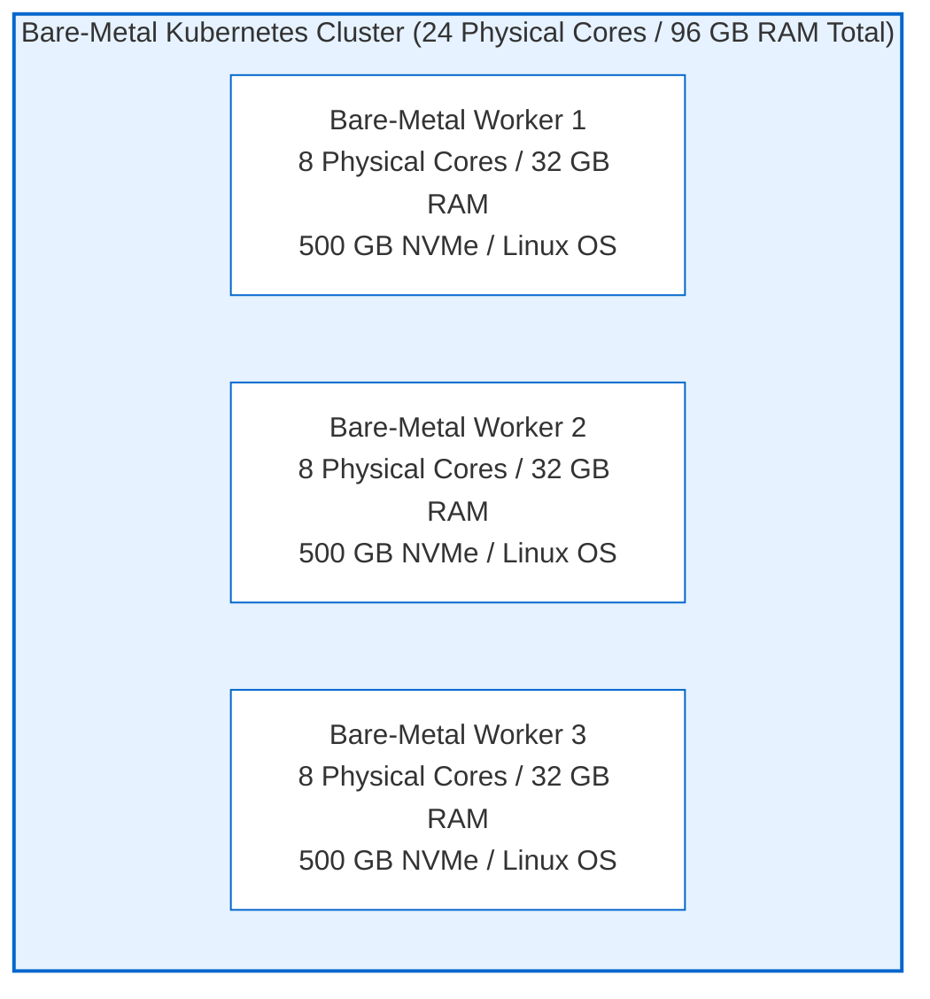
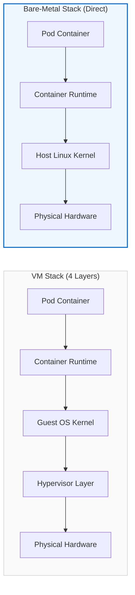
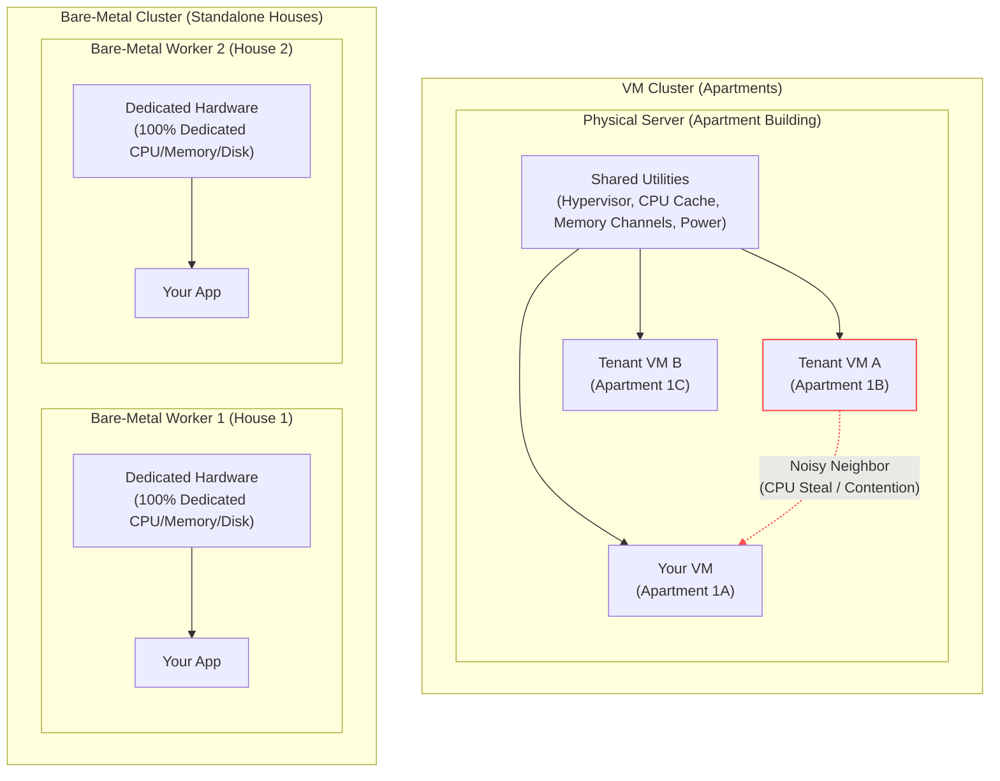

# vms vs bare metal in kubernetes: where do your pods actually run?

I was hearing this baremetla on every cloud infra platform was wondering what would be this so putting my small thoughts about what is baremetal and  when do we need it!

imagine you are setting up a kubernetes cluster to run a production web application.

you calculate your resource requirements and land on a clear set of needs:

* 24 CPU cores
* 96 GB RAM
* High availability across workers
* At least 3 worker nodes

you open your cloud console or datacenter portal to provision the infrastructure. right at the start, you hit a fundamental decision: do you run your worker nodes as virtual machines inside a hypervisor, or do you run them on raw bare-metal servers?

today we look at what happens under the hood when your kubernetes nodes run on VMs versus bare metal — how pod scheduling behaves, how physical hardware failure cascades, and how cpu virtualization impacts performance.

---

## 1. option 1: building a vm-based cluster

in a cloud environment, you don't rent 8-core physical machines directly. instead, the provider buys large physical servers in their datacenter. a single physical host server might look like this:

```text
Physical Host A (Cloud Provider's Datacenter Hardware)
CPU: 32 cores
RAM: 128 GB
Disk: 2 TB NVMe
```

this physical host is NOT your kubernetes node — it is the underlying machine owned by AWS, GCP, or Azure. to turn this 32-core machine into smaller worker nodes matching your required 8 vCPU / 32 GB RAM spec, the provider installs a hypervisor to slice it into multiple virtual machines.

```text
Physical Host A
┌──────────────────────────────────┐
│ Hypervisor                       │
│                                  │
│ VM Worker 1                      │
│ 8 vCPU                           │
│ 32 GB RAM                        │
│ 200 GB disk                      │
│                                  │
│ VM Worker 2                      │
│ 8 vCPU                           │
│ 32 GB RAM                        │
│ 200 GB disk                      │
│                                  │
│ Other customer's VM              │
│ 8 vCPU                           │
│ 32 GB RAM                        │
└──────────────────────────────────┘
```

to satisfy your application requirements, you provision a cluster with three control plane nodes and three worker VMs:

```text
Control Plane 1: 2 vCPU, 8 GB RAM
Control Plane 2: 2 vCPU, 8 GB RAM
Control Plane 3: 2 vCPU, 8 GB RAM

Worker 1: 8 vCPU, 32 GB RAM
Worker 2: 8 vCPU, 32 GB RAM
Worker 3: 8 vCPU, 32 GB RAM
```

your total worker capacity matches your target (3 workers × 8 vCPU & 32 GB = 24 vCPU, 96 GB RAM total).

in an ideal scenario, the cloud provider spreads each of your worker VMs onto a completely separate physical host server in their datacenter:



this separate placement gives you **fault isolation**. if Physical Host A suffers a power or hardware failure, only Worker VM 1 goes down. your other two worker VMs stay alive on Host B and Host C, so Kubernetes can reschedule your app's pods safely.

### the hidden failure domain in VM clusters

because VMs are software abstractions, you do not automatically control which physical server hosts which VM. the cloud scheduler might place two of your worker VMs on the same physical machine:

```text
Physical Host A
├── Worker VM 1 (8 vCPU, 32 GB RAM)
└── Worker VM 2 (8 vCPU, 32 GB RAM)

Physical Host B
└── Worker VM 3 (8 vCPU, 32 GB RAM)
```

now look at what happens if Physical Host A suffers a power failure or motherboard crash:

```text
Physical Host A fails
├── Worker VM 1 dies
└── Worker VM 2 dies
```

in a single moment, two-thirds of your cluster's total worker capacity disappears (16 vCPU and 64 GB RAM vanish).



this is why VM-based kubernetes deployments rely on cloud primitives to enforce isolation:

* **Availability Zones**: placing nodes across physically isolated datacenters with separate power and networking.
* **Host Anti-Affinity Rules**: instructing the hypervisor scheduler never to place designated VMs on the same physical host.
* **Placement Groups / Spread Placement**: forcing VMs onto distinct underlying hardware racks.
* **Failure Domains**: mapping kubernetes topology labels (`topology.kubernetes.io/zone`) so `kube-scheduler` avoids concentrating pods on VMs sharing the same physical chassis.

even with all these cloud placement rules, you are still operating inside a virtualized sandbox — sharing physical CPU sockets, routing disk I/O through software controllers, and hoping neighbor VMs don't spike your latency.

what if you want to bypass the hypervisor middleman entirely and give your pods direct access to raw physical silicon?

that is where bare-metal clusters come in.

---

## 2. option 2: building a bare-metal cluster

instead of renting virtual slices of a machine, you rent three dedicated physical servers.

each machine gives you direct hardware access:

```text
Bare-Metal Server 1: 8 physical cores, 32 GB RAM, 500 GB NVMe, 10 Gbps network
Bare-Metal Server 2: 8 physical cores, 32 GB RAM, 500 GB NVMe, 10 Gbps network
Bare-Metal Server 3: 8 physical cores, 32 GB RAM, 500 GB NVMe, 10 Gbps network
```

your total cluster capacity matches your target on paper (3 dedicated servers × 8 physical cores & 32 GB = 24 physical cores, 96 GB RAM total).

the bare-metal cluster architecture looks like this:



notice what is missing on bare metal: there is no hypervisor sitting between your containers and the physical silicon.



remember: a bare-metal server represents **one complete Kubernetes worker node**, and your application pods run inside it.

if Bare-Metal Worker 1 suffers a power or motherboard failure, **Worker Node 1 goes down — and all pods running inside Worker 1 die with it**.

however, because failure domains map 1:1 to physical hardware, your remaining cluster capacity is completely deterministic:

* **Remaining Worker Nodes**: Worker 2 and Worker 3
* **Remaining CPU**: 16 physical cores
* **Remaining RAM**: 64 GB RAM

`kube-controller-manager` detects that Worker 1 is dead, evicts its failed pods, and `kube-scheduler` automatically recreates those pods on Worker 2 and Worker 3.

both VM and bare-metal clusters recover failed pods automatically — when a node goes down, `kube-controller-manager` evicts the affected pods and `kube-scheduler` recreates them on surviving worker nodes.

the true operational difference comes down to **system capacity loss during a physical host crash**:

* **On Bare Metal**: 1 physical server crash takes down exactly 1 worker node. You lose **1/3** of your capacity and keep **2/3** of your cluster alive to absorb the evicted pods.
* **On VMs (without spread placement)**: 1 physical server crash can take down multiple co-located worker VMs simultaneously. You risk losing **2/3** of your cluster at once, leaving the remaining 1/3 overloaded.

## 4. real-world workload comparison: database clusters

consider designing infrastructure for a latency-sensitive database cluster requiring 3 nodes, each with 16 CPUs, 64 GB RAM, and high-performance storage.

### the VM design

```text
Database VM 1: 16 vCPU, 64 GB RAM, 1 TB Cloud Network Disk
Database VM 2: 16 vCPU, 64 GB RAM, 1 TB Cloud Network Disk
Database VM 3: 16 vCPU, 64 GB RAM, 1 TB Cloud Network Disk
```

**strengths of the VM design:**

* **Fast provision time**: spin up or tear down new database nodes in seconds using cloud APIs.
* **Elastic resizing**: scale a node from 16 vCPU to 32 vCPU with a quick reboot or live resize.
* **Infrastructure resilience**: cloud snapshotting, managed network disk replication, and instant VM replacement if a node fails.

**trade-offs of the VM design:**

* **Storage latency jitter**: network-attached storage (EBS/Persistent Disk) passes I/O requests through virtual storage controllers and network hops.
* **Shared CPU cache & execution**: vCPU thread sharing can introduce latency spikes during heavy transactional bursts.
* **Virtual network stack**: packet processing travels through virtual network interfaces (virtio/SR-IOV drivers) and hypervisor switches.

### the bare-metal design

```text
Database Server 1: 16 Physical Cores, 64 GB RAM, 2 × 1 TB Local NVMe (RAID 1)
Database Server 2: 16 Physical Cores, 64 GB RAM, 2 × 1 TB Local NVMe (RAID 1)
Database Server 3: 16 Physical Cores, 64 GB RAM, 2 × 1 TB Local NVMe (RAID 1)
```

**strengths of the bare-metal design:**

* **Dedicated CPU isolation**: 100% of core processing power and L3 cache reserved exclusively for database query execution.
* **Maximum disk throughput**: local NVMe SSDs connect directly to PCIe lanes, delivering hundreds of thousands of IOPS with sub-millisecond read/write latency.
* **Kernel & hardware control**: direct access to configure system BIOS, NUMA node bindings, CPU frequency governors, RAID arrays, and sysctl network parameters.

**trade-offs of the bare-metal design:**

* **Longer provisioning & replacement time**: replacing a failed server requires hardware swapping or PXE boot re-imaging.
* **Fixed node sizes**: resizing requires physically replacing hardware or adding entire extra servers.
* **State management complexity**: local NVMe disks require database-level replication (e.g., Raft, Postgres streaming replication) because disk state is bound to the physical chassis.

---

## 5. a mental model: apartments vs standalone houses

a useful way to visualize the difference between VM clusters and bare-metal clusters is housing:



with virtual machines, it is like renting an apartment. you get a private living space, but key infrastructure like cpu sockets, memory channels, and hypervisor scheduling is shared with neighbors. with bare metal, it is like owning a standalone house. the entire physical chassis, local nvme drives, and pcie buses belong 100% to you.

## 6. decision framework: when to choose which architecture

choosing between virtual machines and bare metal in kubernetes comes down to workload requirements and operational priorities.

you should choose VM clusters when you need fast autoscaling, rapid node creation, and granular node sizes like 2 vcpu / 4 GB workers. VMs are also the right fit if you rely on managed cloud storage integration, automated backups, and a dynamic setup where nodes are treated as short-lived, disposable primitives.

on the other hand, you should choose bare-metal clusters when you need dedicated physical cpu cores, dedicated memory bandwidth, and zero cpu steal time for ultra-predictable tail latency. bare metal is also necessary when you need maximum local nvme storage iops, direct pcie network speeds, and full low-level control over kernel, numa nodes, and hardware configuration. this is the go-to architecture for large, high-utilization workloads like llm inference, real-time analytics, or high-frequency databases.
