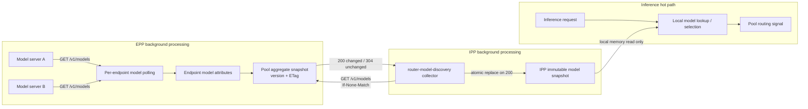
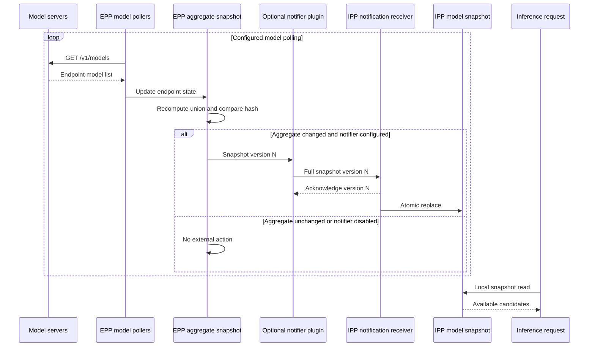

# Solution 1: IPP conditionally polls EPP

IPP periodically requests the EPP aggregate. EPP returns:

- `200` with the complete snapshot when changed.
- `304 Not Modified` when IPP’s ETag is current.
- `503` when EPP has not completed its initial synchronization.

“Unchanged returns `200`” would work, but `304` is the correct and more efficient HTTP behavior.



## Router changes for solution 1

### 1. Make model polling independently configurable

Add a per-source polling interval or change the runtime to support individual dispatcher intervals.

For example:

```yaml
- type: models-data-source
  name: endpoint-models
  parameters:
    path: /v1/models
    pollInterval: 10s
    timeout: 1s
```

Do not reuse the 50ms metrics interval.

### 2. Add a pool aggregate snapshot

The snapshot should contain:

```go
type ModelSnapshot struct {
    Version     uint64
    GeneratedAt time.Time
    Models      []ModelData
    ETag        string
    Synced      bool
}
```

Aggregate rules:

- Include only fresh, ready endpoints.
- Deduplicate by model ID.
- Preserve `Parent`.
- Sort results for deterministic ETags.
- Publish the snapshot atomically.
- Increment the version only when the semantic model set changes.

Initially, the handler can scan endpoint attributes when requested because IPP polling QPS will be low. A cached aggregate is better if notification is planned.

### 3. Expose `/v1/models`

The handler must only read cached state. It must never contact model servers while serving the request.

Recommended semantics:

| Condition | Response |
|---|---|
| Initial EPP model sync incomplete | `503` |
| ETag matches | `304` |
| Snapshot changed | `200` with complete list |
| Successfully synchronized but genuinely empty | `200 {"data":[]}` |

### 4. Add freshness tracking

PR #1231 stores model content but not when it was last successfully obtained. Add endpoint-level timestamps so an old model attribute is not included forever after repeated poll failures.

## IPP changes for solution 1

### 1. Add a collector

Create:

```text
pkg/framework/plugins/datalayer/routermodelcollector/
```

It should implement the existing collector interface in [datasource/types.go](/data/inference/llm-d-projects/llm-d-inference-payload-processor/pkg/framework/interface/datalayer/datasource/types.go:76).

Configuration:

```yaml
- name: pool-a-models
  type: router-model-discovery-collector
  parameters:
    modelsURL: https://pool-a-epp/v1/models
    providerRef: pool-a
    pollInterval: 10s
    requestTimeout: 1s
    maxStaleness: 60s
```

The current IPP processor already executes collectors asynchronously with startup jitter in [processor.go](/data/inference/llm-d-projects/llm-d-inference-payload-processor/pkg/datalayer/processor.go:226).

### 2. Conditional requests

The collector stores the previous ETag:

```text
First request:
GET /v1/models
→ 200, snapshot, ETag=v10

Next request:
GET /v1/models
If-None-Match: v10
→ 304

After model change:
GET /v1/models
If-None-Match: v10
→ 200, new snapshot, ETag=v11
```

### 3. Source-aware reconciliation

The existing model config datasource deletes every model not in its own file. That conflicts with router discovery.

The datastore needs something like:

```go
ReplaceModelsForSource(sourceID string, models []ModelDefinition)
```

A model is removed only when no source owns it.

### 4. Preserve last-known-good state

Timeout, `503`, malformed JSON, or TLS failure must not produce an empty snapshot. Retain the last successful snapshot and track its age.

### Hot-path cost

Solution 1 adds no network latency to inference requests:

```text
Request → datastore read → model selection
```

Polling runs in the background. The only possible contention is a brief datastore write during snapshot replacement, which can be minimized by building the new snapshot before acquiring the write lock.

---


 The current router supports per-endpoint model polling, but neither proposed IPP integration exists yet. PR #1231 built the typed model-state foundation; it did not expose `/v1/models`, aggregate pool state, detect changes, or notify IPP.

My recommendation is:

1. Implement conditional background polling first.
2. Design the aggregate snapshot so notification can reuse it later.
3. If propagation latency proves insufficient, add a watch/notification channel with periodic polling retained for recovery.

Both solutions keep discovery off the inference request hot path.

## Current llm-d-router implementation

I inspected router `main` at commit [`139fb738`](https://github.com/llm-d/llm-d-router/commit/139fb738d1ca08abefb76aa1eaed0741014de2dd).

### What PR #1231 fixed

[PR #1231](https://github.com/llm-d/llm-d-router/pull/1231) is merged. It fixed the internal data-layer contract for model information:

- Introduced shared `ModelData` and `ModelDataCollection` types.
- Stores both model `ID` and optional adapter `Parent`.
- Moved the model attribute into `attribute/models`.
- Made the model extractor a typed producer.
- Added `Produces()` so the data graph can validate producer/consumer types.
- Fixed cloning so consumers receive `ModelDataCollection`, not an inconsistent pointer type.

The current model structure is effectively:

```go
type ModelData struct {
    ID     string `json:"id"`
    Parent string `json:"parent,omitempty"`
}
```

This is useful for LoRA discovery because IPP may need both adapter name and base model.

### How EPP polling works now

The router has an opt-in `models-data-source`:

1. Every discovered endpoint gets its own collector.
2. On every collector tick, it calls that endpoint’s `/v1/models`.
3. `models-data-extractor` stores the response on that endpoint.
4. Poll failures leave the previous endpoint attribute untouched.

Relevant current code:

- [models datasource](https://github.com/llm-d/llm-d-router/blob/main/pkg/epp/framework/plugins/datalayer/source/models/datasource.go)
- [models extractor](https://github.com/llm-d/llm-d-router/blob/main/pkg/epp/framework/plugins/datalayer/extractor/models/extractor.go)
- [polling collector](https://github.com/llm-d/llm-d-router/blob/main/pkg/epp/datalayer/collector.go)

Important findings:

- Model polling is registered but not enabled in the default EPP configuration.
- The default configuration only enables metrics polling.
- All polling sources share one global interval.
- That global default is currently `50ms`.
- The model extractor writes the attribute on every successful poll, even when unchanged.
- Model state exists per endpoint; there is no pool-wide aggregate snapshot.
- There is no external `GET /v1/models` EPP handler.
- There is no outbound notification mechanism to IPP.
- The router’s existing “notification sources” are internal Kubernetes event sources, not EPP-to-IPP notifications.

Therefore, router issue [#1878](https://github.com/llm-d/llm-d-router/issues/1878) is still substantial work.

### Polling interval issue

If `models-data-source` is enabled today without changing the global interval, EPP could call `/v1/models` every 50ms for every endpoint.

For 20 endpoints:

```text
20 endpoints × 20 polls/second = 400 /v1/models requests/second
```

That is unnecessary for model membership, which changes much less frequently than load metrics.

Both proposals should first separate model polling cadence from metrics polling—for example, model polling every 5–30 seconds while load metrics remain frequent.

---

# Solution 1: IPP conditionally polls EPP

IPP periodically requests the EPP aggregate. EPP returns:

- `200` with the complete snapshot when changed.
- `304 Not Modified` when IPP’s ETag is current.
- `503` when EPP has not completed its initial synchronization.

“Unchanged returns `200`” would work, but `304` is the correct and more efficient HTTP behavior.


## Router changes for solution 1

### 1. Make model polling independently configurable

Add a per-source polling interval or change the runtime to support individual dispatcher intervals.

For example:

```yaml
- type: models-data-source
  name: endpoint-models
  parameters:
    path: /v1/models
    pollInterval: 10s
    timeout: 1s
```

Do not reuse the 50ms metrics interval.

### 2. Add a pool aggregate snapshot

The snapshot should contain:

```go
type ModelSnapshot struct {
    Version     uint64
    GeneratedAt time.Time
    Models      []ModelData
    ETag        string
    Synced      bool
}
```

Aggregate rules:

- Include only fresh, ready endpoints.
- Deduplicate by model ID.
- Preserve `Parent`.
- Sort results for deterministic ETags.
- Publish the snapshot atomically.
- Increment the version only when the semantic model set changes.

Initially, the handler can scan endpoint attributes when requested because IPP polling QPS will be low. A cached aggregate is better if notification is planned.

### 3. Expose `/v1/models`

The handler must only read cached state. It must never contact model servers while serving the request.

Recommended semantics:

| Condition | Response |
|---|---|
| Initial EPP model sync incomplete | `503` |
| ETag matches | `304` |
| Snapshot changed | `200` with complete list |
| Successfully synchronized but genuinely empty | `200 {"data":[]}` |

### 4. Add freshness tracking

PR #1231 stores model content but not when it was last successfully obtained. Add endpoint-level timestamps so an old model attribute is not included forever after repeated poll failures.

## IPP changes for solution 1

### 1. Add a collector

Create:

```text
pkg/framework/plugins/datalayer/routermodelcollector/
```

It should implement the existing collector interface in [datasource/types.go](/data/inference/llm-d-projects/llm-d-inference-payload-processor/pkg/framework/interface/datalayer/datasource/types.go:76).

Configuration:

```yaml
- name: pool-a-models
  type: router-model-discovery-collector
  parameters:
    modelsURL: https://pool-a-epp/v1/models
    providerRef: pool-a
    pollInterval: 10s
    requestTimeout: 1s
    maxStaleness: 60s
```

The current IPP processor already executes collectors asynchronously with startup jitter in [processor.go](/data/inference/llm-d-projects/llm-d-inference-payload-processor/pkg/datalayer/processor.go:226).

### 2. Conditional requests

The collector stores the previous ETag:

```text
First request:
GET /v1/models
→ 200, snapshot, ETag=v10

Next request:
GET /v1/models
If-None-Match: v10
→ 304

After model change:
GET /v1/models
If-None-Match: v10
→ 200, new snapshot, ETag=v11
```

### 3. Source-aware reconciliation

The existing model config datasource deletes every model not in its own file. That conflicts with router discovery.

The datastore needs something like:

```go
ReplaceModelsForSource(sourceID string, models []ModelDefinition)
```

A model is removed only when no source owns it.

### 4. Preserve last-known-good state

Timeout, `503`, malformed JSON, or TLS failure must not produce an empty snapshot. Retain the last successful snapshot and track its age.

### Hot-path cost

Solution 1 adds no network latency to inference requests:

```text
Request → datastore read → model selection
```

Polling runs in the background. The only possible contention is a brief datastore write during snapshot replacement, which can be minimized by building the new snapshot before acquiring the write lock.

---

# Solution 2: EPP notifies IPP when aggregate state changes

The notification must be triggered by a semantic change in the pool-wide aggregate—not every metrics poll and not every endpoint attribute write.

For example:

```text
Pod A changes: [base, adapter-X] → [base]
Pod B changes: [base] → [base, adapter-X]

Pool union before: [base, adapter-X]
Pool union after:  [base, adapter-X]
```

IPP does not need a notification because the pool remains capable of serving the same models.



## Router changes for solution 2

Solution 2 still needs the same aggregate snapshot component from solution 1.

Additional changes:

### 1. Add change detection

The current extractor always executes:

```go
attributes.Put(key, newModels)
```

It does not compare old and new state.

Normalize and compare:

- Sort model IDs.
- Deduplicate.
- Include parent relationships.
- Compute a stable hash.
- Increment version only when the pool aggregate changes.

### 2. Add an optional notifier plugin

For example:

```yaml
- type: model-snapshot-notifier
  name: ipp-notifier
  parameters:
    endpoint: https://payload-processor:9010/internal/v1/model-snapshots/pool-a
    timeout: 1s
    maxRetries: 5
```

If this plugin is absent, no notification is sent.

Configuration validation should require:

- `models-data-source`
- `models-data-extractor`
- Aggregate snapshot support

### 3. Never block EPP polling

The notifier needs:

- Bounded queue.
- One latest snapshot per destination.
- Coalescing of intermediate versions.
- Retry with exponential backoff.
- Strict timeout.
- No synchronous callback inside the model extractor.

If IPP is unavailable while versions 10–20 occur, EPP only needs to retain version 20 because notifications contain complete snapshots.

### 4. Send full snapshots, not deltas

Payload:

```json
{
  "provider": "pool-a",
  "version": 20,
  "generated_at": "2026-07-13T12:00:00Z",
  "models": [
    {"id": "base-model"},
    {"id": "adapter-x", "parent": "base-model"}
  ]
}
```

Full snapshots are idempotent and recover more safely from missed messages.

## IPP changes for solution 2

### 1. Add a receiving service

IPP currently exposes:

- ext-proc gRPC
- gRPC health

It does not expose a generic notification HTTP endpoint.

A new internal HTTP or gRPC server is therefore required, including:

- Deployment port.
- Service port.
- TLS/authentication.
- Request limits.
- Provider authorization.
- Graceful lifecycle handling.

### 2. Add version validation

IPP must:

- Ignore duplicate versions.
- Ignore older versions.
- Accept the next version.
- Detect gaps.
- Atomically replace the provider snapshot.

### 3. Handle multiple IPP replicas

This is the hardest edge case for simple webhook push.

If EPP sends one HTTP request to a Kubernetes Service with three IPP replicas, only one replica receives it:

```text
EPP → IPP Service → Replica 2 only
```

The other replicas retain stale state.

Possible fixes:

- Each IPP replica opens its own persistent watch stream to EPP.
- Store snapshots in shared external storage.
- EPP discovers and broadcasts to every IPP pod.
- Keep periodic pull reconciliation on every replica.

This is why a subscriber model is generally better than a webhook:

```text
IPP replica 1 ─┐
IPP replica 2 ─┼── watch EPP model snapshots
IPP replica 3 ─┘
```

### 4. Retain periodic reconciliation

Pure notification is not sufficient because notifications can be lost during:

- EPP restart.
- IPP restart.
- Network partition.
- Queue overflow.
- Leader transition.
- Configuration reload.

Even with notifications, IPP should periodically perform conditional `GET /v1/models` as anti-entropy recovery.

---

# Comparison

| Dimension | Solution 1: conditional pull | Solution 2: notification |
|---|---|---|
| Inference hot-path latency | No additional latency | No additional latency |
| Propagation after EPP observes change | Up to IPP polling interval | Near immediate |
| Idle traffic | Fixed low-rate GET/304 | Nearly zero |
| Missed updates | Self-heals next poll | Needs retries/resync |
| EPP complexity | Moderate | High |
| IPP complexity | Moderate | High |
| IPP HA replicas | Naturally convergent | Difficult with webhook |
| Backpressure | Consumer-controlled | EPP must manage |
| Protocol | Standard HTTP/OpenAI | Custom notification contract |
| Operational debugging | Simple | More distributed states |
| Security direction | IPP calls EPP | EPP calls IPP |
| Dependency on #1878 | Direct | Still needed for bootstrap/recovery |
| Best use | Default implementation | Very frequent/dynamic model changes |

## Proposed rollout

### Phase 1: conditional polling

Implement:

- Independent EPP model polling interval.
- Fresh pool aggregate snapshot.
- `/v1/models` with ETag and sync semantics.
- IPP background collector.
- Source-aware atomic reconciliation.
- Snapshot age metrics.

This delivers the requirement in issue [#206](https://github.com/llm-d/llm-d-inference-payload-processor/issues/206) using the standard interface requested by [#1878](https://github.com/llm-d/llm-d-router/issues/1878).

### Phase 2: optional watch notifications

Only add this if measurements show that the extra IPP polling interval violates model-propagation objectives.

Prefer:

```text
IPP subscribes to EPP watch stream
```

over:

```text
EPP posts webhook to IPP Service
```

Use the conditional GET from phase 1 for initial synchronization and periodic recovery.

## Final recommendation

Choose solution 1 initially.

A 10-second conditional poll produces very little traffic:

```text
1 IPP replica × 1 pool ÷ 10 seconds = 0.1 requests/second
```

Unchanged responses are `304`, and inference requests never wait for discovery.

If dynamic LoRA loading requires sub-second propagation, evolve to a hybrid:

```text
Notification/watch for fast changes
+
Conditional polling for correctness and recovery
```

The main prerequisite for either solution is not the transport. It is a correct, versioned, fresh, pool-wide snapshot inside EPP. Build that once, then let both `/v1/models` and the optional notifier consume the same snapshot.