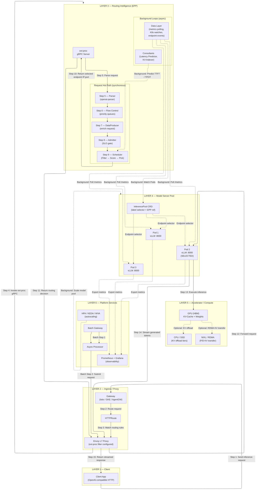
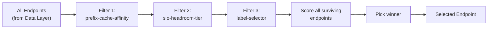
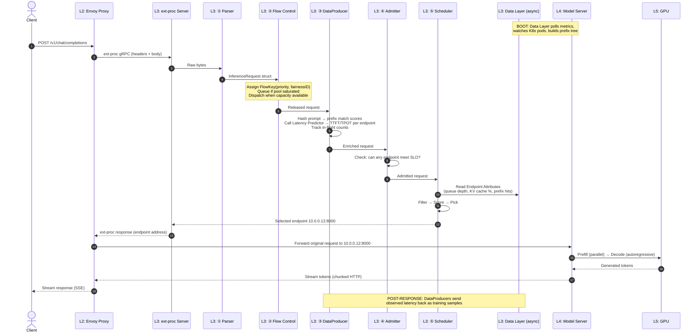
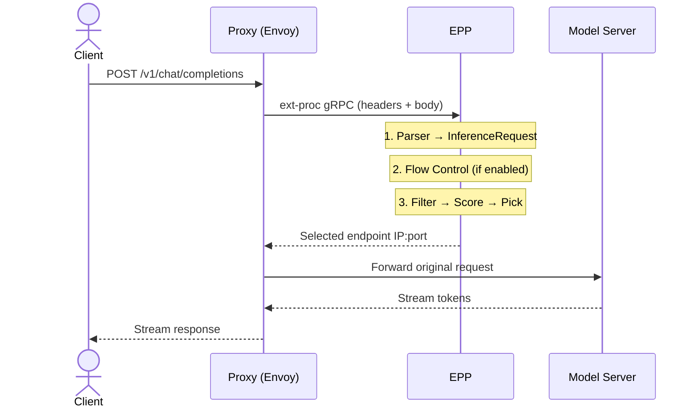
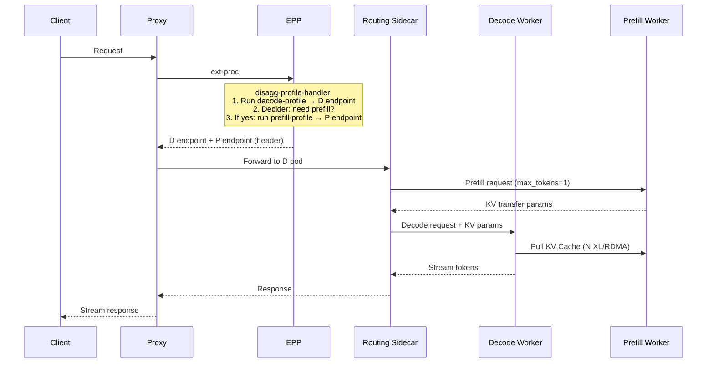

# llm-d System Design Document

## 1. Executive Summary

**llm-d** is a Kubernetes-native, distributed LLM inference serving stack. It sits *above* model servers (vLLM, SGLang, TRT-LLM) and *below* clients, providing intelligent routing, KV-cache management, disaggregated serving, autoscaling, and batch processing. It is a CNCF Sandbox project.

---

## 2. High-Level Design — Layer-by-Layer Execution Analysis

The system is organized into **6 layers**. Each layer is analyzed for what it does **at boot** (control plane) and **per request** (data plane).



---

### Layer 1 — Client

**What it is**: Any application sending OpenAI-compatible HTTP requests.

**At boot**: Nothing — stateless caller.

**Per request**:

1. Client sends `POST /v1/chat/completions` (or `/v1/completions`, `/v1/embeddings`) with JSON body containing `model`, `messages`/`prompt`, and optional headers
2. Optional headers for advanced features:
   - `x-llm-d-inference-objective: premium-traffic` → maps to `InferenceObjective` CRD for priority
   - `x-llm-d-inference-fairness-id: tenant-a` → tenant ID for fair queuing
   - `x-llm-d-slo-ttft-ms: 500` / `x-llm-d-slo-tpot-ms: 50` → latency SLO budgets
3. Receives streaming SSE or complete JSON response

---

### Layer 2 — Ingress / Proxy (Envoy)

**What it is**: A production-grade L7 proxy (Envoy) that accepts traffic and delegates routing decisions to the EPP.

**At boot (control plane)**:

1. Gateway controller watches `HTTPRoute` and `InferencePool` CRDs
2. From `InferencePool.endpointPickerRef`, it resolves the EPP K8s Service + ext-proc port (e.g., `qwen-epp:9002`)
3. Controller programs the Proxy with: route rules, ext-proc filter cluster, timeouts, and `failureMode` (`FailOpen` or `FailClose`)

**Per request (data plane)**:

1. **Accept** — Proxy receives client HTTP request, `HTTPRoute` matching selects the target `InferencePool`
2. **Park** — Proxy parks the request body in memory
3. **Consult** — ext-proc filter sends request headers + body to EPP over gRPC stream
4. **Wait** — Proxy blocks until EPP returns the selected endpoint address
5. **Forward** — Proxy rewrites the destination to the selected pod IP:port (e.g., `10.0.0.12:8000`) and forwards the original request directly
6. **Stream** — Model server streams tokens back through Proxy to client; ext-proc stream can remain active for response processing hooks

**Two deployment modes**:

| Mode | How Proxy Runs | When to Use |
|------|---------------|-------------|
| **Standalone** | Envoy sidecar inside EPP pod; ext-proc over `localhost` | Dev, batch, RL — no Gateway API needed |
| **Gateway** | External Gateway (Istio/GKE/AgentGW); ext-proc over network | Production multi-tenant |

---

### Layer 3 — Routing Intelligence (EPP)

**What it is**: The "brain" of llm-d. A Go service that receives ext-proc callbacks, evaluates candidate model servers, and returns the optimal endpoint. (**Repo**: [llm-d-inference-scheduler](https://github.com/llm-d/llm-d-inference-scheduler))

**At boot**:

1. EPP binary reads `EndpointPickerConfig` YAML (via `--config-file`)
2. Instantiates all configured plugins (parsers, scorers, filters, pickers, data sources)
3. Data Layer starts background loops (see below)
4. ext-proc gRPC server begins listening on configured port (e.g., 9002)

**Per request — synchronous hot path** (6 steps in order):

```
ext-proc gRPC in → ① Parser → ② Flow Control → ③ DataProducer → ④ Admitter → ⑤ Scheduler → ext-proc gRPC out
```

| Step | Component | What Happens | Can Reject? |
|------|-----------|-------------|-------------|
| **①** | **Parser** | Deserializes raw payload (OpenAI JSON / vLLM gRPC) into `InferenceRequest` struct with model name, messages, token counts, headers | No |
| **②** | **Flow Control** | Extracts `FlowKey(priority, fairnessID)` from headers. If pool is saturated: enqueues request in priority band, blocks handler thread. Dispatch worker continuously checks saturation, applies fairness policy (round-robin), ordering policy (FCFS/EDF), releases when capacity available. | **Yes** — HTTP 429 if band limit exceeded; 503 if TTL expires |
| **③** | **DataProducer** | Enriches request with per-endpoint signals: `approx-prefix-cache-producer` hashes prompt blocks and computes prefix match scores; `predicted-latency-producer` calls Latency Predictor sidecar for TTFT/TPOT predictions; `inflight-load-producer` tracks in-flight counts | No |
| **④** | **Admitter** | `latency-slo-admitter` checks if ANY endpoint can meet the SLO. If no endpoint can and the request is sheddable (priority < 0), rejects it. | **Yes** — reject sheddable requests |
| **⑤** | **Scheduler** | `ProfileHandler` selects which profile(s) to run, then per profile: **Filter** (narrow candidates) → **Score** (rank 0.0–1.0 per scorer, weighted sum) → **Pick** (select final endpoint). Returns `SchedulingResult` with target pod IP:port. | No (always picks from available) |

**⑤ Scheduler deep dive — Filter → Score → Pick**:



**Scoring formula**: `FinalScore(endpoint) = Σ (scorer_i(endpoint) × weight_i)`

Example: If `kv-cache-utilization-scorer` (weight 2.0) returns 0.8 and `queue-depth-scorer` (weight 1.0) returns 0.5, then: `FinalScore = (0.8 × 2.0) + (0.5 × 1.0) = 2.1`

**Background async loops (Data Layer)**:

| Loop | Source Plugin | What It Does | Update Frequency |
|------|-------------|-------------|-----------------|
| **Metrics Polling** | `metrics-data-source` → `core-metrics-extractor` | Scrapes `/metrics` from every model server pod; extracts `QueuedRequests`, `RunningRequests`, `KVCacheUtilization` → stores as Endpoint Attributes | Configurable interval |
| **K8s Watch** | `k8s-notification-source` | Watches Pod resources matching `InferencePool.selector` labels; adds/removes endpoints on scale events | Event-driven (instant) |
| **Endpoint Events** | `endpoint-notification-source` | Fires on endpoint add/update/delete within EPP; triggers cache init or stale metric purge | Event-driven |
| **Consultant: Latency Predictor** | `predicted-latency-producer` | Sends completed request latencies as training samples; reads updated XGBoost models from shared volume | Per-request (async post-response) |
| **Consultant: KV-Indexer** | `precise-prefix-cache-producer` | Consumes `KV-Events` over ZeroMQ from model servers; builds global prefix-cache tree | Event-driven (high-frequency) |

---

### Layer 4 — Model Server Pool

**What it is**: The inference engines (vLLM, SGLang, TRT-LLM) that load model weights onto accelerators and execute prefill + decode.

**At boot**:

1. Model server pods start, load model weights onto GPU(s), warm up KV-cache
2. Pods are labeled (e.g., `app: qwen-vllm`, `llm-d.ai/engine-type: vllm`)
3. `InferencePool` CRD's `selector.matchLabels` auto-discovers pods in same namespace
4. EPP Data Layer detects new endpoints and starts polling their metrics

**Per request**:

1. Receives forwarded HTTP request directly from Proxy (not through EPP)
2. Executes **Prefill** (process all input tokens in parallel → populate KV-Cache)
3. Executes **Decode** (generate output tokens one at a time, autoregressively)
4. Streams tokens back to Proxy via chunked HTTP response

**What model servers expose to EPP (Prometheus metrics)**:

| Metric | What EPP Uses It For |
|--------|---------------------|
| `vllm:num_requests_waiting` | Queue depth scorer |
| `vllm:num_requests_running` | Running requests scorer |
| `vllm:kv_cache_usage_perc` | KV cache utilization scorer + saturation detector |
| `vllm:cache_config_info{block_size}` | Prefix cache scorer block alignment |

**InferencePool CRD** — the glue connecting Layer 3 and Layer 4:

```yaml
apiVersion: inference.networking.k8s.io/v1
kind: InferencePool
metadata:
  name: qwen-pool
spec:
  selector:
    matchLabels:
      app: qwen-vllm          # ← which pods belong to pool
  targetPorts:
    - number: 8000             # ← where pods accept requests
  endpointPickerRef:
    name: qwen-epp             # ← which EPP service to consult
    port:
      number: 9002
    failureMode: FailClose     # ← what happens if EPP is down
```

---

### Layer 5 — Accelerator / Compute

**What it is**: The physical GPU memory, KV-Cache, and high-speed interconnects.

**KV-Cache lifecycle**:

1. **Prefill** fills KV-Cache entries in GPU HBM for input tokens
2. **Decode** reads KV-Cache each generation step
3. **Prefix Caching** — if a new request shares a prompt prefix with a cached entry, prefill is skipped for those tokens (TTFT reduction)
4. **Eviction** — when HBM is full, LRU blocks are evicted (or offloaded to CPU/SSD if KV Offloader is configured)

**Disaggregated Serving (P/D) — NIXL/RDMA KV Transfer**:

- Prefill worker computes KV-Cache on its GPU
- NIXL registers the KV memory with the NIC
- Decode worker pulls KV blocks directly GPU-to-GPU over InfiniBand/RoCE (bypasses CPU)
- Routing Sidecar on decode pod orchestrates the 2-phase handshake

**KV Offloading tiers**: GPU HBM → CPU RAM → Local SSD (via `llmd-fs-connector`)

---

### Layer 6 — Platform Services

**What it is**: Supporting infrastructure for scaling, batch processing, and observability.

| Service | What It Does | How It Connects |
|---------|-------------|-----------------|
| **HPA + KEDA** | Scales model server replicas based on EPP-exported metrics (queue depth, running requests) | Reads Prometheus metrics from EPP |
| **WVA** | Global optimizer that places model servers across heterogeneous accelerators to minimize cost while meeting SLO targets | Watches KV cache util, queue depth; sets HPA targets |
| **Batch Gateway** | OpenAI-compatible `/v1/batches` API → priority queue (Redis) → Batch Processor dispatches per-request to llm-d Router | Sends HTTP to Proxy (Layer 2) |
| **Async Processor** | Pulls from message queues (Redis/GCP Pub/Sub), applies dispatch gates (saturation checks), forwards to Router | Sends HTTP to Proxy (Layer 2) |
| **Prometheus + Grafana** | Collects metrics from EPP + model servers; pre-built dashboards for flow control, scheduling, pool health | Scrapes `/metrics` endpoints |

---

### End-to-End Execution Summary (Single Request)



---

## 3. Step-by-Step Data Flow

### 3.1 Online Inference (Aggregated)



**Detailed steps inside EPP:**

1. **Parser** — `openai-parser` / `vllmgrpc-parser` converts raw payload to `InferenceRequest`
2. **DataProducers** — `approx-prefix-cache-producer`, `predicted-latency-producer`, `inflight-load-producer` enrich request with per-endpoint data
3. **Admitter** — `latency-slo-admitter` rejects sheddable requests that can't meet SLO
4. **Flow Control** (behind feature gate) — Assigns `FlowKey(priority, fairnessID)`, queues request, dispatches when saturation detector says pool has capacity
5. **Scheduler** — `ProfileHandler.Pick` selects profile(s), then runs:
   - **Filters**: `prefix-cache-affinity-filter`, `slo-headroom-tier-filter`, `label-selector-filter`
   - **Scorers**: `kv-cache-utilization-scorer`, `queue-depth-scorer`, `prefix-scorer`, `latency-scorer` (weighted sum)
   - **Picker**: `max-score-picker` or `weighted-random-picker`
6. **Response** — EPP returns endpoint address; Proxy forwards; tokens stream back

### 3.2 Disaggregated Serving (P/D)



### 3.3 Batch Inference

```
Client → Batch Gateway API (/v1/batches) → Priority Queue (Redis)
    → Batch Processor → [per-request] → llm-d Router → Model Servers
    → Results → Output File (S3) → Client polls GET /v1/batches/{id}
```

### 3.4 Async Processing

```
Producer → Message Queue (Redis/GCP Pub/Sub)
    → Async Processor workers → Dispatch Gate (saturation check)
    → llm-d Router → Model Servers → Results Queue
```

---

## 4. Module Responsibilities (LLD)

### 4.1 EPP — Endpoint Picker

> **Repo**: `llm-d-inference-scheduler` (Go)

The "brain" of the system. Internal architecture:

```
┌─────────────────────────────────────────────┐
│                    EPP                       │
│  ┌──────────┐  ┌──────────┐  ┌───────────┐  │
│  │Ext-Proc  │→ │ Request  │→ │   Flow    │  │
│  │ Server   │  │ Handler  │  │  Control  │  │
│  └──────────┘  └──────────┘  └─────┬─────┘  │
│                                    ↓         │
│  ┌──────────┐  ┌──────────────────────────┐  │
│  │  Data    │← │    Request Scheduler     │  │
│  │  Layer   │  │  Filter → Score → Pick   │  │
│  └──────────┘  └──────────────────────────┘  │
└─────────────────────────────────────────────┘
```

#### 4.1.1 Request Handler

| Plugin Type | Concrete Plugins | Purpose |
|-------------|-----------------|---------|
| **Parser** | `openai-parser`, `vllmgrpc-parser`, `passthrough-parser` | Convert protocol → `InferenceRequest` |
| **DataProducer** | `predicted-latency-producer`, `inflight-load-producer`, `approx-prefix-cache-producer`, `precise-prefix-cache-producer` | Enrich request with scheduling signals |
| **Admitter** | `latency-slo-admitter` | Reject requests that can't meet SLO |

#### 4.1.2 Flow Control

Three-tier dispatch: **Priority Band → Fairness Policy → Ordering Policy**

| Plugin Type | Plugins |
|-------------|---------|
| **Fairness** | `round-robin-fairness-policy`, `global-strict-fairness-policy` |
| **Ordering** | `fcfs-ordering-policy`, `edf-ordering-policy`, `slo-deadline-ordering-policy` |
| **Saturation** | `utilization-detector`, `concurrency-detector` |

**Key config**: `EndpointPickerConfig.flowControl` with `maxBytes`, `maxRequests`, `priorityBands[]`

#### 4.1.3 Request Scheduler

Pipeline: **ProfileHandler → (Filter → Score → Pick) per profile**

| Extension Point | Key Plugins |
|-----------------|-------------|
| **ProfileHandler** | `single-profile-handler` (default), `disagg-profile-handler` (P/D) |
| **Filters** | `prefix-cache-affinity-filter`, `slo-headroom-tier-filter`, `label-selector-filter`, `prefill-endpoints-filter`, `decode-endpoints-filter` |
| **Scorers** | `kv-cache-utilization-scorer`, `queue-depth-scorer`, `prefix-scorer`, `latency-scorer`, `lora-affinity-scorer`, `running-requests-size-scorer`, `token-load-scorer`, `session-affinity-scorer`, `no-hit-lru-scorer` |
| **Pickers** | `max-score-picker` (default), `random-picker`, `weighted-random-picker` |

**Score formula**: `FinalScore = Σ (scorer_score × weight)` where each scorer returns `[0.0, 1.0]`.

#### 4.1.4 Data Layer

Reactive system: **Source → Extractor → Endpoint Attributes**

| Source Type | Plugin | Extractor |
|-------------|--------|-----------|
| Polling | `metrics-data-source` | `core-metrics-extractor` |
| K8s Notification | `k8s-notification-source` | Custom `NotificationExtractor` |
| Endpoint Event | `endpoint-notification-source` | Custom `EndpointExtractor` |

**Metrics scraped from model servers**: `TotalQueuedRequests`, `TotalRunningRequests`, `KVCacheUtilization`, `BlockSize`, `NumGPUBlocks`

### 4.2 Proxy (Envoy)

- Accepts OpenAI-compatible HTTP requests
- Consults EPP via `ext-proc` gRPC (`FULL_DUPLEX_STREAMED` mode)
- Routes to selected pod IP:port
- Streams response back to client
- Configured by Gateway controller from `InferencePool.endpointPickerRef`

### 4.3 InferencePool

- **Not** a traffic proxy — purely a discovery/config resource
- Label selector → pod membership (dynamic, auto-updates on scale)
- `targetPorts` → model server port (e.g., 8000)
- `endpointPickerRef` → EPP service + ext-proc port
- `failureMode` → `FailOpen` (bypass EPP) or `FailClose` (reject)

### 4.4 Model Servers

| Engine | Supported | Key Metrics Endpoint |
|--------|-----------|---------------------|
| vLLM | Primary | `/metrics` (Prometheus) |
| SGLang | Supported | `/metrics` |
| TRT-LLM | Supported | `/prometheus/metrics` |

**Required pod label**: `llm-d.ai/engine-type: vllm|sglang|trtllm-serve`

**Health**: `GET /health` for liveness + readiness

### 4.5 Latency Predictor

- **Training Server** sidecar: retrains XGBoost on sliding window of completed requests
- **Prediction Server** sidecar(s): serve TTFT/TPOT predictions per endpoint
- **Shared Volume**: model files between training and prediction
- **Features (TTFT)**: KV cache %, input length, queue depth, running requests, prefix cache %, input tokens in flight
- **Features (TPOT)**: KV cache %, input length, queue depth, running requests, tokens generated
- ~5% MAPE accuracy; ~300 QPS per prediction server

### 4.6 KV-Cache Management

Three pillars:

| Pillar | Component | Mechanism |
|--------|-----------|-----------|
| **Routing** | EPP `prefix-scorer` | Hash prompt blocks → match against indexer |
| **Indexing** | KV-Cache Indexer (Consultant) | Consumes `KV-Events` (ZeroMQ) from model servers |
| **Offloading** | KV Offloader (`llmd-fs-connector`) | Tiered storage: GPU HBM → CPU RAM → SSD |

### 4.7 Autoscaling

| Approach | Signal Source | Use Case |
|----------|--------------|----------|
| **HPA + EPP Metrics** | EPP queue depth, running requests (via KEDA) | Homogeneous, single-model |
| **HPA + WVA** | KV cache util, queue depth, SLO targets | Heterogeneous, multi-model, cost-optimized |

### 4.8 Batch Gateway

| Component | Function |
|-----------|----------|
| **API Server** | OpenAI `/v1/batches`, `/v1/files` endpoints |
| **Batch Processor** | Polls priority queue, dispatches to llm-d Router |
| **Storage** | PostgreSQL (metadata), Redis (queue/events), S3 (files) |
| **GC** | Cleans expired jobs and files |

### 4.9 Async Processor

- Workers poll message queues (Redis Sorted Set, Redis Pub/Sub, GCP Pub/Sub)
- **Dispatch Gates**: `constant`, `redis`, `prometheus-saturation`, `prometheus-budget`
- Exponential backoff on retryable failures; deadline enforcement

---

## 5. Key APIs and Protocols

### 5.1 Client → Proxy

Standard OpenAI HTTP API:

- `POST /v1/chat/completions`
- `POST /v1/completions`
- `POST /v1/embeddings`

### 5.2 Proxy ↔ EPP (ext-proc gRPC)

[Envoy External Processing Protocol](https://www.envoyproxy.io/docs/envoy/latest/api-v3/service/ext_proc/v3/external_processor.proto). Mode: `FULL_DUPLEX_STREAMED`.

### 5.3 EPP → Model Server

- **Metrics scraping**: Prometheus pull at configured interval
- **KV-Events**: ZeroMQ push from model server → KV-Cache Indexer
- **Latency predictions**: gRPC to Latency Predictor sidecars

### 5.4 Flow Control Headers

| Header | Purpose |
|--------|---------|
| `x-llm-d-inference-fairness-id` | Tenant ID for fairness |
| `x-llm-d-inference-objective` | Maps to InferenceObjective (priority) |
| `x-llm-d-slo-ttft-ms` | TTFT SLO budget |
| `x-llm-d-slo-tpot-ms` | TPOT SLO budget |

### 5.5 Disaggregation Headers

| Header | Purpose |
|--------|---------|
| `x-prefiller-host-port` | Prefill pod address(es) set by EPP |

### 5.6 EPP Configuration API

`EndpointPickerConfig` (YAML, `llm-d.ai/v1alpha1`) passed via `--config-file`:

```yaml
featureGates: [flowControl]
plugins:
  - type: openai-parser
  - type: kv-cache-utilization-scorer
  - type: prefix-scorer
  - type: queue-depth-scorer
  - type: max-score-picker
  - type: concurrency-detector
    parameters: { maxConcurrency: 15 }
schedulingProfiles:
  - name: default
    plugins:
      - pluginRef: kv-cache-utilization-scorer
        weight: 2.0
      - pluginRef: prefix-scorer
        weight: 1.0
      - pluginRef: queue-depth-scorer
        weight: 1.0
requestHandler:
  parser:
    pluginRef: openai-parser
dataLayer:
  sources:
    - pluginRef: metrics-data-source
      extractors:
        - pluginRef: core-metrics-extractor
```

---

## 6. Key Metrics

### EPP Metrics

| Metric | Type | Description |
|--------|------|-------------|
| `llm_d_epp_ready_endpoints` | Gauge | Ready pods in pool |
| `llm_d_epp_average_kv_cache_utilization` | Gauge | Avg KV cache util |
| `llm_d_epp_scheduler_e2e_duration_seconds` | Histogram | Scheduling latency |
| `llm_d_epp_flow_control_queue_size` | Gauge | Queued requests |
| `llm_d_epp_flow_control_pool_saturation` | Gauge | Pool saturation level |
| `inference_objective_request_ttft_seconds` | Histogram | Actual TTFT |
| `inference_objective_request_duration_seconds` | Histogram | E2E latency |

---

## 7. Design Decisions & Trade-offs

| Decision | Rationale | Trade-off |
|----------|-----------|-----------|
| **ext-proc over custom proxy** | Reuse production Envoy; decouple routing logic | Extra gRPC hop per request (~ms) |
| **Plugin pipeline (Filter→Score→Pick)** | Composable, extensible scheduling | Complexity; must tune weights |
| **Flow Control at EPP (not model server)** | Global priority/fairness; late-binding routing | In-memory queues lost on crash |
| **Disagg via sidecar** | No model server changes needed; protocol-agnostic | Extra hop; sidecar resource overhead |
| **KV-Events via ZeroMQ** | High-frequency, low-latency cache state propagation | Additional dependency |
| **XGBoost for latency prediction** | Online retraining; low inference cost; ~5% MAPE | Assumes homogeneous pool |
| **InferencePool CRD** | K8s-native discovery; decoupled from Service | Requires GAIE CRD installation |
| **Helm + Kustomize for guides** | Composable layered config; reproducible | Learning curve for operators |

---

## 8. Local Setup & Test Commands

### 8.1 Prerequisites

```bash
# Required tools
kubectl, helm, git, kustomize, envsubst, docker/podman
# Optional: go, ginkgo, golangci-lint, jq
```

### 8.2 Clone & Environment Setup

```bash
git clone https://github.com/llm-d/llm-d.git && cd llm-d
export REPO_ROOT=$(realpath $(git rev-parse --show-toplevel))
source ${REPO_ROOT}/guides/env.sh
export NAMESPACE=llm-d-quickstart
```

### 8.3 Install CRDs

```bash
kubectl apply -f https://github.com/kubernetes-sigs/gateway-api-inference-extension/releases/download/${GAIE_VERSION}/v1-manifests.yaml
```

### 8.4 Create Namespace + HF Token

```bash
kubectl create namespace ${NAMESPACE} --dry-run=client -o yaml | kubectl apply -f -
kubectl create secret generic llm-d-hf-token \
  --from-literal="HF_TOKEN=${HF_TOKEN}" \
  --namespace "${NAMESPACE}" --dry-run=client -o yaml | kubectl apply -f -
```

### 8.5 Deploy Router (Standalone)

```bash
helm install quickstart \
    ${ROUTER_STANDALONE_CHART} \
    -f guides/recipes/router/base.values.yaml \
    -f guides/optimized-baseline/router/optimized-baseline.values.yaml \
    -n ${NAMESPACE} --version ${ROUTER_CHART_VERSION}
```

### 8.6 Deploy Model Server

```bash
kubectl apply -n ${NAMESPACE} -k guides/optimized-baseline/modelserver/gpu/vllm/
```

### 8.7 Verify

```bash
export IP=$(kubectl get service quickstart-epp -n ${NAMESPACE} -o jsonpath='{.spec.clusterIP}')

# From inside cluster:
curl -X POST http://${IP}/v1/completions \
    -H 'Content-Type: application/json' \
    -d '{"model": "Qwen/Qwen3-32B", "prompt": "How are you today?"}' | jq
```

### 8.8 Build Commands (Makefile)

```bash
make help                                    # Show all targets
make image-build DEVICE=cuda                 # Build CUDA image
make image-build DEVICE=cuda ENABLE_EFA=true # With EFA support
make image-build DEVICE=rocm                 # AMD ROCm image
make image-build DEVICE=xpu                  # Intel XPU image
make image-push                              # Push to registry
make env                                     # Show build environment
make install-hooks                           # Install git hooks
```

### 8.9 Testing Checklist

```bash
# Deployment verification
kubectl get InferencePool.inference.networking.k8s.io -n ${NAMESPACE}
kubectl get gateway -o yaml      # Check status.address
kubectl get httpRoute -o yaml    # Check status "Route was valid"

# Container image validation checklist:
# [ ] optimized-baseline guide
# [ ] precise-kv-cache-aware example
# [ ] pd-disaggregation example
# [ ] wide-ep-lws example
# [ ] guidellm benchmark (load test)
# [ ] deepseek kernels (--all2all-backend)
```

### 8.10 Cleanup

```bash
helm uninstall quickstart -n ${NAMESPACE}
kubectl delete namespace ${NAMESPACE}
```

---

## 9. Well-Lit Path Guides (Deployment Recipes)

| Category | Guide | What It Enables |
|----------|-------|-----------------|
| **Routing** | Optimized Baseline | Prefix-cache + load-aware routing |
| **Routing** | Predicted Latency | XGBoost-based SLO-aware routing |
| **KV Cache** | Precise Prefix Cache | Global KV-cache indexing |
| **KV Cache** | Tiered Prefix Cache | CPU/SSD KV offloading |
| **Large Models** | P/D Disaggregation | Prefill/decode separation |
| **Large Models** | Wide Expert-Parallelism | Multi-node MoE (DeepSeek-R1) |
| **Operations** | Flow Control | Multi-tenant queuing |
| **Operations** | Workload Autoscaling | SLO-aware scaling |
| **Workloads** | Agentic Serving | Long multi-turn agent workloads |
| **Workloads** | Multimodal Serving | Image/audio/video models |
| **Batch** | Batch Gateway | OpenAI Batch API |
| **Batch** | Async Processing | Queue-based dispatch |

---

## 10. Project Governance & SIGs

| SIG | Focus |
|-----|-------|
| SIG Router | EPP routing, load balancing, flow control |
| SIG PD-Disaggregation | Prefill/decode separation, NIXL |
| SIG KV-Disaggregation | KV caching, prefix indexing, offloading |
| SIG Installation | Helm charts, K8s operators, deployment |
| SIG Autoscaling | HPA, WVA, capacity planning |
| SIG Benchmarking | Performance testing frameworks |
| SIG Observability | Metrics, tracing, dashboards |
| SIG Batch Inference | Async processing, batch gateway |
| SIG RL | Reinforcement learning workloads |
| SIG Inference Payload Processor | Request/response transformations |
