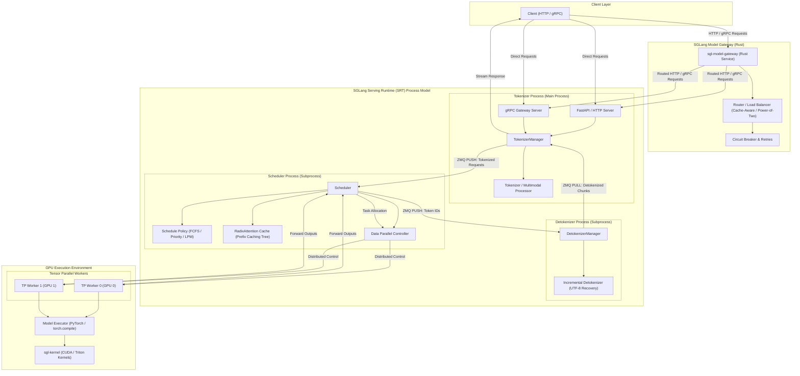

# SGLang Serving Framework: Architectural Analysis & Developmental Evolution

This document provides a comprehensive breakdown of the SGLang architecture, its developmental timeline, and the end-to-end execution flow of the command-line interface (CLI) and runtime components.

---

## 1. Core Architecture Breakdown

SGLang Serving Runtime (SRT) is designed as a co-operative, multi-process architecture to maximize GPU utilization and minimize latency during high-concurrency LLM serving. By separating tokenization, scheduling/inference, and detokenization into discrete processes, SGLang avoids Global Interpreter Lock (GIL) bottlenecks in Python and enables high-throughput streaming.




### 1.1 The Multi-Process Hierarchy

1. **TokenizerManager (Main Process / HTTP Server)**:
   - **Role**: Serves the FastAPI web server or gRPC server (handling OpenAI-compatible APIs, `/generate`, `/v1/chat/completions`, etc.).
   - **Mechanism**: Receives raw string prompts, applies Chat Templates (e.g. Llama-3, DeepSeek-R1), processes multimodal inputs (images/videos) using the multimodal processor, and tokenizes strings into token ID arrays.
   - **Parallelism**: For high-concurrency tokenization, it can utilize a `MultiTokenizerRouter` to distribute encoding workloads across multiple CPU processes.
   - **IPC**: Forwards the tokenized request parameters (wrapped in `TokenizedGenerateReqInput` or `BatchTokenizedGenerateReqInput`) to the Scheduler process over ZeroMQ.

2. **Scheduler (Child Process)**:
   - **Role**: The core engine managing GPU resource scheduling, the Key-Value (KV) cache, and model execution.
   - **Mechanism**: Receives tokenized requests from the TokenizerManager. It implements scheduling policies (such as First-Come-First-Served, Longest-Prefix-Match, or Priority) to form batches.
   - **RadixAttention Cache**: Manages the KV-cache dynamically using a radix tree. If a request shares a prefix (e.g. system prompts, multi-turn chat history, or few-shot exemplars) with a cached block, the Scheduler reuses the KV cache pages, avoiding redundant prefill computation.
   - **Tensor/Data Parallelism**: Spawns and coordinates Tensor Parallel (`tp_size`) or Data Parallel (`dp_size`) workers. DP coordination is handled via `DataParallelController`.
   - **Execution**: Coordinates the forward pass through model executors (leveraging optimized operators in `sgl-kernel`). It outputs raw generated token IDs.

3. **DetokenizerManager (Child Process)**:
   - **Role**: Translates output token IDs back into printable text chunks.
   - **Mechanism**: Runs a continuous event loop reading from the Scheduler's output ZMQ channel.
   - **Incremental Decoding**: Converts new token IDs to text while handling incomplete UTF-8 characters (e.g. multi-byte emojis or unicode characters spanning across token boundaries) by holding back partial tokens in a `LimitedCapacityDict` until the full character is completed.
   - **IPC**: Pushes detokenized text chunks (`BatchStrOutput`) back to the TokenizerManager, which streams them to the client.

### 1.2 High-Performance Kernel Layer (`sgl-kernel`)
Located in `/sgl-kernel`, this component implements custom C++/CUDA, ROCm, MUSA, and Metal kernels to bypass standard PyTorch layer overheads. Key operations accelerated here include:
- **Attention Kernels**: Custom attention routines designed for page-locked KV caches.
- **Structured Decoding**: Compressed Finite State Machine (FSM) operators that accelerate regex and JSON-schema constraints.
- **MoE Routers**: High-speed gating and expert routing kernels (specifically optimized for DeepSeek's Multi-head Latent Attention and expert parallelism).

### 1.3 Rust Model Gateway (`sgl-model-gateway`)
Written in Rust, the `sgl-model-gateway` acts as a high-performance routing control and data plane for scaling large SGLang clusters:
- **Unified Gateway**: Routes traffic across fleets of HTTP/gRPC workers.
- **Prefill-Decode (PD) Disaggregation**: Dynamically separates prefill (prompt processing) and decode (generation) tasks to separate node groups, preventing decode preemption and optimizing resource allocation.
- **Policies**: Implements cache-aware, round-robin, power-of-two, or random routing policies.
- **Resilience**: Features built-in retries with exponential backoff, circuit breakers, and token-bucket rate limiting.

---

## 2. Developmental History & Key Milestones

SGLang has evolved from an academic research project into an enterprise-grade LLM serving infrastructure:

- **January 2024 (RadixAttention Release)**: SGLang introduced **RadixAttention**, which treats the KV cache as a radix tree. This enabled automatic prefix caching and sharing across different prompts (e.g. in multi-turn conversations and agentic loops), yielding up to a 5x throughput improvement over traditional caching.
- **February 2024 (Compressed FSM)**: Added support for constrained structured output generation (JSON, JSON schemas, Regex) via compressed finite state machines (FSM), speeding up JSON decoding by up to 3x.
- **July - September 2024 (v0.2 & v0.3 releases)**: Introduced deep performance optimizations for Llama3 models, native `torch.compile` integration, and out-of-the-box support for DeepSeek's Multi-head Latent Attention (MLA). Added multimodal pipelines supporting video and multi-image LLaVA serving.
- **December 2024 (v0.4 release)**: Released a zero-overhead batch scheduler and cache-aware load balancing policies.
- **January 2025 (Day-1 DeepSeek Support)**: Shipped Day-1 optimized support for DeepSeek V3 and R1 reasoning models, aligning expert routing and caching.
- **May 2025 (Prefill-Decode Disaggregation)**: Enabled large-scale expert parallelism and Prefill-Decode (PD) disaggregation, allowing servers to process prefill tasks on one cluster and decode tokens on another to mitigate prefill-induced latency spikes.
- **October 2025 (TPU Support)**: Integrated TPU backends via the `sglang-jax` package, expanding compatibility beyond NVIDIA and AMD hardware.
- **January 2026 (Diffusion serving)**: Launched SGLang Diffusion, bringing the multi-process batching engine optimizations to image and video generation models.
- **June 2026 (Next-Gen Speculative Decoding)**: Integrated DFlash and Speculative Decoding V2 pipelines to accelerate generation speeds using lightweight draft models.

---

## 3. High-Level Flow of CLI Usage

When running the SGLang CLI server, the request lifecycle traverses multiple layers. Below is the trace of running:
```bash
sglang serve --model-path meta-llama/Llama-3.1-8B-Instruct --port 30000
```

### 3.1 Server Bootstrap Sequence
```
sglang serve --model-path ...
  │
  ▼
[sglang/cli/main.py]  <-- Parses command line subcommands
  │
  ▼
[sglang/cli/serve.py] <-- Resolves model type, config, & runs launch_server
  │
  ▼
[sglang/launch_server.py] <-- Validates ServerArgs, executes run_server()
  │
  ▼
[sglang/srt/entrypoints/engine.py] <-- Creates Engine instance
  │
  ├─► Spawns Scheduler subprocess (sglang::scheduler)
  ├─► Spawns DetokenizerManager subprocess (sglang::detokenizer)
  └─► Initializes TokenizerManager in main process (alongside FastAPI)
```

### 3.2 Request Serving Lifecycle
When a client sends an HTTP POST request to `/v1/chat/completions`:

1. **FastAPI Route dispatch (`http_server.py`)**:
   - The route handler receives the JSON payload, parses it into a `GenerateReqInput` structure, and calls `tokenizer_manager.generate_request()`.

2. **Tokenization and IPC dispatch (`tokenizer_manager.py`)**:
   - The `TokenizerManager` validates the input length, maps the chat template, and runs the tokenization asynchronously (via Hugging Face tokenizers or the custom `AsyncDynamicbatchTokenizer`).
   - The prompt tokens are packaged into a `TokenizedGenerateReqInput` object and pushed onto the ZMQ socket connected to the Scheduler.

3. **Batch Scheduling and Execution (`scheduler.py`)**:
   - The `Scheduler` process polls the ZMQ socket for new inputs.
   - It checks the `tree_cache` (RadixAttention) to find matching prefix KV-cache blocks. Uncached prompt tokens are scheduled for the prefill forward pass, while active requests are batched for decoding.
   - The Scheduler calls the model executor (`TpModelWorker`) which runs CUDA-accelerated PyTorch/Triton forwards.
   - Output tokens are captured, and the generated token IDs are packaged into `BatchTokenIDOutput` and pushed to the Detokenizer ZMQ socket.

4. **Detokenization and Streaming Response (`detokenizer_manager.py`)**:
   - The `DetokenizerManager` process pulls token ID batches.
   - It decodes the tokens into UTF-8 text chunks using `_grouped_batch_decode()`.
   - The incremental text chunks are pushed via ZMQ back to the `TokenizerManager` (in the main process).
   - FastAPI streams the incremental chunks to the client as Server-Sent Events (SSE).

