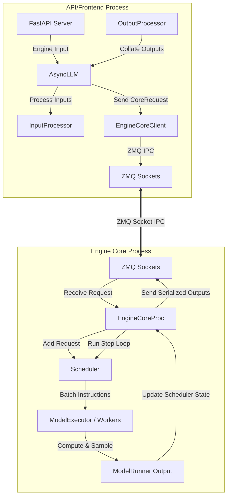
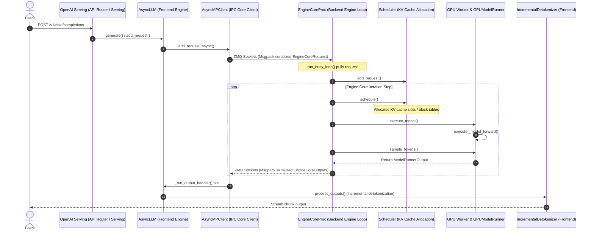
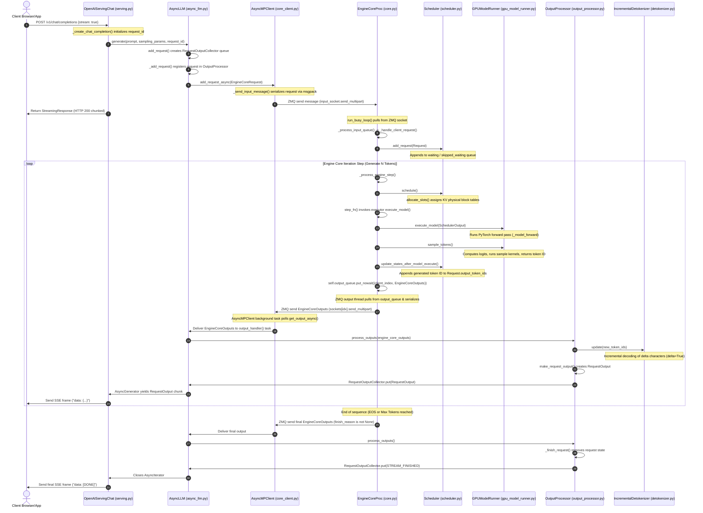
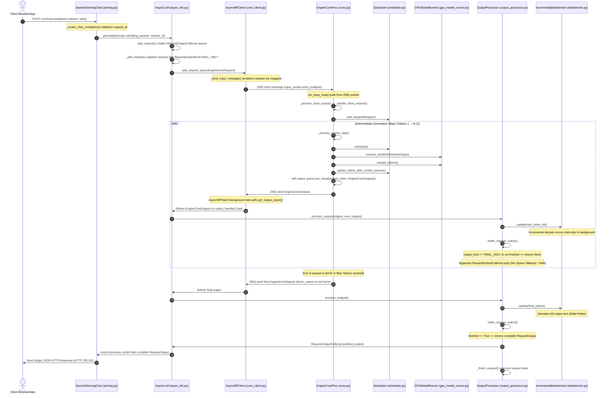

# vLLM Architectural Analysis & request flow

vLLM is a high-throughput, low-latency serving and inference engine for Large Language Models. Initially developed at UC Berkeley's Sky Computing Lab, its flagship innovation is **PagedAttention**, which manages key-value (KV) cache memory to dramatically reduce fragmentation and increase serving capacity.

This document breaks down the vLLM architecture, specifically focusing on the new **V1 core architecture**, the step-by-step lifecycle of a request, and how the codebase evolved.

---

## 1. High-Level Architecture Overview (V1 Core)

The modern vLLM V1 architecture adopts a **disaggregated, multi-process** design to separate high-overhead frontend tasks (FastAPI endpoints, text tokenization, detokenization, logging) from performance-critical backend tasks (scheduling, model execution, tensor/pipeline parallelism). 



### Core Architecture Components

1. **API / Frontend Process**:
   - **FastAPI / Uvicorn**: Hosts the OpenAI-compatible REST endpoints (`/v1/chat/completions`, etc.).
   - **AsyncLLM**: The primary async wrapper representing the client engine. It drives request entry and manages background threads polling for results.
   - **InputProcessor**: Takes prompts, tokenizes text, processes multimodal features, and formats an `EngineCoreRequest`.
   - **OutputProcessor**: Receives raw output tokens, decodes them back into text, processes stop criteria, and compiles them into streaming `RequestOutput` objects.
   - **EngineCoreClient**: Handles IPC communication with the backend process over ZeroMQ (ZMQ).

2. **Backend Engine Core Process (`EngineCoreProc`)**:
   - **EngineCore**: Contains the inner loop (`run_busy_loop`) executing batch cycles.
   - **Scheduler**: Allocates KV cache blocks, manages request queues (waiting, running, swapped), and packs requests using continuous batching and chunked prefill.
   - **ModelExecutor / Workers**: Abstracts the execution of the model across one or more accelerators (GPUs, TPUs, etc.). Workers execute model forward passes and token sampling.

---

## 2. CLI Usage request lifecycle (`vllm serve`)

When you run `vllm serve <model_name>`, the request flows through the CLI parser, sets up sockets, instantiates backend workers, and begins serving.

### Flow diagram

```
[CLI command: vllm serve]
           │
           ▼
[main.py: main()] ──(Loads subcommands)──► [serve.py: ServeSubcommand.cmd()]
                                                      │
                                                      ├─► headless? (headless workers only)
                                                      └─► single/multi api-server setup
                                                              │
                                                              ▼
                                                   [api_server.py: run_server()]
                                                              │
                                        ┌─────────────────────┴─────────────────────┐
                                        ▼                                           ▼
                           [setup_server() socket bind]             [build_async_engine_client()]
                                                                                    │
                                                                                    ▼
                                                                           [AsyncLLM.from_vllm_config()]
                                                                                    │
                                                                                    ▼
                                                                        [EngineCoreClient.make_client()]
                                                                                    │ (Launches Core Process)
                                                                                    ▼
                                                                         [EngineCoreProc.run_busy_loop()]
                                                                                    │
                                                                                    ▼
                                                                        [ModelExecutor profiling & KV cache allocation]
                                                                                    │
                                                                                    ▼
                                                                        [ZMQ Handshake complete]
                                                                                    │
                                                                                    ▼
                                                                        [Uvicorn starts listening]
```

### Step-by-Step execution flow

#### A. Initialization & Bootstrap
1. **CLI Parsing**: The user runs `vllm serve <model_name>`. The entry point `vllm.entrypoints.cli.main:main` invokes the `ServeSubcommand` in `vllm/entrypoints/cli/serve.py`.
2. **Server Port Binding**: `setup_server(args)` in `api_server.py` immediately binds to the TCP port (avoiding race conditions in multi-GPU/Ray environments).
3. **Frontend Initialization**: `run_server_worker()` launches `build_async_engine_client()`, which instantiates `AsyncLLM`.
4. **Backend Process Spawn**: `EngineCoreClient` uses `launch_core_engines` to spawn `EngineCoreProc` in a dedicated subprocess.
5. **Memory Profiling**: `EngineCoreProc` boots, initializes the selected `Executor` (e.g., `MultiprocExecutor` or `RayExecutor`), and runs model profiling. It computes available memory, determines the maximum number of GPU block allocators for PagedAttention, and initializes physical KV caches.
6. **ZMQ Handshake**: `EngineCoreProc` executes a handshake with `EngineCoreClient` to report config parameters (such as `max_model_len` or block sizes adjusted during profiling).
7. **HTTP Server Starts**: The FastAPI app is constructed and loaded into Uvicorn via `serve_http()`.

#### B. Handling an Incoming Request
```
[User Request] ──► [FastAPI Router] ──► [AsyncLLM.generate()]
                                                │
                                                ▼
                                        [InputProcessor] (Tokenizes, creates CoreRequest)
                                                │
                                                ▼
                                        [EngineCoreClient] (Msgpack serializes request)
                                                │
                                               ZMQ
                                                ▼
                                        [EngineCoreProc] (Puts into input queue)
                                                │
                                                ▼
                                        [EngineCore.step()] ◄─── (Busy loop repeats)
                                                │
                          ┌─────────────────────┴─────────────────────┐
                          ▼                                           ▼
                 [scheduler.schedule()]                     [model_executor.execute_model()]
              (Allocates blocks & batches)                       (GPU model forward pass)
                          │                                           │
                          └─────────────────────┬─────────────────────┘
                                                ▼
                                     [Sample next tokens]
                                                │
                                                ▼
                                    [scheduler.update_from_output()]
                                                │
                                               ZMQ
                                                ▼
                                     [AsyncLLM: output_handler()]
                                                │
                                                ▼
                                     [OutputProcessor] (Detokenizes tokens)
                                                │
                                                ▼
                                    [FastAPI Stream Response] ──► [User]
```

1. **Request Reception**: An HTTP request hits `/v1/chat/completions`. The FastAPI route calls `engine_client.generate()`.
2. **Preprocessing**: The frontend `InputProcessor` tokenizes the prompt text and creates an `EngineCoreRequest`.
3. **Serialization & IPC**: The `EngineCoreClient` encodes the request using `Msgpack` and transmits it via a ZeroMQ `ROUTER` socket to the backend process.
4. **Queueing**: The backend process receives the message in `process_input_sockets()` and adds it to the backend `input_queue`.
5. **Iteration-level Scheduling**: In `EngineCoreProc.run_busy_loop()`:
   - `scheduler.schedule()` analyzes the running, waiting, and swapped queues. It uses PagedAttention structures to allocate logical blocks for the new requests.
   - Waitlists are packed together utilizing continuous batching.
6. **Execution**: The scheduler passes the scheduled batch to `model_executor.execute_model()`. The workers run the tensor-parallel/pipeline-parallel GPU kernels.
7. **Sampling**: The model runner samples logits to produce the next token IDs.
8. **State Updates**: `scheduler.update_from_output()` updates request sequences, releases blocks for finished requests, or marks requests as completed.
9. **Result Transmission**: `EngineCoreProc` pushes the token outputs onto a ZMQ socket back to the frontend process.
10. **Detokenization**: The frontend `output_handler()` thread pulls outputs off the ZMQ socket and routes them to the `OutputProcessor`. The processor detokenizes the token IDs back into string characters.
11. **Streaming Output**: The string characters are pushed into a `RequestOutputCollector` stream, which is yielded by the FastAPI controller back to the user client.

---

## 3. How vLLM Evolved (Development Journey)

```
┌─────────────────────────────────┐
│           V0 Legacy             │
│  - Single Python Process        │
│  - Monolithic Scheduler         │
│  - High Python GIL Bottleneck   │
└────────────────┬────────────────┘
                 │
                 ▼
┌─────────────────────────────────┐
│        V1 Architecture          │
│  - Multi-Process Disaggregation │
│  - ZMQ IPC Interface            │
│  - torch.compile CUDA Graphs    │
│  - Optional Rust Frontend       │
└─────────────────────────────────┘
```

1. **Phase 1: Berkeley Roots (v0.1.x - v0.2.x)**:
   - **Monolithic Python Runtime**: Both serving, scheduling, and model execution ran in the same Python process.
   - **PagedAttention**: Fixed memory fragmentation (reducing memory waste from ~60-80% down to under 4%).
   - **Continuous Batching**: Shifted scheduling from request-level (waiting for a whole batch to finish) to iteration-level (adding/removing requests on the fly).

2. **Phase 2: Scale and Plugins (v0.3.x - v0.5.x)**:
   - **Distributed Engines**: Native Ray integration allowed running tensor parallelism (TP) and pipeline parallelism (PP) across multiple GPUs and nodes.
   - **Advanced Features**: Added automatic prefix caching (reusing system prompts/chat templates), multi-LoRA support, and speculative decoding.

3. **Phase 3: The V1 Core Redesign (v0.6.x - Present)**:
   - **Decoupled Architecture**: Python’s Global Interpreter Lock (GIL) created severe CPU bottlenecks when serving high-concurrency tokenization and REST requests. V1 isolated scheduling/model execution from REST serving.
   - **torch.compile Integration**: V1 models are optimized using `torch.compile`, facilitating automatic compilation of optimized model-forward routines and continuous CUDA/HIP graph execution.
   - **Rust Frontend**: To completely eliminate Python frontend serving overhead, an optional Rust-based frontend wrapper was introduced (`RustFrontendProcessManager`).
   - **Disaggregated serving**: Allows disaggregating the Prefill phase (compute-heavy, running on dedicated nodes) and the Decode phase (memory-bandwidth heavy, running on other nodes), utilizing high-speed KV cache transfer networks.


# vLLM V1: Low-Level Request Lifecycle Walkthrough

This document traces the step-by-step journey of a single chat completion request in the **vLLM V1 (multiprocess)** architecture, citing specific classes, files, and line ranges.

---

## Architecture Overview Diagram



---

## Phase-by-Phase Walkthrough

### 1. HTTP Entry Point (FastAPI Router)
The request starts when a client posts to `/v1/chat/completions`.
* **Router Endpoint**: Defined in [api_router.py](file:///data/inference/vllm/vllm/entrypoints/openai/chat_completion/api_router.py#L53-L74) inside `create_chat_completion(request: ChatCompletionRequest, ...)` which validates and hands over to `OpenAIServingChat`.
* **Chat Template & Rendering**: In [serving.py](file:///data/inference/vllm/vllm/entrypoints/openai/chat_completion/serving.py#L245-L398) inside `OpenAIServingChat._create_chat_completion()`. 
  - Tokenization, system prompt injection, and chat templates are resolved.
  - Generates token IDs and prompts.
  - Calls `self.engine_client.generate(prompt, sampling_params, request_id, ...)` where `engine_client` is our `AsyncLLM` engine instance.

---

### 2. Frontend Client & IPC Dispatch (`AsyncLLM` & `AsyncMPClient`)
The frontend process driven by Python asyncio handles validation, token/detokenization, and sends requests to the backend process.
* **Frontend Intake**: Inside [async_llm.py](file:///data/inference/vllm/vllm/v1/engine/async_llm.py#L524-L636) in `AsyncLLM.generate()`, the request is converted to an `EngineCoreRequest` using the `InputProcessor` (token tracking, multimodal feature extraction, and validation).
* **ZMQ IPC Dispatch**:
  - `AsyncLLM._add_request()` calls `await self.engine_core.add_request_async(request)`.
  - In [core_client.py](file:///data/inference/vllm/vllm/v1/engine/core_client.py#L1121-L1125), `AsyncMPClient.add_request_async` sets the client index and calls `await self._send_input(EngineCoreRequestType.ADD, request)`.
  - `_send_input` serializes the payload using `msgpack` (`self.encoder.encode(request)`) and writes it to the ZeroMQ DEALER socket (`self.input_socket.send_multipart(msg, copy=False)`) in [core_client.py](file:///data/inference/vllm/vllm/v1/engine/core_client.py#L1064-L1100).

---

### 3. IPC Reception and Dispatch (Backend Loop)
The backend engine runs in a separate process (`EngineCoreProc`).
* **Busy Loop polling ZMQ**: In [core.py](file:///data/inference/vllm/vllm/v1/engine/core.py#L1259-L1268), `EngineCoreProc.run_busy_loop()` spins and reads ZMQ input router sockets.
* **Request Extraction**: Incoming messages go to `_process_input_queue()`, calling `_handle_client_request()` in [core.py](file:///data/inference/vllm/vllm/v1/engine/core.py#L1372-L1385).
* **Insertion to Scheduler Queue**: The request is added to the scheduler via `self.scheduler.add_request(request)`.
  - In [scheduler.py](file:///data/inference/vllm/vllm/v1/core/sched/scheduler.py#L1993-L2016), `Scheduler.add_request` places the request into either `self.waiting` or `self.skipped_waiting` queue depending on its state.

---

### 4. Scheduler Allocation
The backend engine steps continuous execution iterations.
* **Step Execution**: In [core.py](file:///data/inference/vllm/vllm/v1/engine/core.py#L1300-L1318), `_process_engine_step()` calls `self.step_fn()`, which executes the scheduler.
* **Token & KV Cache Scheduling**: Inside [scheduler.py](file:///data/inference/vllm/vllm/v1/core/sched/scheduler.py#L393-L590) in `Scheduler.schedule()`:
  - Budget boundaries are evaluated (`max_num_scheduled_tokens`, `max_num_running_reqs`).
  - Running/waiting requests are processed.
  - Physical KV Cache Block allocation is managed via `self.kv_cache_manager.allocate_slots(request, num_new_tokens, ...)` in [scheduler.py](file:///data/inference/vllm/vllm/v1/core/sched/scheduler.py#L899-L911) (assigning `KVCacheBlocks` logical mappings to physical block table indexes).
  - Returns `SchedulerOutput` with batch layout details.

---

### 5. Model Executor and Workers (GPU Forward Pass)
* **Executor Routing**: In [uniproc_executor.py](file:///data/inference/vllm/vllm/v1/executor/uniproc_executor.py#L108-L122), `UniProcExecutor.execute_model` forwards the execution request to the driver worker using a fast collective RPC call (`collective_rpc("execute_model", args=(scheduler_output,))`).
* **GPU Worker**: In [gpu_worker.py](file:///data/inference/vllm/vllm/v1/worker/gpu_worker.py#L955-L1043), `GPUWorker.execute_model` sets up pipeline parallel boundaries and invokes `self.model_runner.execute_model(scheduler_output, intermediate_tensors)`.
* **Model Runner Execution**: In [gpu_model_runner.py](file:///data/inference/vllm/vllm/v1/worker/gpu_model_runner.py#L4047-L4415):
  - Prepares input tensors (`_prepare_inputs`).
  - Resolves CUDA Graph batch padding dynamically via `_determine_batch_execution_and_padding`.
  - Builds PagedAttention metadata (`_build_attention_metadata`) and grabs block/slot mappings (`_get_slot_mappings`).
  - Triggers the model neural network forward pass via `_model_forward` inside a PyTorch inference mode context.

---

### 6. Sampling and Iteration Collection
* **Sampling**: Immediately following model execution, [gpu_worker.py](file:///data/inference/vllm/vllm/v1/worker/gpu_worker.py#L948-L951) calls `sample_tokens()`.
  - In [gpu_model_runner.py](file:///data/inference/vllm/vllm/v1/worker/gpu_model_runner.py#L4333-L4520), `GPUModelRunner.sample_tokens` computes logits, evaluates sampling parameters, runs the sampler kernels to generate new token IDs, and records states.
* **Return Construction**:
  - The model outputs are passed back to the scheduler.
  - The scheduler updates request states (detecting EOS tokens or stop strings) and builds `EngineCoreOutputs` in [scheduler.py](file:///data/inference/vllm/vllm/v1/core/sched/scheduler.py#L1801-L1832).
  - The output is queued into `self.output_queue` in [core.py](file:///data/inference/vllm/vllm/v1/engine/core.py#L1307).

---

### 7. IPC Output Transmission
* **Output Queue Loop**: The backend process runs a ZMQ queue socket thread.
  - In [core.py](file:///data/inference/vllm/vllm/v1/engine/core.py#L1623-L1650), it pulls items off `self.output_queue`, encodes them into msgpack structures, and pushes them through a ZMQ socket (`sockets[client_index].send_multipart(buffers, copy=False, track=True)`) back to the frontend process.

---

### 8. Frontend Detokenization and Streaming
* **Output Polling**: In [async_llm.py](file:///data/inference/vllm/vllm/v1/engine/async_llm.py#L656-L707), `AsyncLLM`'s background loop `_run_output_handler` calls `await engine_core.get_output_async()`.
* **Detokenizer Processing**:
  - Received outputs are chunked and passed to `output_processor.process_outputs()` in [output_processor.py](file:///data/inference/vllm/vllm/v1/engine/output_processor.py#L576-L693).
  - Incremental text is decoded using the `IncrementalDetokenizer` in [detokenizer.py](file:///data/inference/vllm/vllm/v1/engine/detokenizer.py#L30-L66).
  - Pushes the resulting `RequestOutput` (text, token IDs, logprobs) to the per-request queue `RequestOutputCollector`.
  - The active FastAPI coroutine yielding output streams pulls from this collector and sends chunked JSON frames back to the client.


# Detailed Execution Flow: Streaming vs. Non-Streaming

This artifact provides a simplified block diagram, detailed sequence diagrams, and comparative walkthroughs showing the exact data flows, class/method calls, file paths, and queue operations for requests processed with and without streaming in vLLM V1.

---

## Simplified Unified Data Flow Diagram

This diagram organizes the system into four linear layers. The request flows from left to right, and the response flows back through the Output Processor where the streaming vs. non-streaming logic diverges.

```mermaid
graph LR
    %% Node Styles
    classDef stream fill:#d4edda,stroke:#28a745,stroke-width:1px,color:#155724;
    classDef nonstream fill:#f8d7da,stroke:#dc3545,stroke-width:1px,color:#721c24;
    classDef common fill:#e2e3e5,stroke:#383d41,stroke-width:1px;

    %% 1. Client Layer
    subgraph Layer1 ["1. Client"]
        Client["Client Browser / App"]
    end

    %% 2. HTTP & API Layer
    subgraph Layer2 ["2. API & Frontend Engine"]
        API["FastAPI Serving Layer<br/>(serving.py)"]
        ILLM["AsyncLLM Engine Client<br/>(async_llm.py)"]
        OutProc["Output Processor & Detokenizer<br/>(output_processor.py)"]
    end

    %% 3. IPC Layer
    subgraph Layer3 ["3. IPC Sockets"]
        ZMQ_Front["ZMQ Sockets (Client Side)<br/>(core_client.py)"]
        ZMQ_Back["ZMQ Sockets (Server Side)<br/>(core.py)"]
    end

    %% 4. Backend Engine Layer
    subgraph Layer4 ["4. Engine Core & GPU"]
        ECProc["EngineCoreProc Loop<br/>(core.py)"]
        Sched["Scheduler & KV Manager<br/>(scheduler.py)"]
        GPU["GPU Workers & Runner<br/>(gpu_model_runner.py)"]
    end

    %% --- INPUT REQUEST FLOW (Left to Right) ---
    Client -->|HTTP Request| API
    API -->|Call generate()| ILLM
    ILLM -->|1. Register Request State| OutProc
    ILLM -->|2. Send Msgpack CoreRequest| ZMQ_Front
    ZMQ_Front ===>|ZMQ Socket IPC| ZMQ_Back
    ZMQ_Back -->|Queue Request| ECProc
    ECProc -->|Schedule Batch| Sched
    Sched -->|Execute Model| GPU

    %% --- OUTPUT RESPONSE FLOW (Right to Left) ---
    GPU -->|Token Outputs| ECProc
    ECProc -->|Send Msgpack Outputs| ZMQ_Back
    ZMQ_Back ===>|ZMQ Socket IPC| ZMQ_Front
    ZMQ_Front -->|Poll Outputs| OutProc

    %% --- DIVERGENT OUTPUT HANDLING ---
    %% Streaming Path
    OutProc -->|stream=true: Yield Delta Token| API
    API -->|Server-Sent Events (SSE)| Client

    %% Non-Streaming Path
    OutProc -.->|stream=false: Intermediate Token| Byp["Bypass Queue<br/>(Return None)"]
    OutProc -->|stream=false: Final Complete Token| API
    API -->|Single JSON Response| Client

    %% Assign style classes
    class API,ILLM,OutProc,ZMQ_Front,ZMQ_Back,ECProc,Sched,GPU common;
    class Byp nonstream;
    class Client common;
```

---

## Detailed Sequence Diagram: Streaming Mode (`stream=True`)

*This diagram details how vLLM V1 processes a streaming request token-by-token, immediately propagating intermediate tokens through ZeroMQ IPC and ASGI servers to the HTTP client using chunked encoding.*



---

## Detailed Sequence Diagram: Non-Streaming Mode (`stream=False`)

*This diagram details how intermediate steps bypass queue allocations, task switching, and detokenization updates. The frontend waits silently until the backend signals complete generation before delivering a single HTTP response.*



---

## Detailed Step-by-Step Execution Comparison

### 1. Request Initialization
* **Streaming**: The HTTP handler `Serving.chat_completion_stream_generator()` is invoked. The client connection is kept open as a chunked HTTP response.
* **Non-Streaming**: The HTTP handler `Serving.chat_completion_full_generator()` is invoked. The server awaits completion of the entire generation iterator.

### 2. Output Processing & Queue Wakeup (Frontend)
* **Streaming**: Inside `OutputProcessor.process_outputs()`, the sampling parameters indicate `RequestOutputKind.DELTA`. `make_request_output()` constructs a `RequestOutput` payload for every iteration. Calling `RequestOutputCollector.put()` triggers the `ready.set()` event, immediately waking the waiting FastAPI generator thread to write to the HTTP connection.
* **Non-Streaming**: Inside `OutputProcessor.process_outputs()`, `self.output_kind` is set to `RequestOutputKind.FINAL_ONLY`. As long as `finish_reason` is `None` (not finished), the method returns `None` and does not wake up the generator task. This reduces CPU and event-loop context-switching overhead significantly.

### 3. Detokenization Behavior
* **Streaming**: `IncrementalDetokenizer.get_next_output_text(finished, delta=True)` computes the string difference since the last step (`self._last_output_text_offset`), sending only the newly generated characters.
* **Non-Streaming**: `IncrementalDetokenizer.get_next_output_text(finished, delta=False)` constructs the entire output text string at the very end of the sequence.

